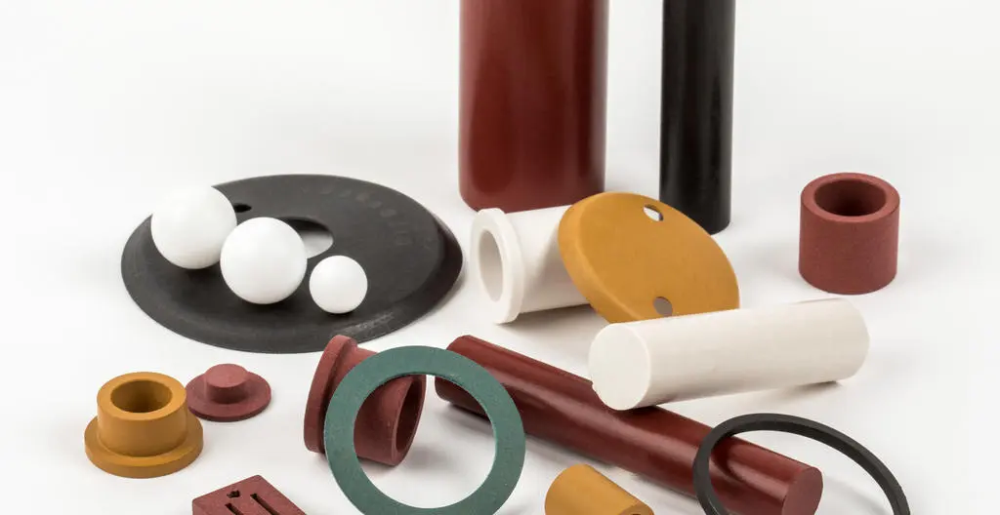
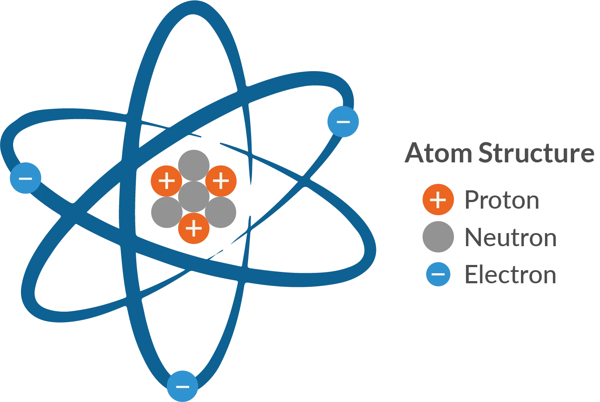
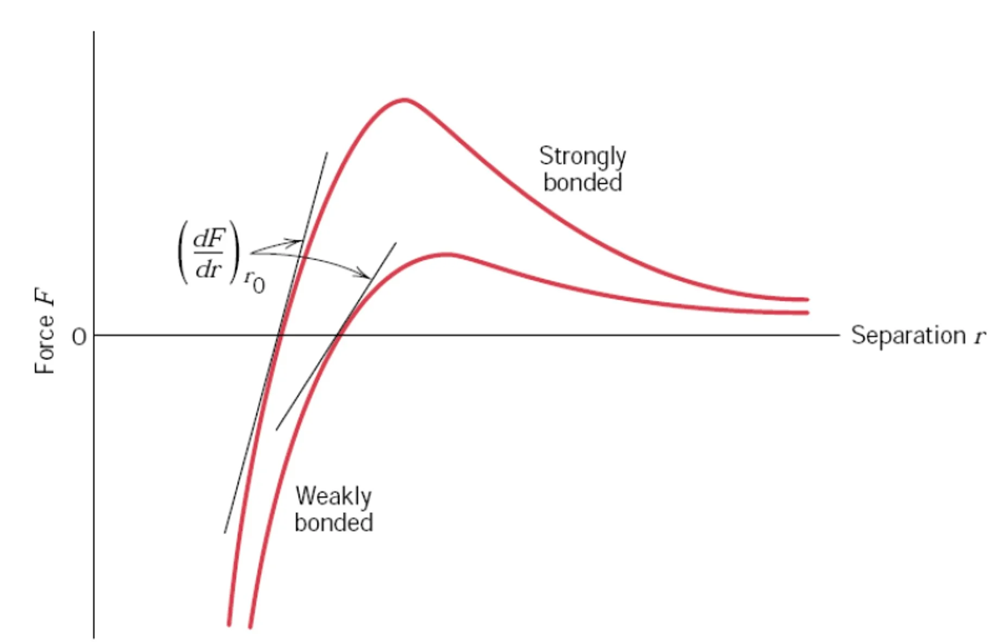
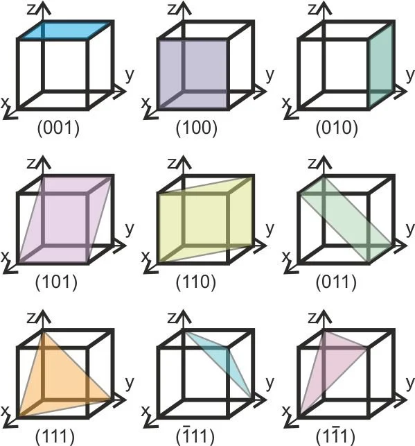
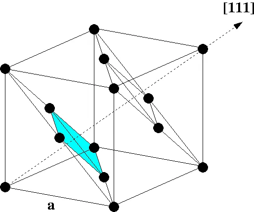

# **خواص مواد مهندسی**

## دکتر اعظم بیگی خردمند

^^^

### منابع

1. W. F. Smith, *Principles of Materials Science and Engineering*, 3rd Edition, McGraw Hill, 1996.
2. K. G. Budinski and M. K. Budinski, *Engineering Materials: Properties and Selection*, 7th Edition, Prentice Hall, 2002.

^^^

## فصل اول

^^^

### تاریخچه

- متالورژی به عنوان صنعت مادر حدود 6-7 هزار سال پیش شکل گرفت.
- مس اولین فلزی بود که به صورت خالص استخراج شد.

<!--  -->

^^^

### انواع مواد مهندسی

#### فلزات

- رسانای خوب حرارت  الکتریسیته

- شکل‌پذیر (به دلیل پیوند فلزی)

#### سرامیک‌ها

- پیوندها کووالانسی و یونی

- سختی و مقاومت حرارتی بالا

#### پلیمرها

- تشکیل شده از مولکول‌های بزرگ و طویل

^^^

### فلزها

- چیدمان اتمی منظم و فشرده

- چگالی بالا

- صلبیت

- استحکام

- انعطاف‌پذیری

- مقاومت به رشد ترک

- هدایت گرمایی

- هدایت الکتریکی

- عدم انتقال نور

- بیشترین کاربرد در مهندسی

<!--  -->

^^^

### فلزات آهنی

- چُدن‌ها: آلیاژهای آهن-کربن با کمتر از 2% کربن
  - چُدن سفید

  - چُدن‌های گرافیتی

  - چُدن خاکستری

  - چُدن داکتیل (نشکن)

  - چُدن مالیبل (چکشخوار)
- فولادها: آلیاژهای آهن-کربن با بیشتر از 2% کربن
  - ساده کربنی

  - کم آلیاژ

  - زنگ نزن

  - ابزار

^^^

### سرامیک‌ها

- تُرد

- مقاومت دمایی

- انعطاف‌پذیری کم

- مقاومت شیمیایی

- عایق جریان

- استثنا: برخی الکتروسرامیک‌ها رسانا هستند (در ساخت ترانزیستورها، یکسو کننده‌ها، و ICها)

<!--  -->

^^^

### کاربرد سرامیک‌ها

- مصالح ساختمانی

- شیشه‌ها و شیشه‌های هوشمند

- ساینده‌ها

- مته‌ها و ابزار برش

- سیمان‌ها

- سرامیک‌های پوششی

- بیوسرامیک‌ها

- فیلترها

- کاتالیست‌ها

- الکتروسرامیک‌ها

^^^

### پلیمرها

- مقاومت دمایی

- تُرد در دمای زیر صفر

- شکل‌پذیر در دمای بالا

- متلاشی در دمای خیلی بالا

- کم چگال

- عایق جریان

- پایداری شیمیایی در دمای محیط

<!--  -->

^^^

### مقایسه سه ماده اصلی

| **ویژگی**                   | **سرامیک**       | **فلز**          | **پلیمر**       |
|-------------------------|--------------|--------------|-------------|
| **سختی**                    | بسیار بالا   | متوسط       | کم          |
| **مدول الاستیسیته**         | بالا         | متوسط       | پایین       |
| **استحکام در دمای بالا**    | بسیار بالا   | بالا         | پایین       |
| **انبساط حرارتی**           | کم           | متوسط       | زیاد        |
| **شکل‌پذیری**               | کم           | زیاد         | زیاد        |
| **مقاومت به خوردگی**        | بسیار بالا   | بسته به نوع  | متوسط تا زیاد |
| **مقاومت به سایش**          | بالا         | متوسط       | کم          |
| **رسانایی الکتریکی**        | کم           | بسیار بالا   | بسیار کم    |
| **چگالی**                   | بالا         | بالا         | کم          |
| **رسانایی حرارتی**          | کم           | بالا         | بسیار کم    |

^^^

### کامپوزیت‌ها

- اجزاء مواد کامپوزیتی از نظر شکل و ترکیب شیمیایی متفاوت هستند.

- اجزاء در یکدیگر حل نمی‌شوند (مخلوط می‌شوند).

- ایجاد موادی با خواص جدید.

- دارای خواص بهتر نسبت به اجزاء اولیه.

<!-- 
 -->

^^^

### مواد مدرن

- نیمه‌هادی‌ها

- مواد زیستی

- مواد هوشمند

- مواد نانو  

<!-- 
 -->

^^^

### مواد هوشمند بر اساس محرک‌ها

- آلیاژ حافظه شکلی

- سرامیک پیزوالکتریک

- مواد مغناطیسی

- مواد الکترو/مغناطیسی  

<!--  -->

^^^

### محورهای اصلی علم مواد

- فرایند

- ساختار

- خواص

- کارایی  

<!--  -->

^^^

### تأثیر محورهای اصلی بر هم

- علم مواد به بررسی ارتباط بین چهار عنصر می‌پردازد:
  - ساختار تابعی از فرایند ساخت است.
  - عملکرد تابعی از ویژگی‌های ماده است.

برای مثال، تأثیر فرایند در ساختار، ویژگی و عملکرد در برابر نور.

<!--  -->

^^^

### تأثیر فرایند ساخت در آلومینیم اکسید

- یک قرص تک‌بلور و شفاف

- یک قرص چندبلوری نیمه‌کدر

- یک قرص چندبلوری کاملاً مات

<!--  -->

^^^

### چرا علم مواد؟

برای موفقیت به عنوان مهندس، باید اطلاعاتی درباره ساختار و ویژگی‌های مواد و تأثیر آن‌ها در فرایند ساخت برای دستیابی به عملکرد بهتر داشته باشیم.

^^^

### سطوح ساختار مواد

<!--  -->

| **مشخصه‌های ساختاری**                 | **مقیاس (m)**             | **محدوده قابل کنترل برای تغییر خواص** |
| --------------------------------------- | -------------------------- | ------------------------------------- |
| ساختار هسته‌ای                         | $10^{-15}$                 |                                       |
| ساختار اتمی                            | $10^{-10}$                 |                                       |
| ساختار کریستالی یا شیشه‌ای             | $10^{-9}$                  | قابل کنترل برای تغییر خواص            |
| ساختار محلول جامد‌ها و ترکیبات         | $10^{-9}$                  | قابل کنترل برای تغییر خواص            |
| ساختار دانه و مرز‌دانه‌‌ها             | $10^{-8}$                  | قابل کنترل برای تغییر خواص            |
| اندازه و شکل دانه‌ها و فاز‌ها           | $10^{-3}$ تا $10^{-7}$     | قابل کنترل برای تغییر خواص            |
| تجمع دانه‌ها و فاز‌ها                  | $10^{-2}$ تا $10^{-5}$     | قابل کنترل برای تغییر خواص            |
| سازه مهندسی                            | $10^{-3}$ تا $10^{3}$      |                                       |

^^^

### حساسیت به ریزساختار

| **خواص غیر حساس** | **خواص حساس** |
| --- | --- |
| دانسیته | استحکام تسلیم |
| مدول یانگ | استحکام کششی |
| ضریب انبساط حرارتی | شکل‌پذیری |
| گرمای ویژه | چقرمگی شکست |
|  | استحکام خستگی |
|  | استحکام خزشی |

<!--  -->

^^^

### انواع خواص مواد

- مکانیکی

- الکتریکی

- حرارتی

- مغناطیسی

- نوری

- استهلاکی

^^^

### ساختار اتمی

**اتم:**

- پروتون (مثبت)

- نوترون (خنثی)

- الکترون (منفی)

^^^

### نمایش ساختار هسته‌ای اتم

- عدد اتمی ($Z$): تعداد پروتون‌ها

- عدد جرمی ($A$): تعداد پروتون‌ها + نوترون‌ها

  $$A = Z + N$$
  
- عدد آووگادرو ($N_A$):
  
  $$N_A = 6.02 \times 10^{23}$$

^^^

### ساختار الکترونی

**والانس (n):**

- تعداد الکترون‌های لایه آخر

- تعیین‌کننده خواص شیمیایی

^^^

### دسته‌بندی بر اساس والانس بخش اول

**الکترونگاتیویته:**

- تمایل به جذب الکترون (الکترونگاتیو) مثل نافلزات

- تمایل به از دست دادن الکترون (الکتروپوزیتیو) مثل فلزات

| **n** | **نوع** |
|--- | --- |
| 1, 2, 3 | فلز |
| 4 | شبه فلز |
| 5, 6, 7 | نافلز |
| 8 | گاز نجیب |

^^^

### دسته‌بندی بر اساس والانس بخش دوم

**جدول تناوبی:**

- اساس چیدمان: آرایش الکترونی عناصر

^^^

### پیوندهای بین اتمی

- **پیوندهای اولیه (اصلی) (پیوند قوی)**

- **پیوندهای ثانویه (فرعی) (پیوند نسبتاً ضعیف):**

^^^

### **پیوندهای اولیه (اصلی) (پیوند قوی):**

- یونی

- کووالانسی

- فلزی

^^^

### **پیوندهای ثانویه (فرعی) (پیوند نسبتاً ضعیف):**

- واندروالس

- هیدروژنی

**نکته:** در این پیوندها انتقال و اشتراک الکترون وجود ندارد.

^^^

### پیوند فلزی

- در فلزات و آلیاژها

- مشخصه: الکترون آزاد

- مدل: "دریای الکترون آزاد"

- ماهیت: غیرجهت‌دار

- عامل اتصال: جاذبه بین الکترون‌های آزاد و هسته‌های یونی با بار مثبت

**نکته 1:** در مدل دریای الکترون آزاد، الکترون‌های آزاد به اتم‌های خاص تعلق ندارند.

**نکته 2:** الکترون‌های غیر والانس باقیمانده و هسته اتم، تشکیل هسته‌های یونی با بار خالص مثبت را می‌دهند که در دریای الکترون شناورند.

^^^

### پیوند یونی

- در بسیاری از سرامیک‌ها و ترکیباتی که شامل یک الکترونگاتیو و یک الکتروپوزیتیو هستند

- مشخصه: انتقال و داد و ستد الکترون‌ها

- ماهیت: غیرجهت‌دار

- عامل اتصال: جاذبه الکترواستاتیکی بین یون‌های مثبت و منفی

- عنصر فلزی با دادن الکترون لایه ظرفیت به نافلز، به هر دو عنصر امکان رسیدن به آرایش گاز پایدار را می‌دهد.

- هر چه اختلاف الکترونگاتیو (فلز-غیرفلز) بیشتر باشد، پیوند یونی قوی‌تر یا انرژی پیوند بیشتر است.

^^^

### ویژگی‌ها پیوند یونی

- سخت

- شکننده

- عایق

- نقطه ذوب بالا

- عدم قابلیت تغییر شکل پلاستیک

- هدایت الکتریکی بسیار کم (در حالت مذاب و توسط یون‌ها)

^^^

### پیوند کووالانسی

- در الماس، سیلیکون و ژرمانیوم

- بین دو غیر فلز یا بین هیدروژن و یک غیر فلز

- مشخصه: شراکت الکترون‌ها

- ماهیت: جهت‌دار

- عامل اتصال: نزدیک شدن دو هسته موجب ایجاد اربیتال الکترونی جدید شامل الکترون‌های شراکت گذاشته شده می‌شود.

- به علت نامتقارن بودن شکل اربیتال‌ها، قدرت پیوند بین اتمی در تمام جهات یکسان نیست.

^^^

### ویژگی‌ها پیوند کووالانسی

- ترد

- چکش‌خواری ضعیف

- سختی بسیار زیاد (الماس ≠ بیسموت)

- نقطه ذوب بسیار بالا

- عایق الکتریکی (برای حرکت الکترون باید پیوند شکسته شود که به دما و انرژی زیاد نیاز دارد)

^^^

### پیوند واندروالس

- بین گازهای ایده‌آل (مانند آرگون، نئون) یا مولکول‌های پایدار مانند متان و مواد آلی دیگر در حالت مایع یا جامد

- ارتباطی به الکترون‌های ظرفیت ندارد

- عامل اتصال: دو قطبی‌های مولکولی یا اتمی است که به صورت دائم یا موقتی به وجود می‌آیند.

^^^

### ویژگی‌ها پیوند واندروالس

- پیوند ضعیف

- در اثر ارتعاشات حرارتی از بین خواهند رفت

^^^

### پیوند هیدروژنی

- در مولکول‌های غیر آلی (مانند آب) و آلی (مانند DNA)

- عامل اتصال: همراه شدن هیدروژن با یکی از عناصر با الکترونگاتیوی بالا (اکسیژن، نیتروژن، فلوئور)

^^^

### ویژگی‌ها پیوند هیدروژنی

- پیوند ضعیف

- در اثر ارتعاشات حرارتی از بین خواهند رفت

^^^

### پیوندهای هیبریدی (ترکیبی)

- در بسیاری از مواد، پیوندهای بین اتمی ترکیبی از پیوندهای اولیه یا ثانویه است.

^^^

### انرژی پیوند بخش اول

- منحنی تغییرات نیروی بین اتمی (و انرژی پتانسیل) بر حسب فاصله بین اتمی

- با نزدیک شدن دو اتم به هم؛ دو نوع نیروی بین اتمی (جاذبه و دافعه) بین آن‌ها شکل می‌گیرد.

- نیروی جاذبه: وابسته به نوع پیوند اتمی از نیروی بین مراکز با بار مثبت و منفی است.

- نیروی دافعه: هم‌پوشانی الکترون‌های لایه آخر که با نزدیک شدن دو اتم، افزایش می‌یابد.

- نیروی خالص: مجموع این دو نیرو است.

**نکته:** هنگامی که نیروی خالص برابر صفر شود، اتم‌ها در فاصله تعادل قرار دارند.

^^^

### انرژی پیوند بخش دوم

^^^

### انرژی پیوند بخش سوم

**نکته:** مهم‌ترین مشخصه منحنی انرژی پیوند، نقطه مینیمم آن است. انرژی متناظر با فاصله تعادلی، انرژی پیوند است. انرژی پیوندی حداقل انرژی برای جدا کردن یا شکستن پیوند است.

| **نوع پیوند** | **انرژی پیوند $(kJ/mol)$** |
| --- | --- |
| یونی | $625-1550$ |
| کووالانسی | $520-1250$ |
| فلزی | $100-800$ |
| واندروالسی | $< 40$ |

^^^

### انرژی پیوند بخش چهارم

**افزایش انرژی پیوند:**

- دماي ذوب افزايش می‌یابد

- مدول یانگ افزایش می‌یابد

- ضریب انبساط حرارتی کاهش می‌یابد

^^^

### انرژی پیوند بخش پنجم

**در مقیاس اتمی:** مقدار مدول یانگ تابعی از مقاومت پیوند اتمی در برابر تغییر فاصله تعادلی اتم‌هاست. مدول یانگ متناسب با شیب نمودار نیروهای بین اتمی بر حسب فاصله در نقطه تعادلی است:

$$aE \propto - \left(\frac{dF}{dr_0}\right)_{r = r_0}$$

^^^

## فصل دوم

^^^

### نظم اتمی

1. **بی نظم**: مانند گازها

2. **کریستال**: نظم بلند دامنه، عدد همسایگی ثابت، نظم تکرار شونده (آرایش پریودی) طی انجماد

3. **آمورف**: نظم کم دامنه، عدد همسایگی متغیر، نظم تا چند فاصله اتمی حفظ می‌شود، سریع سرد کردن مذاب با سرعت بالا برای تولید آمورف فلزی

^^^

### ساختار کریستالی

**کریستال**: مجموعه اتم‌هایی که با نظم معین در تمام حجم توزیع شده‌اند. از اتصال فرضی مرکز اتم‌ها، سیستم سه‌بعدی شامل تعداد زیادی متوازی‌السطوح که شبکه بلوری را تشکیل می‌دهند، ایجاد می‌شود. کوچک‌ترین متوازی‌السطوح تکرار شونده در تمام سه جهت، حجم بلور را سلول واحد کویند می‌نامند.

^^^

### سیستم‌های بلوری بخش اول

دسته‌بندی برای راحتی ساختارهای بلوری بر مبنای شکل سلول واحد یا آرایش اتمی گروه است. این روش فقط بر پایه شکل سلول واحد بدون توجه به موقعیت اتم‌ها در سلول واحد است. در این روش یک سیستم مختصاتی برقرار می‌شود که شامل:

1. طول بردار در امتداد محور $x$
2. طول بردار در امتداد محور $y$
3. طول بردار در امتداد محور $z$
4. زاویه بین بردارها $b$ و $c$
5. زاویه بین بردارها $a$ و $b$
6. زاویه بین بردارها $a$ و $c$

^^^

### سیستم‌های بلوری بخش دوم

هفت ترکیب احتمالی وجود دارد که هرکدام یک سیستم بلوری یا سیستم تبلور جداگانه را مشخص می‌کنند که ۱۴ حالت به وجود می‌آید و به ۱۴ شبکه براوه معروفند:

- مکعبی

- تتراگونال

- هگزاگونال

- ارتورمبیک

- رمبوهدرال

- مونوکلینیك

- تری‌کلینیك

^^^

### سیستم‌های بلوری بخش سوم

بیشتر فلزات از سیستم‌های مکعبی یا هگزاگونال متبلور می‌شوند.

| **حالت‌های مکعبی** | **انگلیسی** | **اختصار** | **شکل** |
| --- | --- | --- | --- |
| ***مکعبی ساده*** | Simple Cubic | SC |  |
| ***مکعبی مرکزدار*** | Body Centered Cubic | BCC |  |
| ***مکعبی با سطوح مرکز دار*** | Face Centered Cubic | FCC |  |

^^^

### اندیس‌های بلوری (جهات)

جهات و صفحات بلوری در فضا توسط علائمی به نام اندیس‌های بلوری تعریف می‌گردند. عموماً از سیستم میلر برای اندیس‌گذاری صفحات و جهات بلوری استفاده می‌شود.

**روش تعیین اندیس‌های جهات در شبکه مکعبی:**

- از مبدا مختصات برداری به موازات جهت مورد نظر رسم می‌شود.

- مؤلفه‌های بردار بر روی سه محور مختصات تعیین می‌شوند.

- مؤلفه‌های بردار به کوچک‌ترین اعداد صحیح تبدیل می‌شوند.

^^^

### اندیس‌های بلوری (صفحات) بخش اول

**روش تعیین اندیس‌های صفحات در شبکه مکعبی:**

1. نقاط تقاطع صفحه مورد نظر با محورهای مختصات را مشخص کنید.
2. معکوس مختصات نقاط تقاطع با محورها را محاسبه کنید.
3. این مقادیر را به کوچک‌ترین اعداد صحیح تبدیل کنید تا اندیس‌های میلر صفحه به دست آید.

^^^

### اندیس‌های بلوری (صفحات) بخش دوم

**اندیس میلر** یک جهت در براکت و به صورت $[hkl]$ نشان داده می‌شود، اما تمام جهات هم‌نوع به صورت $\langle hkl \rangle$ نمایش داده می‌شوند. به عنوان مثال، اندیس جهات قطری در مکعب به شکل $\langle 111 \rangle$ نشان داده می‌شود که شامل چهار جهت زیر است:

$$[\bar{1}11], [1\bar{1}1], [11\bar{1}], [111]$$

^^^

### اندیس‌های بلوری (صفحات) بخش سوم

اندیس میلر یک صفحه در پرانتز و به صورت $(hkl)$ نشان داده می‌شود. اما تمام صفحات هم‌نوع به صورت $\{hkl\}$ نمایش داده می‌شوند. به عنوان مثال، اندیس صفحات اکتاهدرال در مکعب به شکل $\{111\}$ نشان داده می‌شود که شامل چهار صفحه زیر است:

$$(1\bar{1}1), (\bar{1}11), (11\bar{1}), (\bar{1}\bar{1}\bar{1})$$

^^^

^^^

### اندیس‌های بلوری (صفحات) بخش چهارم

**نکته مهم:**  
اندیس میلر یک صفحه و جهت عمود بر آن صفحه یکسان هستند.  
به عنوان مثال، اندیس وجه مکعب که عمود بر محور $ [100] $ است، برابر با $ (100) $ است و اندیس محور $ [100] $ نیز برابر با $ (100) $ است. همچنین، اندیس صفحه اکتاهدرال در مکعب $ (111) $ و اندیس قطر مکعب که عمود بر آن است نیز $ [111] $ است.

^^^

### اندیس‌های بلوری (صفحات) در شبکه هگزاگونال

**نکته:**  
اندیس میلر صفحات و جهات در بلورهای هگزاگونال به صورت چهار رقمی بیان می‌شود و همواره به فرم $ (hkil) $ است. در اینجا $ h $، $ k $ و $ i $ مربوط به سه محور در صفحه پایه هستند و $ l $ به محور عمود بر صفحه پایه اشاره دارد. رابطه زیر بین $ h $ و $ k $ و $ i $ برقرار است:

$$i = -(h + k)$$

^^^

### اندیس‌های بلوری (صفحات)

^^^

### مقدمه‌ای بر ساختار بلوری فلزات

#### **ساختار بلوری فلزات**

- اغلب فلزات به یکی از ساختارهای زیر متبلور می‌شوند:
  - **مکعبی:**
    - مکعب ساده (SC)

    - مکعب مرکز دار (BCC)

    - مکعب با وجوه مرکزدار (FCC)

  - **هگزاگونال فشرده (HCP)**

- **تصویر:** نمایش انواع ساختارهای بلوری (فلزات بلوری)

^^^

### سیستم مکعبی ساده (SC)

- **ویژگی‌های ساختاری سیستم SC:**
  - **موقعیت اتم‌ها:** اتم‌ها در گوشه‌های مکعب قرار دارند.
  - **عدد همسایگی:** هر اتم دارای ۶ اتم همسایه نزدیک است.
  - **مدل کرات سخت (Hard-Ball Model):** شعاع هر کره نصف فاصله مراکز دو اتم چسبیده به هم است.
  - **حجم شبکه:**
    - اگر یال شبکه $a$ باشد، حجم شبکه خواهد بود:
  
      $$V = a^3$$

  - **تصویر:** سیستم مکعبی ساده (SC)
  
  

^^^

### تراکم و عدد همسایگی در SC

- **ضریب تراکم اتمی (APF):** نسبت حجم اتم‌ها به حجم سلول واحد.
- **تراکم چگالی صفحه‌ای (PPD):**
  - برای صفحه $ [100] $ در سیستم SC:
    $$PPD_{[100]} = \frac{\pi R^2}{(2R)^2} = 0.785$$

  

  - **جهات فشرده:** یال‌های مکعب جهات فشرده ساختار هستند.

  - **نمونه:** شبکه بلوری مکعبی ساده سدیم کلرید (NaCl)

  

^^^

### سیستم مکعبی مرکزدار (BCC) بخش اول

- **ویژگی‌های ساختاری سیستم BCC:**
  - **موقعیت اتم‌ها:** هر اتم گوشه به ۸ سلول تعلق دارد.

  - **سهم اتم مرکزی:** اتم مرکزی فقط به همان سلول تعلق دارد.

  - **کل تعداد اتم‌ها:** ۲ اتم در هر سلول واحد.
  
  

^^^

### سیستم مکعبی مرکزدار (BCC) بخش دوم

- **ساختار داخلی BCC:**
  - **جهات و صفحات فشرده:**
    - قطرهای مکعب $\langle 111\rangle$ جهات فشرده

    - صفحات $ \{110\} $ صفحات متراکم
  - **رابطه شعاع اتمی با یال شبکه:**
  
    $$a = \frac{4R}{\sqrt{3}}$$
  
  - **ضریب تراکم اتمی (APF):**
  
    $$APF = 0.68$$

  

^^^

### سیستم مکعبی با وجوه مرکزدار (FCC) بخش اول

- **ویژگی‌های ساختاری سیستم FCC:**
  - **تعداد اتم‌ها در هر سلول:**
    - هر اتم گوشه به ۸ سلول تعلق دارد.

    - هر اتم در مرکز هر وجه به ۲ سلول مجاور تعلق دارد.

    - در کل ۴ اتم در هر سلول واحد.

    $$\begin{rcases}8 \times \frac{1}{8} = 1\\\6 \times \frac{1}{2} = 3\end{rcases}\Rightarrow  1 + 3 = 4$$

^^^

### سیستم مکعبی با وجوه مرکزدار (FCC) بخش دوم

- **ویژگی‌های فیزیکی:**
  - وجود ۴ صفحه فشرده و ۳ جهت فشرده در هر صفحه.

  - تأثیر این ساختار بر خواص فیزیکی فلزات (مانند قابلیت تغییر شکل بالا).

  - بیشترین فشردگی به این ساختار اختصاص دارد

- **مثال‌ها:** آلومینیوم (Al)، مس (Cu)، طلا (Au)
  
  

^^^

### ساختار مکعبی با وجوه مرکزدار (FCC)

**ضریب تراکم اتمی و چگالی صفحه‌ای در FCC:**

- **APF (Atomic Packing Factor):**
  $$APF = 0.74$$
  
- **PPD[100] (Plane Packing Density):**
  $$PPD_{[100]} = \frac{\pi R^2 + 4 \times \frac{1}{4} \times \pi R^2}{a^2} = \frac{2 \pi R^2}{\left( \frac{4R}{\sqrt{2}} \right)^2} = 0.785$$

^^^

### ویژگی‌های هندسی و حجمی ساختار FCC

- **تعداد اتم‌ها در سلول واحد**: $4$

- **طول لبه سلول**: $ 4R = \sqrt{2}a $

- **حجم اتم**: $ \frac{4}{3} \pi \left(\sqrt{2}\frac{a}{4}\right)^3 $

- **حجم سلول واحد**: $ a^3 $

$$\text{APF} = \frac{4 \times \frac{4}{3}\times \pi \left(\sqrt{2}\frac{a}{4}\right)^3}{a^3}$$

^^^

### ترتیب چیدمان در ساختار FCC

- **توالی چیدمان:** $ABCABC\dots$

- **نمایش دو بعدی:**
  
  
  
- **سلول واحد FCC:**
  
  

^^^

### تصاویر تکمیلی ساختار FCC

^^^

### چیدمان صفحات اتمی در ساختار FCC

- **توالی چیدمان متوالی صفحات اتمی:** $ABCABCABC$

**تصویر مربوطه:**

^^^

### ساختار هگزاگونال فشرده (HCP)

**ویژگی‌های ساختاری:**

- در ساختار HCP، اتم‌های صفحه بالایی سلول دقیقاً روی اتم‌های صفحه پایینی قرار دارند، اما اتم‌های صفحه میانی در موقعیت متفاوتی هستند.

- **توالی چیدمان:** $ABAB\dots$

- **نمایش سه‌بعدی و دو‌بعدی:** (تصاویر مرتبط در دسترس نیستند، لطفاً در صورت وجود اضافه کنید)

**ضریب تراکم اتمی و صفحه‌ای در HCP:**

- **APF:**
  $$APF = 0.74$$

- **PPF[0001]:**
  $$PPF_{[0001]} = 0.92$$

^^^

### ویژگی‌های اضافی ساختار HCP

- **صفحه قاعده بلور:** دارای بیشترین فشردگی اتمی است و مشابه صفحه اکتاهدرال در FCC دارای 3 جهت فشرده است.
- **عدد همسایگی در FCC و HCP:** برابر 12 است.
- **تعداد اتم‌ها در سلول واحد HCP:**
  $$\left(12 \times \frac{1}{6}\right) + \left(2 \times \frac{1}{2}\right) + 3 = 6$$

^^^

### مقایسه ساختارهای FCC و HCP

**شباهت‌ها:**

- **عدد همسایگی:** هر دو برابر 12.
- **ضریب تراکم اتمی:** هر دو برابر 0.74.
- **ضریب تراکم صفحه‌ای در صفحات فشرده:**
  $$PPF_{[0001]} = PPF_{[111]} = 0.92$$

**تفاوت‌ها:**

- **توالی چیدمان:**
  - FCC: $ABCABC\dots$

  - HCP: $ABAB\dots$

**نکته:** یک جابجایی عرضی در یکی از صفحات فشرده می‌تواند ساختار را از HCP به FCC یا بالعکس تغییر دهد.

^^^

### نقص در چیدمان صفحات (Stacking Faults)

- **تعریف:** زمانی که توالی چیدمان صفحات اتمی در یک بلور ناقص یا ناپیوسته باشد.
- **مثال:** تبدیل توالی ABCABC به ABCA...CABCA.
- **انواع نقص‌ها:**
  - **ذاتی:** با حذف بخشی از یک صفحه فشرده ایجاد می‌شود.
  - **عارضی:** با اضافه شدن بخشی از یک صفحه فشرده ایجاد می‌شود.

**تاثیرات دما:**

- تغییر ساختمان اتمی از HCP به FCC یا بالعکس در حین گرمایش یا سرمایش برخی فلزات با ایجاد نقص در چیدمان صفحات اتمی امکان‌پذیر است.

- **مثال:** استحاله آلوتروپیک فلز کبالت در 420 درجه سانتی‌گراد.

^^^

### مقایسه آرایش اتمی در ساختارهای کریستالی فلزات

| **ساختار** | **تعداد اتم در سلول واحد** | **عدد همسایگی** | **تعداد جهات متراکم** | **تعداد صفحات متراکم** | **تراکم فضایی** | **رابطه شعاع اتمی و پارامتر شبکه (a)** |
| --- | --- | --- | --- | --- | --- | --- |
| SC | 1 | 6 | $3 \langle 100 \rangle$ | $\{100\}$ | 0.52 | $a = 2R$ |
| BCC | 2 | 8 | $4 \langle 111 \rangle$ | $6 \{110\}$ | 0.68 | $a = \frac{4R}{\sqrt{3}}$ |
| FCC | 4 | 12 | $6 \langle 110 \rangle$ | $4 \{111\}$ | 0.74 | $a = \frac{4R}{\sqrt{2}}$ |
| HCP | 6 | 12 | $3 \langle 11\bar{2}0 \rangle$ | $1 (0001)$ | 0.74 | $a = 2R$ |

^^^

### ساختار بلوری عناصر فلزی

| **Face-centered Cubic (FCC)** | **Hexagonal Close-packed (HCP)** | **Body-centered Cubic (BCC)** |
| --- | --- | --- |
| آلومینیوم (Al) | منیزیم (Mg) | آهن (Fe) (زیر 911.5°C و بین 1396 تا 1538°C) |
| مس (Cu) | روی (Zn) | تیتانیوم (Ti) (بین 882 تا 1670°C) |
| نقره (Ag) | کادمیوم (Cd) | تنگستن (W) |
| طلا (Au) | زیرکونیوم (Zr) (زیر 863°C) | وانادیوم (V) |
| نیکل (Ni) | بریلیوم (Be) | مولیبدن (Mo) |
| سرب (Pb) | | فلزات قلیایی (Li, Na, K, Rb, Cs) |
| پلاتین (Pt) | | کروم (Cr) |

^^^

### اندازه شعاع اتمی برخی از فلزات

| **فلز** | **ساختار کریستالی** | **شعاع اتمی (nm)** | **فلز** | **ساختار کریستالی** | **شعاع اتمی (nm)** |
| --- | --- | --- | --- | --- | --- |
| ***آلومینیوم*** | FCC | 0.1431 | ***مولیبدن*** | BCC | 0.1363 |
| ***کادمیوم*** | HCP | 0.1490 | ***نیکل*** | FCC | 0.1246 |
| ***کروم*** | BCC | 0.1249 | ***پلاتین*** | FCC | 0.1387 |
| ***کبالت*** | HCP | 0.1253 | ***نقره*** | FCC | 0.1445 |
| ***مس*** | FCC | 0.1278 | ***تانتالوم*** | BCC | 0.1430 |
| ***طلا*** | FCC | 0.1442 | ***تیتانیوم*** $(\alpha)$ | HCP | 0.1445 |
| ***آهن*** $(\alpha)$ | BCC | 0.1241 | ***تنگستن*** | BCC | 0.1371 |
| ***سرب*** | FCC | 0.1750 | ***روی*** | HCP | 0.1332 |

**توضیحات:**

- 1 نانومتر (nm) برابر با $10^{-9}$ متر است. برای تبدیل به آنگستروم (Å)، مقدار نانومتر را در 10 ضرب کنید.

^^^

### محاسبه دانسیته تئوریک فلزات

**رابطه کلی:**

$$\rho = \frac{n \times A}{V_c \times N_A}$$

**متغیرها:**

- $n$: تعداد اتم‌ها در سلول واحد

- $A$: وزن اتمی ($g/mol$)

- $V_c$: حجم سلول واحد ($cm^3$)

- $N_A$: عدد آووگادرو ($6.022 \times 10^{23} mol^{-1}$)

^^^

### محاسبه دانسیته تئوریک برای مس (Cu)

- **داده‌ها:**
  - ساختار بلوری: FCC (4 اتم در سلول واحد)
  - وزن اتمی: $63.55$ $g/mol$
  - شعاع اتمی: $0.128$ $nm$

- **محاسبات:**
  - پارامتر شبکه:

    $$a = \frac{4R}{\sqrt{2}} = \frac{4 \times 0.128}{\sqrt{2}} = 0.361\ nm = 3.61 \times 10^{-8}\ cm$$

  - حجم سلول واحد:

    $$V_c = a^3 = (3.61 \times 10^{-8})^3 = 4.72 \times 10^{-23}\ cm^3$$

  - دانسیته:

    $$\rho = \frac{4 \times 63.55}{4.72 \times 10^{-23} \times 6.022 \times 10^{23}} = 8.89\ g/cm^3$$

**نکته:** دانسیته تئوریک معمولاً بیشتر از دانسیته واقعی است به دلیل وجود نقص‌ها و فضای خالی در ساختار واقعی.

^^^

### ناهمسانگردی (Anisotropy)

**تعریف:**

- اگر خواص یک ماده مستقل از جهت باشد، به آن **همسانگرد (Isotropic)** گفته می‌شود. در غیر این صورت، ماده **ناهمسانگرد (Anisotropic)** است.

**ویژگی‌ها:**

- خواص فیزیکی بلورها معمولاً تابعی از جهت بلوری هستند، زیرا فشردگی و فاصله اتم‌ها در جهات مختلف متفاوت است.

- **مثال در بلور BCC:**
  - فاصله اتم‌ها در سه جهت اصلی:
    $$a,\ \sqrt{2}a,\ \sqrt{\frac{3}{2}}a$$

^^^

### پلی‌کریستال‌ها

- بیشتر مواد مهندسی **پلی‌کریستال** هستند که هر دانه آن یک تک‌کریستال است.

- اگر دانه‌ها به صورت تصادفی قرار گرفته باشند، خواص ماده به صورت همسانگرد مشاهده می‌شود.

^^^

### مدول الاستیسیته (Elastic Modulus)

**رابطه:**

$$\sigma = E \times \varepsilon$$

**متغیرها:**

- $\sigma$: تنش (Stress)

- $E$: مدول الاستیسیته

- $\varepsilon$: کرنش (Strain)

**مثال از ناهمسانگردی مکانیکی:**

- در آهن BCC، مدول الاستیک تابع جهت کشش است:

  $$E_{[111]} = 2E_{[100]}$$

- به دلیل جاذبه اتمی بیشتر در جهات فشرده‌تر، مدول الاستیک در این جهات بیشتر است.

^^^

### عوامل موثر بر استحکام فلزات

**مقاومت مواد بلوری:**

- **نقص‌های بلوری:** مقاومت مواد بلوری را به طور قابل توجهی تحت تاثیر قرار می‌دهند. هر گونه نقص در ساختار بلوری (مانند نقص‌های نقطه‌ای، نقص‌های خطی یا نقص‌های صفحه‌ای) می‌تواند تاثیر زیادی بر روی خواص مکانیکی ماده داشته باشد.

**دسته‌بندی نقص‌ها:**

- **نقص‌های نقطه‌ای:** شامل جابجایی اتم‌ها، حفره‌ها و ناخالصی‌های بینابینی است.

- **نقص‌های خطی:** شامل نابه‌جایی‌ها (Dislocations) می‌شود.

- **نقص‌های صفحه‌ای:** شامل نقص‌های چیدمان صفحات، دوگانگی‌های مکانیکی، و مرزهای دانه است.

^^^

### نا‌به‌جایی‌ها (Dislocations)

**تعریف و مفهوم:**

- نا‌به‌جایی به عنوان نقصی در ساختار بلوری شناخته می‌شود که منجر به تغییر در چیدمان منظم اتم‌ها در یک بلور می‌شود.
  
^^^

### انواع نابه‌جایی‌ها

1. **نا‌به‌جایی لبه‌ای (Edge Dislocation):**

  - در این نوع، یک صفحه از اتم‌ها به طور ناقص به درون بلور وارد شده و باعث انحراف در نظم بلوری می‌شود.

  - **تصویر مرتبط:** (در دسترس نیست، لطفاً در صورت وجود اضافه کنید)

2. **نا‌به‌جایی پیچی (Screw Dislocation):**

  - یک خط از اتم‌ها در یک جهت خاص به نحوی جابجا شده که یک شکل پیچ مانند در ساختار بلوری ایجاد می‌کند.

  - **تصویر مرتبط:** (در دسترس نیست، لطفاً در صورت وجود اضافه کنید)

3. **نا‌به‌جایی مخلوط (Mixed Dislocation):**

  - ترکیبی از دو نوع نابه‌جایی لبه‌ای و پیچی است.

**اثر نابه‌جایی‌ها:**

- نابه‌جایی‌ها از عواملی هستند که باعث کاهش استحکام بلورها می‌شوند. حضور نابه‌جایی‌ها باعث ایجاد لغزش بین صفحات بلوری می‌شود که در نهایت منجر به تغییر شکل پلاستیک می‌شود.

^^^

### مفاهیم مرتبط با نابه‌جایی‌ها

#### بردار برگرز (Burgers Vector)

- **تعریف:** برداری که میزان و جهت تغییر چیدمان اتم‌ها در یک نابه‌جایی را نشان می‌دهد.

- **ویژگی‌ها:** بردار برگرز به نابه‌جایی‌ها وابسته است و در ساختارهای بلوری مختلف، اندازه و جهت‌های مختلفی دارد.

- **تصویر مربوطه:** (در دسترس نیست، لطفاً در صورت وجود اضافه کنید)

#### دانسیته نابه‌جایی‌ها

- **تعریف:** تعداد نابه‌جایی‌ها در واحد حجم یا سطح.

- **واحد:** $cm^{-2}$

- **اثر:** افزایش دانسیته نابه‌جایی‌ها می‌تواند منجر به افزایش استحکام ماده شود، زیرا حرکت نابه‌جایی‌ها با یکدیگر باعث کاهش حرکت کلی آن‌ها می‌شود.

^^^

### تنش تسلیم (Yield Stress)

**رابطه تنش تسلیم با دانسیته نابه‌جایی‌ها:**

$$\tau = \tau_0 + k\sqrt{\rho}$$

- **متغیرها:**
  - $\tau$: تنش تسلیم

  - $\tau_0$: تنش پایه

  - $k$: ثابت ماده

  - $\rho$: دانسیته نابه‌جایی‌ها

**مثال:** در فلزات، افزایش دانسیته نابه‌جایی‌ها منجر به افزایش استحکام تسلیم می‌شود. این پدیده به عنوان اثر **تقویت کار (Work Hardening)** شناخته می‌شود.

^^^

### ساختارهای بلوری

#### 1. **ساختار مکعبی ساده (SC)**

- **تعریف**: در این ساختار، اتم‌ها فقط در گوشه‌های مکعب وجود دارند.

- **جهات فشرده**: $<100>$ (تعداد: 3)

- **صفحات متراکم**: $\{100\}$

- **تراکم اتمی**: $0.52$

- **رابطه شعاع اتمی و a**: $a = 2R$

^^^

### جدول ویژگی‌های ساختار SC

| **ویژگی**              | **مقدار**             |
| --- | --- |
| تعداد اتم در سلول واحد | 1                 |
| عدد همسایگی        | 6                 |
| تعداد جهات متراکم  | 3 $<100>$         |
| تعداد صفحات متراکم | $\{100\}$         |
| تراکم فضایی        | 0.52              |
| رابطه شعاع اتمی و a | $a = 2R$          |

^^^

### 2. **ساختار مکعبی مرکز دار (BCC)**

- **تعریف**: در این ساختار، اتم‌ها در گوشه‌های مکعب و مرکز آن قرار دارند.

- **جهات فشرده**: $<111>$ (تعداد: 4)

- **صفحات متراکم**: $\{110\}$ (تعداد: 6)

- **تراکم اتمی**: $0.68$

- **رابطه شعاع اتمی و a**: $a = \frac{4R}{\sqrt{3}}$

- **پراکندگی اتمی**: $PPD_{[100]} = 0.585$

^^^

### جدول ویژگی‌های ساختار BCC

| **ویژگی**              | **مقدار**                      |
| --- | --- |
| تعداد اتم در سلول واحد | 2                          |
| عدد همسایگی        | 8                          |
| تعداد جهات متراکم  | 4 $<111>$                  |
| تعداد صفحات متراکم | $\{110\}$ (6 صفحه)         |
| تراکم فضایی        | 0.68                       |
| رابطه شعاع اتمی و a | $a = \frac{4R}{\sqrt{3}}$  |
| پراکندگی اتمی      | $PPD_{[100]} = 0.585$      |

^^^

### فرمول‌های مربوط به BCC

- **رابطه شعاع اتمی و a**:
  $$(4R)^2 = a^2 + (a\sqrt{2})^2 \Rightarrow a = \frac{4}{\sqrt{3}}R$$

- **ضریب تراکم اتمی (APF)**:
  $$APF = \frac{2 \times \frac{4}{3}\pi R^3}{\left(\frac{4}{\sqrt{3}}\right)^3} = 0.68$$

- **پراکندگی صفحه‌ای (PPD)**:
  $$PPD_{[100]} = \frac{4 \times \frac{1}{4} \times \pi R^2}{a^2} = \frac{4 \times \frac{1}{4} \times \pi R^2}{\left(\frac{4}{\sqrt{3}}R\right)^2} = 0.585$$

^^^

### ساختار مکعبی با وجوه مرکز دار (FCC)

- **تعریف**: در این ساختار، اتم‌ها در گوشه‌ها و مرکز هر وجه مکعب قرار دارند.

- **جهات فشرده**: $<110>$ (تعداد: 6)

- **صفحات متراکم**: $\{111\}$ (تعداد: 4)

- **تراکم اتمی**: $0.74$

^^^

### ویژگی‌ها و فرمول‌های FCC

- **رابطه شعاع اتمی و a**: $a = \frac{4R}{\sqrt{2}}$

- **پراکندگی اتمی**: $PPD_{[100]} = 0.785$

- **چیدمان صفحات**: $ABCABC\dots$

^^^

### جدول ویژگی‌های ساختار FCC

| **ویژگی**              | **مقدار**                      |
| --- | --- |
| تعداد اتم در سلول واحد | 4                          |
| عدد همسایگی        | 12                         |
| تعداد جهات متراکم  | 6 $<110>$                  |
| تعداد صفحات متراکم | $\{111\}$ (4 صفحه)         |
| تراکم فضایی        | 0.74                       |
| رابطه شعاع اتمی و a | $a = \frac{4R}{\sqrt{2}}$  |
| پراکندگی اتمی      | $PPD_{[100]} = 0.785$      |

^^^

### فرمول‌های مربوط به FCC

- **ضریب تراکم اتمی (APF)**:

  $$APF = 0.74$$

^^^

### پراکندگی صفحه‌ای (PPD) FCC

  $$PPD_{[100]} = \frac{\pi R^2 + 4 \times \frac{1}{4} \times \pi R^2}{a^2} = \frac{2 \times \pi R^2}{\left(\frac{4}{\sqrt{2}}\right)^2} = 0.785$$

^^^

### یادآوری ساختار هگزاگونال فشرده (HCP)

- **تعریف**: در این ساختار، اتم‌ها در سه لایه با چیدمان $ABAB\dots$ قرار دارند.

- **جهات فشرده**: $<1120>$ (تعداد: 3)

^^^

### ویژگی‌های ساختار HCP

- **صفحات متراکم**: $\{0001\}$ (تعداد: 1)

- **تراکم اتمی**: $0.74$

- **رابطه شعاع اتمی و a**: $a = 2R$

- **پراکندگی اتمی**: $PPF_{[0001]} = 0.92$

^^^

### جدول ویژگی‌های ساختار HCP

| **ویژگی**              | **مقدار**                      |
| --- | --- |
| تعداد اتم در سلول واحد | 6                          |
| عدد همسایگی        | 12                         |
| تعداد جهات متراکم  | 3 $<1120>$                 |
| تعداد صفحات متراکم | $\{0001\}$ (1 صفحه)        |
| تراکم فضایی        | 0.74                       |
| رابطه شعاع اتمی و a | $a = 2R$                   |
| پراکندگی اتمی      | $PPF_{[0001]} = 0.92$      |

^^^

### مقایسه سیستم‌های FCC و HCP

- **عدد همسایگی**: $12$

- **ضریب تراکم اتمی**: $0.74$

- **پراکندگی صفحه‌ای**: $0.92$

^^^

### تفاوت در چیدمان صفحات

- **چیدمان صفحات**:
  - **FCC**: $ABCABC\dots$

  - **HCP**: $ABAB\dots$
  
این ساختارها از نظر عدد همسایگی، ضریب تراکم اتمی، و پراکندگی صفحه‌ای مشابه هستند، اما در چیدمان صفحات و ویژگی‌های ساختاری تفاوت‌هایی دارند که می‌تواند بر خواص فیزیکی مواد تأثیر بگذارد.

^^^

### فرمول محاسبه دانسیته تئوریک فلزات

فرمول عمومی برای محاسبه دانسیته تئوریک به صورت زیر است:

$$\rho = \frac{n A}{V_c N_A}$$

^^^

### پارامترهای فرمول دانسیته تئوریک

- $n$: تعداد اتم‌ها در سلول واحد

- $A$: وزن اتمی ($g/mol$)

- $V_c$: حجم سلول واحد ($cm^3$)

- $N_A$: عدد آووگادرو ($6.02 \times 10^{23} \text{ atoms/mol}$)

^^^

### مثال برای مس (FCC)

- تعداد اتم در سلول واحد: $4$

- وزن اتمی: $63.55$ $g/mol$

- شعاع اتمی: $0.128$ $nm$ ($1$ $nm$ = $10^{-7}$ $m$)

- حجم سلول واحد: $a^3$؛ برای FCC، $a = \frac{4R}{\sqrt{2}}$؛ $V_c = 4.75 \times 10^{-23} \text{ cm}^3$

^^^

### محاسبه دانسیته تئوریک مس

فرمول دانسیته تئوریک:

$$\rho_{Cu} = \frac{4 \times 63.55}{\left(\frac{4 \times 0.128 \times 10^{-7}}{\sqrt{2}}\right)^3 \times 6.02 \times 10^{23}}$$

نتیجه:

$$\rho_{Cu} = 8.89\ \text{g/cm}^3$$

^^^

### ناهمسانگردی

خواص فیزیکی بلورها معمولاً به جهت بلوری وابسته است. در ساختار BCC، فواصل اتمی در جهات مختلف متفاوت است، که منجر به خواص فیزیکی متفاوت در جهات مختلف می‌شود.

^^^

### پلی‌کریستال

پلی‌کریستال‌ها (Polycrystalline) موادی هستند که از دانه‌های مختلف کریستالی تشکیل شده‌اند. هر دانه، یک کریستال تک است و این دانه‌ها به طور تصادفی درون ماده قرار گرفته‌اند.

#### خواص پلی‌کریستال‌ها

این ساختارها به دلیل ویژگی‌های متفاوتی که از یک دانه به دانه دیگر دارند، می‌توانند خواص متنوعی از خود نشان دهند.

^^^

### 2. **ناهمسانگردی (Anisotropy) و همسانگردی (Isotropy)**

- **ناهمسانگردی**: خواصی از یک ماده که به جهت بلوری وابسته است.

- **همسانگردی**: خواصی که در تمامی جهات مشابه است.

^^^

### مثال‌هایی از ناهمسانگردی و همسانگردی

- در پلی‌کریستال‌ها، به دلیل چیدمان تصادفی دانه‌ها، معمولاً خواص همسانگردی دارند.

- مدول الاستیسیته می‌تواند در جهات مختلف بلور متفاوت باشد.

^^^

### 3. **مدول الاستیسیته (Elastic Modulus)**

مدول الاستیسیته رابطه بین تنش و کرنش را بیان می‌کند:

$$\frac{F}{A_0} = E \frac{\Delta L}{L_0}$$

^^^

### متغیرهای فرمول مدول الاستیسیته

- $\frac{F}{A_0}$: تنش

- $E$: مدول الاستیسیته

- $\frac{\Delta L}{L_0}$: کرنش

^^^

### 4. **ناهمسانگردی مکانیکی در آهن BCC**

مدول الاستیسیته در آهن با ساختار BCC:

$$E_{[111]} = 2E_{[100]}$$

^^^

### تأثیر جهت در مدول الاستیسیته آهن BCC

مدول الاستیسیته در جهات فشرده‌تر بیشتر است به دلیل جاذبه بیشتر اتمی.

^^^

### 5. **پلی‌مورفی (الوتروپی)**

پلی‌مورفی به وجود دو یا چند ساختار کریستالی مختلف برای یک ماده اشاره دارد.

^^^

### مثال برای پلی‌مورفی

آهن می‌تواند به صورت‌های مختلفی مانند آهن آلفا، بتا، و گاما وجود داشته باشد که هرکدام ویژگی‌های مختلفی دارند.

^^^

### 6. **تأثیر دما بر حجم آهن خالص**

- ساختار FCC از ساختار BCC متراکم‌تر است.

- چگالی آهن گاما (FCC) بیشتر از آهن آلفا و دلتا (BCC) است.

^^^

### تغییر حجم در آهن گاما به آلفا

تبدیل آهن گاما به آهن آلفا و دلتا با افزایش حجم همراه است.

^^^

### 7. **محاسبه تغییر حجم در استحاله آلوتروپی**

مراحل محاسبه تغییر حجم در استحاله آلوتروپی:

1. محاسبه تعداد اتم‌های ساختار اولیه و نهایی.
2. مقایسه حجم ساختار اولیه و نهایی.
3. محاسبه تغییر حجم:

$$\Delta V = \frac{V_1 - V_0}{V_0} \times 100$$

^^^

### مثال تغییر حجم در تبدیل BCC به FCC

برای تبدیل BCC به FCC:

$$\Delta V = \frac{V_{FCC} - 2V_{BCC}}{2V_{BCC}} \times 100$$

یا:

$$\Delta V = \frac{\frac{V_{FCC}}{n_{FCC}} - \frac{V_{BCC}}{n_{BCC}}}{\frac{V_{BCC}}{n_{BCC}}} \times 100$$

^^^

### 8. **چگالی خطی (Linear Density)**

چگالی خطی اتمی:

$LD = \frac{\text{Number of atoms}}{\text{Unit length in the vector direction}}$

^^^

### مثال چگالی خطی برای آلومینیوم

در جهت [110]:

$$LD = \frac{2}{\sqrt{2}a} = 3.5\ nm^{-1}$$

^^^

### 9. **چگالی صفحه‌ای (Planar Density)**

چگالی صفحه‌ای در صفحه (100) در آهن (BCC):

$$a = \frac{4\sqrt{3}}{3}R$$

^^^

### محاسبه چگالی صفحه‌ای (100) در آهن

$$pd = \frac{1}{a^2} = \frac{1}{\left(\frac{4\sqrt{3}}{3}R\right)^2} = 12.1 \frac{atoms}{nm^2}$$

^^^

### محاسبه چگالی صفحه‌ای (111) در آهن

$$area = \sqrt{2}ah = \sqrt{3}a^2 = \frac{16\sqrt{3}}{3} R^2$$

چگالی صفحه‌ای:

$$pd = \frac{1}{\frac{16\sqrt{3}}{3} R^2} = 7.0 \frac{atoms}{nm^2}$$

^^^

### 10. **عدد همسایگی (Coordination Number)**

عدد همسایگی: تعداد نزدیکترین اتم‌های همسایه به یک اتم.

^^^

### مقدارهای عدد همسایگی

عدد همسایگی می‌تواند شامل مقادیر مختلف مانند 1، 2، 3، 4، 6، 8 و 12 باشد.

^^^

### 11. **فضاهای خالی (Voids)**

فضاهای خالی در ساختارهای کریستالی:

- فضاهای هشت‌وجهی و چهاروجهی.

^^^

### 12. **نقایص کریستالی**

نقایص کریستالی بر خواص ماده تأثیرگذار هستند.

^^^

### دو دسته کلی نقایص کریستالی

- **نقایص کریستالی یا ساختاری**: تمام نقاط شبکه توسط اتم‌ها اشغال شده‌اند.

- **کریستال‌های واقعی**: نقاط شبکه ممکن است بی‌نظم باشند.

^^^

## فصل سوم (نقائص کریستالی)

^^^

### سوالات کلیدی

- مکانیسم انجماد چیست؟

- انواع نقائص چیست؟

- عیوب بر خواص چه اثری دارند؟ آیا می‌توان آنها را کنترل کرد؟

- آیا عیوب مطلوب هستند؟

^^^

### دسته‌بندی کریستال‌ها

1. **کریستال‌های کامل یا ایده‌آل:**
   - تمام نقاط شبکه در سلول واحد توسط اتم‌ها اشغال شده است.

2. **کریستال‌های واقعی:**
   - نقاط شبکه دچار بی‌نظمی موضعی در چیدمان اتم‌ها می‌شوند، که این بی‌نظمی‌ها به عنوان "عیب" شناخته می‌شوند.

^^^

### مکانیسم انجماد

- شامل دو مرحله است: **جوانه‌زنی** و **رشد جوانه**.  
   در نهایت، مرز  دانه‌ای بین کریستال‌ها با چگالی کمتر تشکیل می‌شود.

^^^

### طبقه‌بندی عیوب کریستالی بر اساس تعداد ابعاد

1. **عیوب صفر بعدی (نقطه‌ای):** مانند جای خالی، اتم بین‌نشین، اتم جانشینی.

2. **عیوب یک بعدی (خطی):** مانند نابجایی‌ها.

3. **عیوب دو بعدی (صفحه‌ای):** مانند مرزهای دانه.

4. **عیوب سه بعدی (حجمی):** مانند فاز دوم.

^^^

### تأثیر عیوب بر خواص مواد

1. **خواص مکانیکی:** عیوب می‌توانند استحکام آلیاژها را بهبود بخشند.

2. **خواص الکتریکی:** ناخالصی‌ها می‌توانند هدایت الکتریکی را کاهش دهند.

3. **خواص نوری:** نقائص می‌توانند طول موج نور جذب شده یا منتشر شده را تغییر دهند.

^^^

### انواع نقائص نقطه‌ای

1. **جای خالی:**  
   غیاب یک اتم در محل شبکه.

2. **اتم بین‌نشینی:**  
   اتمی که در فضای بین اتم‌های فلز قرار گرفته و میدان تنش فشاری ایجاد می‌کند.

3. **نقص جانشینی:**  
   اتم ناخالصی به جای اتم اصلی فلز قرار می‌گیرد.

4. **نقص شاتکی:**  
   جفت جای خالی آنیونی و کاتیونی، در بلورهای یونی.

5. **نقص فرنکل:**  
   ترکیب یک جای خالی و یک اتم بین‌نشینی.

^^^

### غلظت تعادلی جای خالی

- وابسته به دما و با استفاده از رابطه زیر محاسبه می‌شود:

$$\frac{N_v}{N} = \exp \left( \frac{-Q_v}{kT} \right)$$

- **$N_v$:** تعداد جاهای خالی  

- **$N$:** تعداد مکان‌های بالقوه  

- **$Q_v$:** انرژی اکتیواسیون  

- **$k$:** ثابت بولتزمن  

- **$T$:** دما بر حسب کلوین  

^^^

### مثال: غلظت تعادلی جاهای خالی در مس

محاسبه غلظت تعادلی جاهای خالی برای یک سانتی‌متر مکعب مس در دمای 1000 درجه سانتی‌گراد با داده‌های زیر:

- **$\rho = 8.4\ \text{g/cm}^3$**

- **$A = 63.5\ \text{g/mol}$**

- **$Q_v = 0.9\ \text{eV/atom}$**

- **$N_A = 6.02 × 10^{23}\ \text{atoms/mol}$**

^^^

### نقائص خطی

نقائص خطی یا یک‌بعدی در مواد مهندسی، که به آن‌ها نابجایی نیز گفته می‌شود، از اهمیت ویژه‌ای در تعیین خواص مواد برخوردارند. این نقائص تأثیر قابل توجهی بر خواص مواد، به ویژه خواص مکانیکی آن‌ها دارند1.

#### انواع نابجایی‌ها

نابجایی‌ها به سه دسته اصلی تقسیم می‌شوند:

1. **نابجایی پله‌ای (لبه‌ای):** در اثر وجود یک نیم‌صفحه اضافی در ساختار بلوری ایجاد می‌شود.

2. **نابجایی پیچی:** در اثر وارد نمودن تنش برشی به شبکه ایجاد می‌شود.

۳. **نابجایی مخلوط:** ترکیبی از نابجایی پله‌ای و پیچی است.

- **نابجایی لبه‌ای:**  
  مانند وارد شدن یک نیم‌صفحه اتمی اضافی در بلور است. مشخصه آن **بردار برگرز** است:

$$\mathbf{b} = \frac{[hkl]}{2a}$$

- در نابجایی لبه‌ای، بردار برگرز عمود بر خط نابجایی است.

^^^

### نابجایی پیچی

- ناشی از حرکت یک بخش بلور نسبت به بخش دیگر.
- نابجایی پیچشی می‌تواند راستگرد یا چپگرد باشد.

^^^

### اهمیت نابجایی‌ها

- **لغزش:**
  نابجایی‌ها با حرکت خود موجب **لغزش سطوح کریستالی** و تغییر شکل پلاستیک مواد می‌شوند. سیستم لغزش شامل ترکیب جهت لغزش و صفحه لغزش است.

^^^

### نقائص سطحی

**سطح آزاد بلور:** این نقص مرز بین بلور و محیط اطراف است.
**مرزدانه‌ها:** مرزهای بین دانه‌های مختلف در یک ماده چند بلوری هستند1.

**مرز دوقلویی:** مرز بین دو بخش از بلور که نسبت به هم جهت‌گیری متقارن دارند.

**نقص چیدمان:** تغییر در ترتیب لایه‌های اتمی در ساختار بلوری.

^^^

### اهمیت نقائص سطحی

نقائص سطحی تأثیرات مهمی بر خواص مواد دارند:

- **خواص مکانیکی:** مرزدانه‌ها در دمای اتاق باعث افزایش استحکام ماده می‌شوند، زیرا حرکت نابجایی‌ها را محدود می‌کنند.

- **خوردگی:** مرزدانه‌ها مکان‌های مناسبی برای شروع خوردگی هستند.

- **هدایت الکتریکی و حرارتی:** حضور مرزدانه‌ها به دلیل تغییر جهت‌گیری اتم‌ها، تأثیر منفی بر هدایت الکتریکی و حرارتی دارد.

- **تغییر شکل پلاستیک:** در دمای بالا، مرزدانه‌ها می‌توانند باعث تغییر شکل پلاستیک (خزش) شوند.

^^^

### سطح آزاد بلور

نقائص سطحی مانند سطح آزاد بلور و مرز دانه‌ها، عیوب دوبعدی هستند که بر خواص فیزیکی و شیمیایی مواد تأثیر می‌گذارند. اتم‌های سطحی پیوندهای کمتری با همسایه‌های خود دارند و در سطح انرژی بالاتری قرار دارند. این نقائص می‌توانند بر استحکام، خوردگی، کاتالیز، و نفوذ مواد تأثیر بگذارند. ترک‌ها و شکاف‌ها استحکام را کاهش می‌دهند، در حالی که انرژی بالای سطح آزاد، خوردگی را تشدید می‌کند. نقائص سطحی همچنین در کاتالیز واکنش‌ها و فرآیندهای نفوذ نقش دارند.

^^^

### مرز دانه

مرز دانه‌ها (Grain Boundaries) یکی از اجزای کلیدی در ساختار مواد مهندسی و بلوری هستند که تأثیر زیادی بر خواص فیزیکی و مکانیکی مواد دارند. این مرزها نواحی بین دو دانه یا بلور با جهات کریستالی متفاوت را تشکیل می‌دهند و به عنوان عیوب دوبعدی در مواد چندبلوری شناخته می‌شوند.

^^^

### ویژگی‌های مرز دانه

**تعریف:** مرز دانه‌ها به نواحی گفته می‌شود که دو دانه با خواص کریستالوگرافی مختلف در آنجا به هم می‌رسند. این نواحی معمولاً دارای انرژی بالاتری نسبت به دانه‌های داخلی هستند.

**انواع:** مرز دانه‌ها می‌توانند به دو دسته کم زاویه (با اختلاف جهت‌گیری کمتر از ۱۵ درجه) و پر زاویه (با اختلاف بیشتر از ۱۵ درجه) تقسیم شوند.

^^^

### تأثیرات مرز دانه بر خواص مواد

**استحکام مکانیکی:** مرز دانه‌ها می‌توانند مانع از حرکت نابجایی‌ها شوند و بنابراین باعث افزایش استحکام تسلیم ماده می‌شوند. هر چه اندازه دانه‌ها کوچکتر باشد، تعداد مرزهای دانه افزایش یافته و موانع بیشتری برای حرکت نابجایی‌ها ایجاد می‌شود.

**خوردگی و جوانه‌زنی فازها:** به دلیل چگالی بالای عیوب بلوری در مرز دانه، این مناطق معمولاً مکان‌های مناسبی برای شروع خوردگی و جوانه‌زنی فازهای ثانویه هستند.
خواص حرارتی و الکتریکی: مرز دانه‌ها تأثیر منفی بر هدایت الکتریکی و حرارتی دارند. این تأثیر به دلیل تغییر در جهت‌گیری اتم‌ها در این نواحی است.

^^^

### نقش مرز دانه در فرآیندها

مرز دانه‌ها همچنین در فرآیندهای مختلف مانند خزش، تغییر شکل پلاستیک و نفوذ اتم‌ها نقش دارند. در شرایط دمای بالا، این مناطق می‌توانند به تغییر شکل پلاستیک کمک کنند و منجر به رفتار خزشی مواد شوند.

^^^

### مرز دوقلویی (Twin Boundary)

- نوعی نقص سطحی با تأثیر بر خواص مکانیکی مواد

- تشکیل‌شده از دو بلور متقارن با تقارن آینه‌ای

- **شکل‌گیری:**
  - ایجاد در اثر تنش‌های مکانیکی یا فرآیندهای حرارتی مانند آنیلینگ

- **تأثیرات:**
  - موانع حرکت نابجایی‌ها، افزایش استحکام

  - تأثیر بر تغییر شکل و شکست مواد

- **کاربردها:**
  - تقویت ساختار فلزات و سرامیک‌ها

  - استفاده در تولید کاتالیزورها و مواد با خواص خاص

^^^

### نقص چیدمان

- نقص در ترتیب لایه‌های اتمی یا صفحات بلوری

- تأثیر بر خواص فیزیکی و مکانیکی مواد

- **شکل‌گیری:**
  - ایجاد در اثر فرآیندهای حرارتی، تنش‌های مکانیکی یا تغییرات دما

- **تأثیرات:**
  - کاهش استحکام به دلیل تسهیل حرکت نابجایی‌ها

  - افزایش نفوذپذیری و تأثیر بر تغییر شکل پلاستیک

- **کاربردها:**
  - کنترل این نقص‌ها برای بهبود خواص مواد در آلیاژها و سرامیک‌ها

^^^

### جدول طبقه‌بندی عیوب کریستالی

| **نوع عیب**   | **توضیحات** |
| --- | --- |
| عیوب صفر بعدی | نقص نقطه‌ای: جای خالی، اتم بین‌نشین، اتم جانشینی |
| عیوب یک بعدی | نابجایی‌ها: لبه‌ای، پیچشی |
| عیوب دو بعدی | مرزهای دانه‌ای، نقص‌های صفحه‌ای |
| عیوب سه بعدی | فاز دوم، عیوب حجمی |

^^^

### نقص در چیدمان لایه‌های اتمی

- در فلزات با ساختار FCC:
  توالی چیدمان صفحات معمولاً به‌صورت ABCABC است.  
  اگر این توالی به ABCABABABC تغییر کند، نقص ایجاد می‌شود که باعث افزایش استحکام فلز می‌گردد.

^^^

### مرزهای دوقلویی

- زمانی که یک بخش از بلور نسبت به بخش دیگر تصویر آینه‌ای باشد، "دوقلویی" نامیده می‌شود.

- دوقلویی در اثر تغییر شکل یا عملیات حرارتی رخ می‌دهد.

- صفحه تقارن بین دو بخش به عنوان "مرز دوقلویی" شناخته می‌شود.

- مرز دوقلویی مانعی برای لغزش است و به افزایش استحکام فلز کمک می‌کند.

^^^

### نقایص حجمی

نقائص حجمی در مواد مهندسی به عیوبی مانند حفرات، ترک‌ها، آخال‌ها و فازهای ثانویه اشاره دارد که در حجم مشخصی از ماده وجود دارند و بر خواص مکانیکی و فیزیکی تأثیر می‌گذارند.

**تأثیرات:**

- کاهش استحکام مکانیکی

- کاهش هدایت الکتریکی و حرارتی

- تأثیر بر پلاستیسیته و تغییر شکل نامتجانس

^^^

### انواع نقائص حجمی

- **حفرات:** فضاهای خالی در ساختار بلوری که معمولاً استحکام و چقرمگی ماده را کاهش می‌دهند.

- **ترک‌ها:** ناشی از تنش‌های داخلی یا خارجی که منجر به شکست زودهنگام ماده می‌شوند.

- **آخال‌ها:** ذرات ناخالصی که بر خواص الکتریکی و حرارتی ماده تأثیر دارند.

- **فازهای ثانویه:** فازهای متفاوت از ماتریس که می‌توانند رفتار کلی ماده را تغییر دهند.

^^^

### تعریف آلیاژ

- آلیاژ ترکیبی از دو یا چند عنصر شیمیایی است که حداقل یکی از آن‌ها فلز باشد.

- **سیستم آلیاژی:** به ترکیب آلیاژهایی که از عناصر مختلف تشکیل می‌شوند، گفته می‌شود.

^^^

### ساختار آلیاژها

- در حالت تعادلی، گرم و سرد کردن آلیاژ باید آهسته باشد تا زمان کافی برای تغییرات فاز وجود داشته باشد.

- در حالت جامد، فلزات سه نوع فاز دارند:
  1. **فلزات خالص**

  2. **آلیاژها یا ترکیبات واسطه**

  3. **محلول‌های جامد**

^^^

### فلزات خالص

فلزات خالص به مواد تشکیل شده از یک عنصر شیمیایی خاص گفته می‌شود که خواص فیزیکی و شیمیایی مشخصی دارند. رایج‌ترین فلزات خالص شامل آلومینیوم، مس، سرب، روی، قلع، نقره، و طلا هستند. این فلزات خواصی چون چکش‌خواری، هدایت الکتریکی خوب و مقاومت در برابر خوردگی دارند اما معمولاً به‌تنهایی کاربرد محدودی داشته و با دیگر عناصر ترکیب می‌شوند.

^^^

### آلیاژها یا ترکیبات واسطه

- آلیاژها مخلوطی از دو یا چند عنصر، که معمولاً یکی از آن‌ها فلز است، هستند. این ترکیبات به منظور بهبود خواص فیزیکی و مکانیکی مواد ایجاد می‌شوند.

- **مثال‌ها:**
  - **فولاد کربنی** (آهن و کربن) با استحکام بالا.

  - **فولاد ضد زنگ** (آهن و کروم) با مقاومت در برابر زنگ‌زدگی.
  - **برنج** (مس و روی) برای ساخت لوله‌ها و اتصالات.

^^^

### فازهای آلیاژی

- فاز بخشی از سیستم با ترکیب و خواص همگن است.

- **فاز با نقطه ذوب متجانس:** فازهایی که منحنی سرد شدن آن‌ها مانند فلزات خالص است و دارای نقطه ذوب و انجماد ثابتی هستند.

^^^

### ترکیبات واسطه

- ترکیبات واسطه به سه دسته تقسیم می‌شوند:
  1. **ترکیبات بین‌فلزی یا ظرفیتی:** ترکیبات فلزات غیرمشابه از نظر شیمیایی.

  2. **ترکیبات بین‌نشینی:** ترکیبات بین فلزات واسطه مثل تیتانیوم و کروم.

  3. **ترکیبات الکترونی:** طبق قانون هیوم و روتاری، ترکیب اتم‌ها با نسبت الکترون‌های ظرفیت.

^^^

### محلول‌های جامد

- محلول‌های جامد ترکیباتی هستند که در آن دو یا چند عنصر به صورت یکپارچه در یک شبکه بلوری قرار دارند.

- دو نوع اصلی:
  1. **محلول‌های جامد جانشینی:** اتم‌های یک عنصر جایگزین اتم‌های عنصر دیگر در شبکه بلوری می‌شوند.

  2. **محلول‌های جامد بین‌نشینی:** اتم‌های کوچک‌تر بین اتم‌های بزرگ‌تر قرار می‌گیرند.

^^^

### محلول‌های جامد جانشینی

- اتم‌های حل‌شونده جایگزین اتم‌های حلال در شبکه بلوری می‌شوند.
  
- **ویژگی‌ها:**
  - نیاز به شباهت در اندازه و خواص شیمیایی اتم‌ها.

  - اختلاف قطر اتمی بیش از ۱۵ درصد، مانع تشکیل محلول می‌شود.

- **مثال‌ها:** برنج (مس و روی)، فولاد (آهن و کربن).

^^^

### محلول‌های جامد بین‌نشینی

- اتم‌های کوچک حل‌شونده در فضاهای خالی بین اتم‌های حلال قرار می‌گیرند.

- **ویژگی‌ها:** نسبت قطر اتم حل‌شونده به حلال باید کمتر از 0.6 باشد.

- **مثال:** انحلال کربن در آهن که باعث تشکیل فولاد می‌شود.

^^^

### عوامل تأثیرگذار بر تشکیل محلول‌های جامد

- **ساختار بلوری:** تأثیر ساختار بلوری بر حل‌شوندگی.

- **اندازه نسبی اتم‌ها:** میزان تطابق اندازه اتم‌ها.

- **تمایل شیمیایی:** میل شیمیایی بین اتم‌ها.

- **ظرفیت نسبی:** ظرفیت اتم‌ها برای حل شدن در یکدیگر.

^^^

### قانون هیوم و روتاری

- دو اتم با نسبت مشخص از تعداد الکترون‌های ظرفیت ترکیب می‌شوند.

- **مثال:** ترکیب نقره و روی به نسبت 2 به 1.

^^^

## فصل چهارم (خواص مکانیکی)

^^^

### تنش

تنش ($\sigma$) به نیروی ($F$) اعمال شده بر واحد سطح ($A$) اشاره دارد:

$$\sigma = \frac{F}{A}$$

^^^

### کرنش

کرنش ($\varepsilon$) میزان تغییر شکل نسبی ماده را نشان می‌دهد:
$$\varepsilon = \frac{\Delta L}{L_0}$$
که در آن $\Delta L$ تغییر طول و $L_0$ طول اولیه است.

^^^

### نمودار تنش-کرنش

نمودار تنش-کرنش شامل موارد زیر است:

- **ناحیه الاستیک:** تغییر شکل برگشت‌پذیر.

- **نقطه تسلیم:** شروع تغییر شکل پلاستیک (غیر قابل برگشت).

- **ناحیه پلاستیک:** تغییر شکل دائمی.

- **استحکام نهایی:** حداکثر تنش قابل تحمل.

- **نقطه شکست:** نقطه شکست ماده.

^^^

### انواع رفتار مواد

- **رفتار الاستیک:** مانند شیشه و سرامیک‌ها (تغییر شکل برگشت‌پذیر).

- **رفتار ویسکوالاستیک:** در مواد زیستی (بازگشت تدریجی به شکل اولیه).

- **رفتار الاستیک-پلاستیک یکنواخت:** در موادی با امکان تغییر شکل پلاستیک.

- **رفتار الاستیک-پلاستیک غیریکنواخت:** در موادی با تغییرات ساختاری ناهمگن.

- **رفتار با نقطه تسلیم مشخص:** در برخی آلیاژهای آهنی.

^^^

### رفتار الاستیک

رفتار الاستیک به تغییر شکل برگشت‌پذیر ماده در اثر اعمال نیرو اشاره دارد. در ناحیه الاستیک، پس از قطع نیروی اعمالی، ماده به حالت اولیه خود برمی‌گردد و رفتاری شبیه به فنر از خود نشان می‌دهد. رابطه بین تنش ($\sigma$) و کرنش ($\varepsilon$) در این ناحیه خطی است و از قانون هوک پیروی می‌کند:

$$\sigma = E \cdot \varepsilon$$

که $E$ مدول الاستیسیته است. محدوده الاستیک از نقطه صفر تا نقطه تسلیم (حد الاستیک) ادامه دارد.

^^^

### رفتار پلاستیک

رفتار پلاستیک به تغییر شکل دائمی و غیرقابل برگشت ماده اشاره دارد. در ناحیه پلاستیک، پس از قطع نیرو، ماده به حالت اولیه خود باز نمی‌گردد و این رفتار پس از نقطه تسلیم آغاز می‌شود. رابطه بین تنش و کرنش در این ناحیه غیرخطی است. میزان تغییر شکل پلاستیک قبل از شکست، نشان‌دهنده شکل‌پذیری ماده است.

^^^

### نقاط کلیدی در نمودار تنش-کرنش

- **تنش تسلیم ($\sigma_Y$):** نقطه‌ای که ماده از رفتار الاستیک به پلاستیک تغییر می‌کند و در نمودار با شروع منطقه پلاستیک مشخص است.

- **تنش نهایی ($\sigma_U$):** بالاترین نقطه نمودار که نشان‌دهنده بیشترین تنشی است که ماده می‌تواند تحمل کند.

- **منطقه الاستیک:** بخشی از نمودار که تا نقطه تسلیم ادامه دارد و ماده در آن به حالت اولیه باز می‌گردد.

- **منطقه پلاستیک:** پس از نقطه تسلیم شروع می‌شود و نشان‌دهنده تغییر شکل دائمی ماده است.

^^^

### اهمیت در مهندسی مواد

درک رفتار الاستیک و پلاستیک مواد برای مهندسان بسیار مهم است زیرا:

- انتخاب مواد مناسب برای کاربردهای خاص را تسهیل می‌کند.

- امکان پیش‌بینی رفتار مواد تحت بارگذاری را فراهم می‌آورد.

- در طراحی سازه‌ها و قطعات مهندسی نقش کلیدی دارد.

- برای بهینه‌سازی فرآیندهای تولید و شکل‌دهی مواد ضروری است.

^^^

### آزمایش کشش

- **آماده‌سازی نمونه**: مطابق با استاندارد مشخص.

- **بستن نمونه**: به فک‌های دستگاه کشش.

- **اعمال نیروی کششی**: تا زمان شکست.

- **ثبت نیرو و تغییر طول**: در هر لحظه.

- **رسم نمودار تنش-کرنش**: با استفاده از داده‌ها.

^^^

### مفاهیم مرتبط با تنش و کرنش

- **تنش مهندسی ($S$)**: نسبت نیرو به سطح مقطع اولیه.

- **کرنش مهندسی ($e$)**: نسبت تغییرات طول به طول اولیه.

- **تنش حقیقی ($\sigma$)**: نسبت نیرو به سطح مقطع لحظه‌ای.

- **کرنش حقیقی ($ε$)**: نسبت تغییرات طول به طول لحظه‌ای.

^^^

### روابط مهم

- **تنش و کرنش مهندسی و حقیقی**:
  - $ \varepsilon = \ln(1 + e) $

  - $ \sigma = S \times \exp(\varepsilon) $

^^^

### بخش‌های نمودار تنش-کرنش

- **کرنش الاستیک**: تغییر طول نسبی در محدوده الاستیک.

- **کرنش یکنواخت**: از نقطه شروع تغییرشکل پلاستیک تا نقطه تنش ماکزیمم.

- **کرنش غیر یکنواخت**: از نقطه حداکثر تنش تا شکست.

^^^

### خواص کششی

- **استحکام تسلیم (Yield Strength)**: تنشی که تغییر شکل پلاستیک آغاز می‌شود.

- **استحکام کششی (Tensile Strength)**: تنش در نقطه حداکثر منحنی تنش-کرنش.

- **مدول الاستیک یا مدول یانگ (E)**: شیب منحنی در ناحیه الاستیک.

^^^

### استحکام (Strength)

استحکام به توانایی یک ماده برای مقاومت در برابر نیروهای اعمالی بدون شکست اشاره دارد. این خاصیت نشان‌دهنده ظرفیت ماده برای تحمل تنش‌های مختلف است، و بسته به نوع نیروی اعمالی (کشش، فشار، برش) استحکام می‌تواند تغییر کند. سه نوع استحکام کلیدی وجود دارد:

- **استحکام تسلیم ($\sigma_Y$):** حداکثر تنشی که ماده می‌تواند قبل از تغییر شکل پلاستیک تحمل کند. این نقطه، جایی است که ماده از رفتار الاستیک به رفتار پلاستیک می‌رسد. استحکام تسلیم نقش مهمی در طراحی قطعات سازه‌ای دارد، زیرا نشان می‌دهد که ماده قبل از شروع تغییر شکل دائمی تا چه حد می‌تواند بارگذاری شود.

- **استحکام کششی نهایی ($\sigma_U$):** حداکثر تنشی که ماده قبل از شروع فرآیند شکست می‌تواند تحمل کند. این نقطه نشان‌دهنده بیشترین توانایی ماده برای تحمل نیروی کششی است و به‌عنوان معیار اصلی در آزمون‌های کشش استفاده می‌شود.

- **استحکام شکست:** تنشی که در آن ماده دچار شکست نهایی می‌شود. پس از رسیدن به استحکام کششی نهایی، ماده وارد مرحله‌ای می‌شود که دچار تغییر شکل‌های شدید و در نهایت شکست می‌شود.

^^^

### نرمی (Ductility)

نرمی توانایی یک ماده برای تغییر شکل پلاستیک قبل از شکست است. مواد نرم می‌توانند در طول زیاد و بدون شکست تغییر شکل دهند. این خاصیت برای فرآیندهایی مانند نورد، کشش سیم، و شکل‌دهی بسیار حیاتی است. موادی با نرمی بالا می‌توانند بدون شکست در فرآیندهای شکل‌دهی قرار گیرند.

- نرمی معمولاً با **درصد افزایش طول** در هنگام شکست یا **کاهش سطح مقطع** پس از اعمال بار اندازه‌گیری می‌شود. هرچه این مقادیر بالاتر باشند، ماده نرم‌تر است. در مهندسی، نرمی به ما اجازه می‌دهد تا بفهمیم که یک ماده در برابر کشش طولانی‌مدت چقدر مقاومت می‌کند بدون اینکه دچار شکست شود.

^^^

### جهندگی (Resilience)

جهندگی توانایی یک ماده برای جذب انرژی در ناحیه الاستیک و سپس بازگشت به حالت اولیه پس از برداشتن نیرو است. این خاصیت مهم است، مخصوصاً برای موادی که در معرض بارهای متناوب یا ضربه‌های ناگهانی قرار دارند. 

- **حد جهندگی (Modulus of Resilience)** نیز معیاری است که به صورت انرژی ذخیره‌شده در ماده قبل از رسیدن به نقطه تسلیم تعریف می‌شود. این خاصیت با توانایی ماده در جذب انرژی بدون ایجاد تغییر شکل دائمی مرتبط است و معمولاً با سطح زیر نمودار تنش-کرنش در ناحیه الاستیک اندازه‌گیری می‌شود.

^^^

### چغرمگی (Toughness)

چغرمگی میزان انرژی‌ای است که یک ماده می‌تواند قبل از شکست جذب کند. این خاصیت ترکیبی از استحکام و نرمی است و به ما کمک می‌کند تا میزان تحمل ماده در برابر شکست را بفهمیم.

- **چغرمگی** به مساحت زیر نمودار تنش-کرنش تا نقطه شکست مربوط می‌شود. موادی که چغرمگی بالایی دارند، توانایی بیشتری در جذب انرژی قبل از شکست دارند و معمولاً برای کاربردهایی که مقاومت به ضربه یا سایش نیاز دارند، مناسب‌ترند. به همین دلیل، این خاصیت برای موادی که در محیط‌های شدید یا تحت بارگذاری‌های تصادفی قرار دارند، اهمیت دارد.

^^^

### سختی (Hardness)

سختی به مقاومت ماده در برابر تغییر شکل موضعی مانند فرورفتگی، خراشیدگی، یا سایش اشاره دارد. مواد با سختی بالا می‌توانند بهتر در برابر سایش، سایش‌پذیری، و ضربه‌های کوچک مقاومت کنند.

- **سختی** معمولاً با استفاده از آزمون‌هایی مانند **برینل (Brinell)**، **ویکرز (Vickers)** یا **راکول (Rockwell)** اندازه‌گیری می‌شود. این آزمون‌ها میزان فرورفتگی ایجادشده توسط یک نیروی مشخص را اندازه‌گیری می‌کنند. مواد سخت معمولاً مقاومت بیشتری در برابر آسیب‌های سطحی دارند و در کاربردهایی مانند ابزارآلات، بلبرینگ‌ها، و قطعات مقاوم به سایش مورد استفاده قرار می‌گیرند.

^^^

### آزمایش فشار

- استفاده برای مواد ترد مانند چدن‌ها و سرامیک‌ها.

- تنش فشاری ممکن است بیشتر از تنش کششی باشد.

^^^

### خستگی (Fatigue)

خستگی پدیده‌ای است که تحت تأثیر بارهای متناوب و تکرارشونده در مواد ایجاد می‌شود و معمولاً منجر به شکست ناگهانی می‌گردد. این نوع شکست در شرایطی رخ می‌دهد که تنش‌های اعمال‌شده کمتر از استحکام تسلیم ماده هستند، اما به دلیل تکرار مداوم، باعث ایجاد آسیب در ماده می‌شود.

- **تعریف:** خستگی زمانی اتفاق می‌افتد که ماده در معرض تنش‌های تکرار شونده یا نوسانی قرار بگیرد و در نهایت شکست رخ دهد. این تنش‌ها می‌توانند از منابع مختلفی مانند بارهای مکانیکی یا حرارتی باشند.

^^^

### مراحل خستگی

1. **شروع ترک:** ترک‌های خستگی معمولاً از نقاطی شروع می‌شوند که تمرکز تنش وجود دارد، مانند لبه‌ها، شکاف‌ها، حفره‌های ریز یا سطح‌های خشن. این نقاط ضعف می‌توانند به‌عنوان محل شروع ترک عمل کنند.

2. **رشد ترک:** با هر سیکل بارگذاری، ترک به تدریج رشد می‌کند و به مناطق داخلی ماده نفوذ می‌کند. این مرحله به طور معمول به کندی رخ می‌دهد، اما به تدریج ترک بزرگ‌تر می‌شود.

3. **شکست ناگهانی:** زمانی که ترک به اندازه‌ای بزرگ شود که ماده نتواند تنش‌های باقی‌مانده را تحمل کند، شکست ناگهانی و بدون هشدار رخ می‌دهد.

^^^

### عوامل مؤثر بر عمر خستگی

- **مقدار و نوع تنش اعمالی:** تنش‌های بالا یا نوسانات تنش بزرگ، عمر خستگی را کاهش می‌دهند.

- **تعداد سیکل‌های بارگذاری:** با افزایش تعداد سیکل‌ها، احتمال خستگی و شکست بیشتر می‌شود.

- **کیفیت سطح و وجود نقص‌های سطحی:** سطوح خشن یا دارای نقص، محل‌هایی برای تمرکز تنش هستند و ترک‌های خستگی را تسریع می‌کنند.

- **شرایط محیطی:** عواملی مانند دما و خوردگی می‌توانند روند خستگی را تسریع کنند. به‌ویژه در محیط‌های خورنده، ترک‌های خستگی سریع‌تر رشد می‌کنند.

^^^

#### اهمیت خستگی در مهندسی

خستگی یکی از عوامل اصلی شکست در بسیاری از قطعات مکانیکی است که در شرایط بارگذاری متناوب کار می‌کنند، مانند **محورها، فنرها، چرخ‌دنده‌ها** و **اجزای هواپیما**. این پدیده به دلیل وقوع ناگهانی شکست بسیار خطرناک است و می‌تواند به خرابی‌های بزرگ منجر شود.

^^^

### منحنی ولر (Wöhler Curve) و روش آزمایش

- **تعریف**: منحنی ولر نشان‌دهنده رابطه بین دامنه تنش (S) و تعداد سیکل‌های لازم برای شکست (N) است.

- **محورها**: محور عمودی تنش و محور افقی (لگاریتمی) تعداد سیکل‌ها.

- **روش آزمایش**: نمونه‌های استاندارد تحت بارگذاری متناوب (خمشی/چرخشی) قرار گرفته و تعداد سیکل‌ها تا لحظه شکست ثبت می‌شود.

^^^

### ویژگی‌ها و کاربردهای منحنی ولر

- **تنش‌های بالا**: منجر به شکست سریع.

- **تنش‌های پایین**: شکست در تعداد سیکل‌های بیشتر.

- **حد خستگی**: برخی مواد (مانند فولاد) دارای حدی هستند که در تنش‌های پایین‌تر از آن شکست رخ نمی‌دهد.

- **کاربردها**: پیش‌بینی عمر خستگی، طراحی قطعات با عمر طولانی و مقایسه رفتار خستگی مواد مختلف.

^^^

### خزش (Creep)

خزش پدیده‌ای است که تحت بار ثابت در دمای بالا رخ می‌دهد و باعث تغییر شکل دائمی ماده در طول زمان می‌شود. این پدیده به‌ویژه در دماهای بالا و طولانی‌مدت، در مواد حساس به دما مانند فلزات و پلیمرها اتفاق می‌افتد.

- **تعریف:** خزش تغییر شکل تدریجی ماده تحت بار ثابت در دمای بالا است. این تغییر شکل وابسته به زمان و دما است و معمولاً در دماهایی بالاتر از 0.4 دمای ذوب ماده رخ می‌دهد.

^^^

### مراحل خزش

1. **خزش اولیه:** در این مرحله، نرخ کرنش (تغییر شکل) کاهش می‌یابد و ماده به‌تدریج به حالت تعادل می‌رسد. این مرحله نسبتاً کوتاه است.

2. **خزش ثانویه:** در این مرحله، ماده به یک نرخ کرنش ثابت می‌رسد. این مرحله طولانی‌ترین مرحله خزش است و سرعت تغییر شکل ثابت است.

3. **خزش ثالثیه:** در این مرحله، نرخ کرنش افزایش می‌یابد و ماده به سمت شکست نزدیک می‌شود. این مرحله پایان خزش است و معمولاً با شکست ماده همراه است.

^^^

### عوامل مؤثر بر خزش

- **دما:** افزایش دما تأثیر بسیار زیادی بر سرعت خزش دارد. هر چه دما بالاتر باشد، خزش سریع‌تر رخ می‌دهد.

- **تنش اعمالی:** بارهای بیشتر باعث افزایش نرخ خزش می‌شوند.

- **ساختار میکروسکوپی ماده:** ساختار داخلی و دانه‌بندی ماده تأثیر زیادی بر رفتار خزش دارد.

- **زمان بارگذاری:** هرچه زمان اعمال بار بیشتر باشد، تغییر شکل ناشی از خزش بیشتر خواهد بود.

^^^

### اهمیت در مهندسی

خزش در طراحی قطعاتی که در دماهای بالا کار می‌کنند، بسیار مهم است. از جمله این قطعات می‌توان به **توربین‌های گازی، دیگ‌های بخار، راکتورهای هسته‌ای** و **قطعات هواپیما** اشاره کرد. اگر خزش به درستی در طراحی این قطعات در نظر گرفته نشود، می‌تواند منجر به تغییر شکل‌های غیرمجاز و حتی شکست‌های فاجعه‌بار شود.

^^^

### تفاوت‌های کلیدی بین خستگی و خزش

1. **دمای رخداد:** خستگی معمولاً در دمای پایین اتفاق می‌افتد، در حالی که خزش در دماهای بالا رخ می‌دهد.

2. **نوع بارگذاری:** خستگی ناشی از بارهای متناوب و نوسانی است، اما خزش تحت بار ثابت و مداوم رخ می‌دهد.

3. **نوع شکست:** شکست در اثر خستگی معمولاً ناگهانی است، در حالی که خزش باعث تغییر شکل تدریجی و شکست به مرور زمان می‌شود.

^^^

### سختی

- **سختی**: مقاومت ماده در برابر تغییر شکل دائمی تحت فشار. به بیان دیگر، میزان مقاومت یک ماده در برابر **فرورفتگی**، **خراش** یا **برش** است.
  - **اهمیت مهندسی**: سختی یکی از پارامترهای کلیدی برای تعیین قابلیت استفاده مواد در قطعات مکانیکی است. مواد سخت‌تر معمولاً مقاومت بالاتری در برابر سایش و ضربه دارند.

  - **ارتباط با دیگر خواص مکانیکی**: سختی به طور مستقیم با خواصی مانند استحکام و مقاومت در برابر سایش مرتبط است.
  
- **روش‌های اندازه‌گیری سختی**: روش‌های مختلفی برای سنجش سختی وجود دارد که شامل روش‌هایی مانند:
  - **روش راکول**: سریع و برای اکثر مواد مناسب است.

  - **روش برینل**: برای مواد نرم و نمونه‌های بزرگتر مناسب است.

  - **روش ویکرز**: دقیق‌تر و مناسب برای آزمایش مواد نازک و سخت.

^^^  

### روش برینل

- **تعریف**: این روش بر اساس اندازه فرورفتگی یک نافذ کروی فولادی بر روی سطح ماده انجام می‌شود.

- **روش کار**:
  - نیروی مشخصی به یک کره فولادی یا کاربید تنگستن با قطر مشخص وارد می‌شود.

  - قطر فرورفتگی که در اثر نیرو ایجاد می‌شود اندازه‌گیری می‌گردد و سختی برینل از تقسیم نیروی اعمالی بر سطح فرورفتگی محاسبه می‌شود.

- **مناسب برای**: مواد نرم‌تر مانند آلومینیوم و مس. 

^^^

### سختی راکول

- **تعریف**: روش راکول یکی از روش‌های سریع و متداول اندازه‌گیری سختی است که در آن عمق فرورفتگی به جای قطر آن محاسبه می‌شود.

  - **کاربردها**: این روش برای بسیاری از مواد از جمله فلزات سخت و نرم کاربرد دارد.

  - **ویژگی‌ها**: سرعت بالا، قابلیت استفاده برای نمونه‌های بزرگ و کوچک، و نیاز به آماده‌سازی ساده سطح.

^^^

### روش اندازه‌گیری سختی به روش راکول

- **اصل کار**: در این روش، سختی ماده براساس **عمق فرورفتگی** تحت یک بار اعمالی اندازه‌گیری می‌شود. عمق بیشتر نشان‌دهنده ماده نرم‌تر و عمق کمتر نشان‌دهنده ماده سخت‌تر است.
  
- **مراحل**:
  1. **بار اولیه** (10 کیلوگرم) به سطح نمونه اعمال می‌شود تا تماس اولیه بین نافذ و ماده برقرار شود.

  2. **بار اصلی** (60 تا 150 کیلوگرم بسته به مقیاس راکول) به نمونه اعمال می‌شود و عمق فرورفتگی ثبت می‌گردد.

  3. **خواندن عدد سختی**: عدد سختی از طریق عقربه دستگاه و براساس عمق فرورفتگی به دست می‌آید. این عدد مستقیم نمایش داده می‌شود و نیازی به محاسبات اضافی نیست.

^^^

### نافذها

- **مخروط الماسی** با زاویه رأس 120 درجه: برای مواد سخت مانند فولاد و سرامیک‌ها استفاده می‌شود.

- **گلوله‌های فولادی** با قطرهای مختلف (1/16، 1/8، 1/4 و 1/2 اینچ): برای مواد نرم‌تر مانند فلزات غیرآهنی (آلومینیوم، مس) استفاده می‌شود.

^^^

### بارها (راکول)

- **سختی‌سنجی عادی**:
  - **بار اولیه**: 10 کیلوگرم

  - **بار ثانویه**: 60، 100 یا 150 کیلوگرم بسته به مقیاس استفاده‌شده.

- **سختی‌سنجی سطحی**:
  - **بار اولیه**: 3 کیلوگرم

  - **بار ثانویه**: 15، 30 یا 45 کیلوگرم، برای مواد و سطوح نازک و حساس که تحت بارهای سبک مورد آزمایش قرار می‌گیرند.

^^^

### مقیاس‌های رایج راکول

- **RB**: مقیاسی که برای مواد نرم‌تر استفاده می‌شود. در این مقیاس از **نافذ کره فولادی** با قطر 1/16 اینچ و بار 100 کیلوگرم استفاده می‌شود.

- **RC**: مقیاسی که برای مواد سخت‌تر مانند فولادهای سخت‌شده استفاده می‌شود. در این مقیاس از **نافذ مخروط الماسی** و بار 150 کیلوگرم استفاده می‌شود.

^^^

### مزایای روش راکول

- **تشخیص تغییرات کوچک سختی**: به‌ویژه برای مواد سخت مانند فولادهای سخت‌شده.

- **سرعت بالا**: آزمایش راکول به دلیل سرعت بالای آن برای تولید انبوه و کنترل کیفی مناسب است.

- **کاهش خطای انسانی**: با توجه به دقت بالای دستگاه‌های راکول، خطای انسانی در قرائت نتایج به حداقل می‌رسد.

- **نیاز کم به آماده‌سازی سطح نمونه**: برخلاف برخی روش‌ها مانند ویکرز که نیاز به سطح صیقلی دارند، راکول نیاز چندانی به آماده‌سازی سطح ندارد.

- **اندازه کوچک فرورفتگی**: فرورفتگی‌های کوچک به مواد آسیبی نمی‌رساند و می‌توان از یک نمونه در چندین نقطه استفاده کرد.

^^^

### سختی ویکرز

- **تعریف**: روش ویکرز یکی از دقیق‌ترین روش‌های اندازه‌گیری سختی است که با استفاده از نافذ هرم‌مانند الماسی و محاسبه سطح فرورفتگی انجام می‌شود.
  - **کاربردها**: این روش برای مواد سخت و نازک مانند فیلم‌ها و لایه‌های نازک کاربرد دارد.

  - **ویژگی‌ها**: مناسب برای مواد سخت و نرم و دقت بالا در تعیین سختی مواد.

^^^

### روش اندازه‌گیری سختی به روش ویکرز

- **اصل کار**: در روش ویکرز، نافذ هرمی شکل با زاویه رأس 136 درجه بر روی سطح نمونه فشار داده می‌شود و سختی براساس سطح فرورفتگی محاسبه می‌شود.
  
- **مراحل**:
  1. نافذ هرم مربعی شکل تحت نیروی ثابت به سطح نمونه فشار داده می‌شود.
  2. طول قطرهای فرورفتگی مربعی که ایجاد می‌شود با استفاده از میکروسکوپ اندازه‌گیری می‌شود.
  3. **محاسبه سختی** با استفاده از رابطه زیر:
     $$HV = 1.8564 \frac{F}{d^2}$$
     که در آن:
     - $HV$: عدد سختی ویکرز

     - $F$: نیرو بر حسب کیلوگرم

     - $d$: میانگین قطر فرورفتگی بر حسب میلی‌متر

^^^

### مزایا و معایب روش ویکرز

| **مزایا** | **معایب** |
| --- | --- |
| مناسب برای اندازه‌گیری سختی مواد نازک و ورق‌های فلزی | سرعت پایین آزمایش |
| دقت بالا در تعیین سختی | نیاز به آماده‌سازی دقیق سطح |
| امکان اندازه‌گیری سختی در قطعات با اندازه‌های مختلف | خطا در اندازه‌گیری طول قطر فرورفتگی |

^^^

### نافذ ویکرز

- **هرم الماسی**: با زاویه رأس 136 درجه که برای ایجاد فرورفتگی در سطح نمونه استفاده می‌شود. این زاویه باعث ایجاد فرورفتگی مربعی شکل می‌شود.

^^^

### بار (ویکرز)

- **دامنه بار**: بین 1 تا 100 کیلوگرم براساس سختی ماده و نوع آزمایش.

^^^

### مقایسه روش‌های آزمون سختی برینل، ویکرز، نوپ و راکول

^^^

### مقیاس سختی Mohs

- **تعریف**: سنجش سختی مواد بر اساس مقاومت در برابر خراش.

- **مقیاس**: از 1 (نرم‌ترین) تا 10 (سخت‌ترین).

- **روش**: خراشیدن ماده با ماده‌ای با سختی شناخته‌شده.

- **کاربرد**: بیشتر در شناسایی مواد معدنی.

- **محدودیت**: مناسب برای فلزات و آلیاژها نیست؛ مقیاس خطی نیست.

- **مقایسه**: برخلاف روش‌های Rockwell و Vickers، از نیرو استفاده نمی‌کند.

^^^

## فصل پنجم (خواص حرارتی مواد)

^^^

### ظرفیت گرمایی و ظرفیت گرمایی ویژه

ظرفیت گرمایی (Heat Capacity) توانایی یک ماده در ذخیره و انتقال گرما است و به دو صورت کمی و کیفی تعریف می‌شود:

- **ظرفیت گرمایی کمی**: میزان انرژی مورد نیاز برای افزایش دمای ماده به مقدار مشخص.

  - فرمول: $C = \frac{Q}{\Delta T}$

  - **واحدها**: ژول بر کلوین $(J/K)$.

  - **ظرفیت گرمایی ویژه**: مقدار انرژی لازم برای افزایش دمای یک گرم از ماده به اندازه یک درجه سانتیگراد.  

  - **ظرفیت گرمایی مولی**: انرژی مورد نیاز برای افزایش دمای یک مول از ماده.

- **ظرفیت گرمایی کیفی**: نشان‌دهنده رفتار ذاتی ماده در برابر تغییرات دما.

  - **تأثیر ماده و حالت فیزیکی**: مواد مختلف و حالات جامد، مایع، و گاز ظرفیت گرمایی متفاوتی دارند. مثلاً آب ظرفیت گرمایی بالایی دارد و به آرامی گرم می‌شود، در حالی که فلزات سریع‌تر گرم می‌شوند.

^^^

### کاربرد

در مهندسی، ظرفیت گرمایی مواد در طراحی سیستم‌های حرارتی مانند رآکتورهای هسته‌ای و سیستم‌های تهویه مطبوع اهمیت دارد و به بهینه‌سازی مصرف انرژی کمک می‌کند.

| **ویژگی**                 | **توضیحات**                                       |
|------------------------|-----------------------------------------------|
| **ظرفیت گرمایی**       | قابلیت یک ماده برای جذب انرژی.                |
| **ظرفیت گرمایی ویژه**  | مقدار انرژی لازم برای افزایش دمای یک گرم از ماده به میزان یک درجه سانتی‌گراد. |
| **فرمول ظرفیت گرمایی ویژه** | $c = \frac{q}{m \Delta T}$  $ |

^^^

### دمای دیبای ($\theta_D$)

- دمای خاصی که پس از آن ظرفیت گرمایی به مقدار ثابت می‌رسد.

^^^

### پدیده‌های فیزیکی

<!-- - **امواج مکانیکی و الکترومغناطیسی**: مانند امواج صوتی و پرتوهای X.
- **امواج مکانیکی**: در شبکه‌های اتمی با کوپل شدن ارتعاشات اتم‌ها به وجود می‌آیند. -->

| **نوع موج**               | **تأثیر حرارتی**                           |
|---------------------------|--------------------------------------------|
| **امواج مکانیکی**          | انتقال حرارت، افزایش دما، خستگی و شکست.    |
| **امواج الکترومغناطیسی**   | گرمایش، تحلیل ساختاری، رزونانس.           |

^^^

### تأثیر امواج مکانیکی بر خواص حرارتی مواد

#### امواج مکانیکی (صوتی)

- **انتقال حرارت:** از طریق ارتعاشات مولکولی.

- **افزایش دما:** ارتعاشات باعث گرمایش نقطه‌ای در ماده.

- **خستگی و شکست:** تنش‌های مکانیکی منجر به شکست مواد.

^^^

### تأثیر امواج الکترومغناطیسی بر خواص حرارتی مواد

#### امواج الکترومغناطیسی (اشعه ایکس)

- **گرمایش دی‌الکتریک:** جذب انرژی توسط مولکول‌ها.

- **تحلیل ساختاری:** شناسایی عیوب داخلی مواد.

- **رزونانس:** افزایش دما در نقاط خاص.

^^^

### فونون‌ها و خواص حرارتی مواد

#### تعریف فونون

- **فونون‌ها**: کوانتوم‌های ارتعاشات شبکه بلوری که به عنوان حاملان گرما در مواد جامد عمل می‌کنند.
- **انواع**:  
  - **فونون‌های طولی**: نوسان اتم‌ها در راستای موج.

  - **فونون‌های عرضی**: نوسان عمود بر موج.

^^^

### تأثیر فونون‌ها بر خواص حرارتی

- **هدایت حرارتی**: فونون‌ها گرما را در مواد جامد منتقل می‌کنند.

- **ظرفیت گرمایی**: وابسته به انرژی فونون‌ها که با افزایش دما بیشتر می‌شود.

- **انبساط حرارتی**: افزایش انرژی فونون‌ها باعث فاصله بیشتر بین اتم‌ها و انبساط ماده می‌شود.

^^^

### مکانیزم‌های پراکندگی فونون

- **پراکندگی سه‌فونونی**: تعامل بین سه فونون که هدایت حرارتی را کاهش می‌دهد.

- **پراکندگی عیوب**: عیوب بلوری باعث کاهش انتقال حرارت توسط فونون‌ها می‌شود.

^^^

### کاربردها

- **طراحی مواد حرارتی جدید**.

- **کنترل حرارت در صنایع الکترونیک**.

^^^

### مکانیزم‌های انتقال حرارت در دماهای بالا

| **دما**            | **مکانیسم غالب**             |
|----------------|---------------------------|
| **بالاتر از 1200°C** | انتقال از طریق تابش (پدیده فوتونی) |
| **دماهای معمولی**   | صندلی تابش کم، در دمای بالا تابش قابل مشاهده است |

^^^

### مقایسه ظرفیت گرمایی مواد

| **ماده**      | **ظرفیت گرمایی (C)**   | **علت ظرفیت گرمایی بالا**                      |
|-----------|--------------------|--------------------------------------------|
| **پلیمرها**   | بالا                | جذب انرژی توسط زنجیره‌های پلیمری          |
| **سرامیک‌ها** | متوسط               | ساختار مستحکم و پیوندهای قوی یونی و کووالانسی |
| **فلزات**     | کم                  | وجود الکترون‌های آزاد برای انتقال انرژی    |

^^^

### چرا ظرفیت گرمایی پلیمرها بالاتر است؟

- ساختار زنجیره‌ای پلیمرها قادر به جذب انرژی زیاد و تغییر شکل است.

- زنجیره‌های پلیمری به همراه پیوندهای بین اتمی در جذب انرژی موثرند.

^^^

### مقایسه ظرفیت گرمایی مواد مهندسی

در مهندسی مواد، ظرفیت گرمایی به توانایی یک ماده در جذب و ذخیره گرما اشاره دارد. این ویژگی برای انتخاب مواد مناسب در کاربردهای مختلف اهمیت دارد.

#### جدول مقایسه ظرفیت گرمایی

| **نوع ماده** | **ظرفیت گرمایی** | **ویژگی‌ها**                       | **کاربردها**                            |
|--------------|-------------------|-------------------------------------|-----------------------------------------|
| **پلیمرها**  | بالا              | ساختار زنجیره‌ای و انعطاف‌پذیر       | عایق حرارتی، بسته‌بندی، وسایل الکترونیکی |
| **سرامیک‌ها**| متوسط            | ساختار کریستالی با پیوندهای قوی      | قطعات توربین، محفظه احتراق، پوشش مقاوم به حرارت |
| **فلزات**    | پایین             | رسانای حرارتی عالی به دلیل الکترون‌های آزاد | رادیاتور، مبدل حرارتی، قطعات الکترونیکی |

^^^

### نکات مهم در طراحی‌های مهندسی بر اساس ظرفیت گرمایی

- **پلیمرها**: مناسب برای کاربردهایی که نیاز به جذب و ذخیره‌سازی گرمای زیاد دارند.

- **سرامیک‌ها**: مناسب برای محیط‌های با دمای بالا و تغییرات دمایی شدید.

- **فلزات**: مناسب برای انتقال سریع گرما، ولی نه برای جذب و ذخیره طولانی‌مدت انرژی.

^^^

### هدایت حرارتی

- **تعریف**: انتقال انرژی حرارتی از نقاط داغ به سرد در مواد.

- **اهمیت**: نقشی اساسی در سیستم‌های گرمایشی و سرمایشی صنعتی و خانگی دارد.

^^^

### تعریف و ضریب هدایت حرارتی

| ویژگی               | توضیح                                                                 |
|---------------------|----------------------------------------------------------------------|
| **ضریب هدایت حرارتی (k)** | میزان توانایی ماده در عبور حرارت (**واحد:** W/m.K)                   |
| **مواد رسانا**        | فلزات (دارای رسانایی بالا)                                         |
| **مواد عایق**         | پلیمرها و برخی سرامیک‌ها (رسانایی پایین)                           |

^^^

### قانون فوریه

- **فرمول**: $$ Q = -k\frac{dT}{dx} $$

- **توضیح**: نرخ انتقال حرارت متناسب با گرادیان دما و مساحت و معکوس ضخامت ماده.

^^^

### عوامل مؤثر بر هدایت حرارتی

- **ساختار ماده**: بلوری یا آمورف

- **دما**

- **ترکیب شیمیایی و وجود ناخالصی‌ها**

^^^

### کاربردهای مهندسی

| کاربرد               | توضیحات                                                              |
|---------------------|----------------------------------------------------------------------|
| **عایق‌های حرارتی**     | کاهش انتقال حرارت در ساختمان‌ها و وسایل                               |
| **مدیریت حرارتی**     | کاهش دما در سیستم‌های الکترونیکی                                      |
| **مبدل‌های حرارتی**    | انتقال حرارت در صنایع نفت و گاز                                    |

^^^

### هدایت حرارتی در مواد مختلف

- **فلزات**: رسانایی بالا، برای انتقال سریع حرارت

- **سرامیک‌ها**: رسانایی متوسط، مقاومت به خوردگی

- **پلیمرها**: رسانایی پایین، کاربرد در عایق‌ها

^^^

### مقاومت حرارتی و شعاع بحرانی عایق

- **مقاومت حرارتی**: معکوس هدایت حرارتی، ترکیب به‌صورت سری یا موازی

- **شعاع بحرانی عایق**: نقطه‌ای که عایق‌گذاری بیش‌ازحد باعث افزایش انتقال حرارت می‌شود.

^^^

### هدایت حرارتی اتمی

- **ارتعاشات شبکه‌ای**: اتم‌ها انرژی حرارتی را از طریق ارتعاشات منتقل می‌کنند، مخصوصاً در مواد بلوری مثل فلزات.

^^^

### خواص حرارتی الکترون‌های آزاد

- **مقدمه**: الکترون‌های آزاد نقش کلیدی در **خواص حرارتی فلزات** دارند و به دلیل حضور آن‌ها، فلزات از هدایت حرارتی و الکتریکی بالایی برخوردارند.

- **ظرفیت گرمایی الکترونی**: در دماهای پایین، سهم الکترون‌های آزاد در ظرفیت گرمایی خطی با دما افزایش می‌یابد: $ C_e = \gamma T $.

^^^

### هدایت حرارتی و قانون ویدمان-فرانتس

- **هدایت حرارتی**: الکترون‌های آزاد عامل اصلی در انتقال حرارت فلزات هستند.

- **قانون ویدمان-فرانتس**: این قانون، رابطه میان **هدایت حرارتی** و **هدایت الکتریکی** فلزات را بیان می‌کند.

^^^

### تابع توزیع فرمی-دیراک و دمای فرمی

- **تابع فرمی-دیراک**: توزیع الکترون‌ها در **سطوح انرژی مختلف** را توصیف می‌کند که با تغییر دما تغییر می‌کند.

- **دمای فرمی**: تنها الکترون‌های نزدیک سطح فرمی در دماهای معمولی در خواص حرارتی مشارکت دارند.

^^^

### اثر پوستی در خواص حرارتی

- **اثر پوستی**: در فرکانس‌های بالا، الکترون‌های آزاد در سطح فلز تجمع کرده و بر **خواص حرارتی و الکتریکی** فلزات اثرگذارند.

^^^

### مقایسه خواص حرارتی مواد

| **نوع ماده**   | **مکانیسم انتقال حرارت**          | **ویژگی مکانیکی**          |
|----------------|-----------------------------------|----------------------------|
| **فلزات**      | جابجایی الکترون‌های آزاد           | انعطاف‌پذیر و پلاستیک      |
| **سرامیک‌ها**  | ارتعاشات اتمی (بدون الکترون آزاد) | ترد و شکننده               |
| **پلیمرها**    | جذب انرژی در زنجیره‌های پلیمری    | رفتار پلاستیک محدود        |

^^^

### معرفی تنش و شوک حرارتی

- **تنش و شوک حرارتی**:  
  دو پدیده مهم در مهندسی مواد که بر خواص و عملکرد مواد تأثیر می‌گذارند. تغییرات دما و فرآیندهای حرارتی می‌توانند باعث ایجاد تنش‌ها و شوک‌های حرارتی شوند و در نتیجه ممکن است مواد دچار تغییر شکل، ترک یا شکست شوند.

- **اهمیت در مهندسی مواد**:  
  این پدیده‌ها به دلیل اثرات مخربی که می‌توانند بر ساختار مواد، خصوصاً در کاربردهای صنعتی، داشته باشند، از موضوعات اصلی در طراحی و مهندسی مواد هستند.

^^^

### تنش حرارتی

- **تعریف**:  
  تنش حرارتی زمانی به وجود می‌آید که اختلاف دما یا گرادیان دمایی در ماده، انبساط یا انقباض ناهمگن ایجاد کند.

- **علل اصلی تنش حرارتی**:  
  - **تغییرات دمای ناگهانی**: تغییرات سریع دما باعث بروز تنش‌های داخلی می‌شود.

  - **گرادیان دمایی**: اختلاف دمای بین بخش‌های مختلف یک قطعه.

  - **اختلاف ضریب انبساط حرارتی**: مواد مختلف در یک قطعه می‌توانند به شکل متفاوتی منبسط یا منقبض شوند.

- **اثرات**:  
  تنش حرارتی می‌تواند باعث تغییر شکل، ترک‌خوردگی، و حتی شکست مواد شود. در سازه‌های مهندسی، این اثرات ممکن است عمر مفید قطعات را به طور چشمگیری کاهش دهند.

^^^

### شوک حرارتی

- **تعریف**: شوک حرارتی در اثر تغییرات دمایی سریع و شدید در ماده به وجود می‌آید.

- **مکانیزم**: گرادیان دمایی شدید منجر به انبساط یا انقباض ناهمگن می‌شود و تنش‌های داخلی ایجاد می‌کند.

- **اثرات در مواد ترد**: در موادی مانند سرامیک‌ها که انعطاف‌پذیری کمی دارند، شوک حرارتی می‌تواند ترک‌خوردگی یا شکست ایجاد کند.

^^^

### سرد کردن ناگهانی (Quenching)

- **تعریف**: فرآیندی است که طی آن ماده از دمای بالا به سرعت سرد می‌شود.

- **اثرات**: سرد کردن ناگهانی ممکن است باعث ایجاد تنش‌های سطحی و درونی در مواد شود و در فولادها می‌تواند به افزایش سختی منجر شود.

- **کاربردها**: این روش در عملیات حرارتی فلزات و ساخت شیشه‌های مقاوم به کار می‌رود.

^^^

### مقاومت در برابر شوک حرارتی و راهکارها

- **مقاومت در برابر شوک حرارتی**:  
  مقاومت مواد به فاکتورهایی مانند ضریب انبساط حرارتی، مدول یانگ، و ضریب هدایت حرارتی بستگی دارد.

- **مواد ترد و شوک حرارتی**:  
  موادی مانند سرامیک‌ها در برابر شوک حرارتی حساس‌ترند، اما تنش‌های فشاری می‌تواند مقاومت آن‌ها را افزایش دهد.

- **راهکارها برای کاهش تنش و شوک حرارتی**:  

  - **طراحی مناسب**: توزیع یکنواخت دما در قطعات با طراحی مناسب.

  - **استفاده از مواد مقاوم**: انتخاب مواد با مقاومت بالا در برابر شوک حرارتی.

  - **کنترل نرخ تغییرات دما**: اعمال تغییرات دما به صورت تدریجی در فرآیندهای حرارتی.

^^^

### رشد ترک در مواد تحت شرایط حرارتی

رشد ترک در مواد مهندسی به ویژه در مواجهه با شرایط حرارتی تحت تأثیر عوامل متعددی قرار می‌گیرد:

- **تنش‌های حرارتی**: تغییرات دمایی منجر به ایجاد تنش‌های داخلی می‌شود که به رشد ترک‌ها کمک می‌کند.
  
- **گرادیان دمایی**: توزیع غیر یکنواخت دما، تنش‌های موضعی ایجاد کرده و رشد ترک را تسهیل می‌کند.

- **خواص مکانیکی وابسته به دما**: افزایش دما منجر به کاهش استحکام و چقرمگی مواد می‌شود که امکان گسترش ترک‌ها را فراهم می‌سازد.

- **انبساط حرارتی**: اختلاف در ضریب انبساط حرارتی بخش‌های مختلف یک قطعه می‌تواند باعث ایجاد تنش‌های داخلی و رشد ترک شود.

- **شوک حرارتی**: تغییرات ناگهانی و شدید دما منجر به ایجاد تنش‌های بزرگ و گسترش سریع ترک می‌شود.

- **خستگی حرارتی**: چرخه‌های متناوب گرم و سرد شدن، باعث رشد تدریجی ترک‌ها می‌شود.

- **اثرات محیطی**: دما می‌تواند واکنش‌های شیمیایی، همچون خوردگی، را تشدید کند که به گسترش ترک‌ها می‌انجامد.

^^^

### راهکارهای کنترل و مدیریت رشد ترک

برای کنترل و کاهش رشد ترک در شرایط حرارتی، به ویژه در صنایع حساس، اقدامات زیر توصیه می‌شود:

- **انتخاب مواد با مقاومت بالا**: استفاده از موادی که دارای مقاومت خوبی در برابر شوک حرارتی هستند.

- **طراحی بهینه قطعات**: توزیع یکنواخت دما و کاهش تمرکز تنش برای جلوگیری از رشد ترک‌ها.

- **کنترل گرادیان‌های دمایی**: استفاده از روش‌هایی که تفاوت دمایی را در قطعه کاهش دهند و مانع از ایجاد تنش‌های داخلی شوند.

- **استفاده از پوشش‌های محافظتی**: برای کاهش اثرات تنش‌های حرارتی و افزایش مقاومت مواد در برابر خوردگی و آسیب‌های دمایی.

این اقدامات به حفظ یکپارچگی ساختاری و افزایش طول عمر مواد و قطعات تحت شرایط حرارتی کمک شایانی می‌کنند.

^^^

## فصل ششم (خواص الکتریکی)

^^^

### قانون اهم

- رابطه‌ی معناداری بین ولتاژ، جریان الکتریکی و مقاومت وجود دارد که این تناسب از مقاومت الکتریکی نشأت می‌گیرد.

- **فرمول قانون اهم**:
  
  $$\Delta v = IR$$

- هر چه مقاومت کمتر یا بیشتر شود، جریان به ازای یک ولتاژ مشخص کم یا زیاد می‌شود.

^^^

### مفاهیم

| **نماد**         | **معنی**                         |
|---------------|------------------------------|
| $I$           | شدت جریان (آمپر)              |
| $R$           | مقاومت الکتریکی (اهم)          |
| $\Delta v$    | ولتاژ الکتریکی (ولت)           |
| **توضیح**     | اختلاف ولتاژ در هر فاصله‌ای یک میدان الکتریکی به وجود می‌آورد. |

^^^

### پاسخ ماده به میدان الکتریکی

- میدان الکتریکی محرک است و با ماده برهمکنش می‌کند، ماده با رسانایی، عایقی یا رفتاری بینابینی پاسخ می‌دهد.

^^^

### مقاومت ویژه (Resistivity)

- وقتی که فاصله و ابعاد وارد مقاومت شوند، مقاومت به مقاومت ویژه وابسته می‌شود.

- **فرمول‌ها**:
  
  $$\sigma = \frac{1}{\rho}, \quad R = \frac{\rho L}{A}$$

  که در آن $ \rho $ مقاومت ویژه و $ \sigma $ هدایت الکتریکی است.

^^^

### ساختار مواد و هدایت الکتریکی

| **نوع ماده**      | **توضیحات**                                              |
|---------------|------------------------------------------------------|
| **الکترون‌ها** | در فلزات، الکترون‌های آزاد نقش مهمی در هدایت الکتریکی و حرارتی دارند. هر چه تعداد الکترون‌های آزاد بیشتر باشد، هدایت حرارتی و الکتریکی فلز بیشتر است. |
| **یون‌ها**    | در سرامیک‌ها الکترون آزاد وجود ندارد و یون‌ها نقش هدایت الکتریکی را به عهده دارند. در جامدات یون‌ها تحرک کمتری نسبت به الکترون‌ها دارند، ولی در محلول‌ها حرکت بیشتری دارند. |

^^^

### مقایسه خواص الکتریکی مواد

| **ماده**         | **ویژگی‌ها**                                        |
|--------------|-------------------------------------------------|
| **فلزات**    | دارای پیوند فلزی و الکترون‌های آزاد هستند، که به راحتی جابجا شده و باعث هدایت الکتریکی بالا می‌شوند. |
| **سرامیک‌ها**| به دلیل پیوند یونی-کووالانسی قوی، فاقد الکترون‌های آزاد و جریان الکتریکی در شرایط معمول عایق هستند. |
| **پلیمرها**  | فاقد الکترون‌های آزاد و دارای یون‌های سبک غیر فلزی هستند، که رسانایی کمتری دارند. |

^^^

### نیمه‌هادی‌ها

- در نیمه‌هادی‌ها هدایت الکتریکی به دلیل عبور الکترون‌ها از نوار ظرفیت به نوار هدایت رخ می‌دهد.

- هدایت الکتریکی نیمه‌هادی‌ها وابسته به دما است و با افزایش دما، هدایت آنها افزایش می‌یابد.

^^^

### نوارهای انرژی

- نوار ظرفیت (Valence Band) و نوار هدایت (Conduction Band) دو نوار اصلی در ساختار مواد هستند.

- **فاصله بین نوار ظرفیت و نوار هدایت (Gap)**:
  - اگر فاصله کوچک باشد، ماده رسانا است.
  - اگر فاصله بزرگ باشد، ماده عایق است.

^^^

### فلزات انتقالی

- الکترون‌ها به راحتی می‌توانند با تحریک حرارتی یا الکتریکی از ترازهای پر به ترازهای خالی بروند، که این منجر به هدایت الکتریکی بالا در فلزات می‌شود.

^^^

### مقایسه رسانه‌ها از نظر هدایت

| **ماده**        | **ویژگی هدایت**   |
|-------------|----------------|
| **پلیمر**   | کم‌ترین هدایت |
| **سرامیک**  | هدایت متوسط   |
| **نیمه هادی** | هدایت بالا     |
| **فلز**     | بیشترین هدایت |

^^^

### حفره-الکترون

- وقتی الکترونی از نوار ظرفیت به نوار هدایت می‌رود، حفره‌ای در نوار ظرفیت باقی می‌ماند. این حفره‌ها معادل بار مثبت هستند و ماهیت الکتریکی مهمی دارند.

#### حفره (Hole)

- **تعریف**: حفره از نظر قدر مطلق معادل بار الکترون و از نظر علامت مثبت است.

- وقتی میدان الکتریکی اعمال می‌شود، دو عامل در هدایت دخالت دارند:
  - الکترون‌هایی که در جهت میدان حرکت می‌کنند.
  - حفره‌ها که در جهت عکس میدان حرکت می‌کنند.

^^^

### هدایت الکتریکی (Electrical Conductivity)

$$\sigma = n e \mu_e$$

#### پارامترها

| **پارامتر**      | **توضیحات**                                                                 |
|--------------|--------------------------------------------------------------------------|
| $ n $        | جمعیت موجودات که قابلیت انتقال بار دارند.                             |
| $ e $        | بار الکتریکی که حفره‌ها به اندازه الکترون با علامت مخالف بار دارند.    |
| $ \mu_e $    | قابلیت تحرک الکترون‌ها.                                                 |

#### رفتار الکترون‌ها

- الکترون‌ها مسیر خود را مستقیم طی نمی‌کنند و مدام مسیرشان تغییر می‌کند، به دلیل برخورد با موانع.

^^^

### سرعت دریفت (Drift Velocity)

- **تعریف**: سرعت دریفت در یک ذره الکترون در شرایط عادی به سرعت نور نزدیک می‌شود.
  
  $$v_d = \mu_e E$$

- **توضیحات**:
  - سرعت دریفت برآیند حرکت الکترون است و بسیار کندتر از سرعت امواج الکترومغناطیس است.
  - کاهش نقص‌ها و عیوب موجب افزایش سرعت دریفت و بهبود هدایت الکتریکی می‌شود.

#### رفتار حفره‌ها و الکترون‌ها

- رفتار حفره‌ها و الکترون‌ها به دلیل قدرت تحرک متفاوتشان و میزان انحراف از مسیر اصلی متفاوت است.

^^^

### عوامل موثر بر مقاومت ویژه (ρ_total)

$$\rho_{total} = \rho_t + \rho_i + \rho_d$$

| **عامل**         | **توضیحات**                                                       |
|---------------|----------------------------------------------------------------|
| $ \rho_t $    | مقاومت تحت تاثیر دما                                          |
| $ \rho_i $    | مقاومت تحت تاثیر میزان ناخالصی‌ها                            |
| $ \rho_d $    | مقاومت تحت تاثیر تغییر شکل                                    |

^^^

### تاثیر دما، ناخالصی و تغییر شکل

#### تاثیرات در دمای معین

| **نوع**                   | **تاثیرات**                                                   |
|-----------------------|------------------------------------------------------------|
| **مس خالص**           | مقاومت 1 است                                              |
| **مس با ناخالصی نیکل**| مقاومت 2.5 است                                            |
| **مس با ناخالصی‌های بیشتر** | مقاومت 3.5 است                                        |

#### تاثیرات در تغییر شکل

| **نوع**                       | **تاثیرات**                                                 |
|---------------------------|----------------------------------------------------------|
| **مس خالص بدون تغییر فرم** | مقاومت 1.5 است                                        |
| **مس خالص با تغییر شکل**   | مقاومت 3.5 است                                        |

^^^

### تأثیر ناخالصی‌ها بر رسانایی مس

- **کاهش رسانایی:** افزودن ناخالصی باعث کاهش رسانایی الکتریکی مس می‌شود.

- **پراکندگی الکترون‌ها:** ناخالصی‌ها مراکز پراکندگی الکترون‌های آزاد را افزایش می‌دهند.

- **وابستگی به نوع و مقدار ناخالصی:** تأثیر ناخالصی بر مقاومت به نوع و مقدار آن وابسته است.

^^^

### تأثیر تغییر شکل بر رسانایی مس

- **کاهش رسانایی:** تغییر شکل پلاستیک باعث افزایش مقاومت الکتریکی می‌شود.

- **نابجایی‌های کریستالی:** ایجاد عیوب و نابجایی‌ها، مسیر حرکت الکترون‌ها را مختل می‌کند.

- **شدت تغییر شکل:** کاهش رسانایی به میزان تغییر شکل بستگی دارد.

^^^

### اثرات ترکیبی ناخالصی و تغییر شکل

- **کاهش مضاعف رسانایی:** ترکیب ناخالصی‌ها و تغییر شکل باعث کاهش بیشتر رسانایی می‌شود.

- **تأثیر متقابل:** برخی ناخالصی‌ها اثر تغییر شکل را تشدید یا کاهش می‌دهند.

^^^

### بهینه‌سازی رسانایی مس

- **خلوص بالا و ساختار منظم:** برای رسانایی بالا، از مس با خلوص زیاد استفاده می‌شود.

- **افزودن عناصر خاص:** در مواردی، افزودن مقادیر کمی از عناصر برای بهبود خواص مکانیکی بدون تأثیر زیاد بر رسانایی امکان‌پذیر است.

^^^

### نیمه هادی‌ها

**هدایت الکتریکی در نیمه هادی‌های ذاتی:**

$$\sigma = n e \mu_e + p e \mu_h$$

| **نوع ماده**   | **فرمول**                                          |
|-------------|-------------------------------------------------|
| **حفره**    | $ \sigma_h = p e \mu_h $                       |
| **الکترون** | $ \sigma_e = n e \mu_e $                       |

**نیمه هادی‌های غیر ذاتی (Doped Semiconductors):**

- **نوع-n (n-type):**
  - حضور الکترون‌های آزاد که مسبب هدایت هستند.
  - $ \sigma \approx n e \mu_e $

- **نوع-p (p-type):**
  - مکانیزم حفره هدایت را ایجاد می‌کند.
  - $ \sigma \approx p e \mu_h $

^^^

### انواع نیمه‌هادی‌ها

**انواع نیمه‌هادی:**

- **n-type:** حضور الکترون‌های آزاد در این نوع نیمه‌هادی موجب افزایش هدایت می‌شود.

- **p-type:** هدایت به کمک مکانیزم حفره‌ها انجام می‌گیرد.

^^^

### تبدیل سیلیکون به نیمه‌هادی غیرذاتی (n-type)

**n-type:** برای این نوع نیمه‌هادی باید از عناصری با بار بیشتر از سیلیکون استفاده شود. به عنوان مثال:

$$\text{فسفر با ظرفیت } 5 \text{ وقتی وارد شبکه سیلیکون می‌شود، یک الکترون اضافی با خود به سیستم اضافه می‌کند}$$

- هرچه تعداد ناخالصی‌ها بیشتر باشد، الکترون‌های آزاد بیشتری نیز تولید می‌شود.

^^^

### فرمول هدایت مجموع

**هدایت مجموع**  
فرمول کلی هدایت به‌صورت زیر است:

$$\sigma = e \cdot \mu_e \cdot n + e \cdot \mu_h \cdot p$$

که در آن:

- $\sigma$: هدایت الکتریکی

- $e$: بار الکترون

- $\mu_e$: تحرک‌پذیری الکترون‌ها

- $\mu_h$: تحرک‌پذیری حفره‌ها

- $n$: تعداد الکترون‌های آزاد

- $p$: تعداد حفره‌ها

^^^

### تقریب هدایت برای نیمه‌هادی n-type

**تقریبی برای نیمه‌هادی n-type:**

با توجه به اینکه در نیمه‌هادی‌های n-type تعداد حفره‌ها بسیار کم و قابل صرف‌نظر است، فرمول هدایت به‌صورت تقریبی زیر بیان می‌شود:

$$\sigma \approx e \cdot \mu_e \cdot n$$

^^^

### نیمه‌هادی نوع p-type

- در شبکه سیلیکونی، عناصری با ظرفیت کمتر (مثل بور با ظرفیت 3) جایگزین سیلیکون می‌شوند و ایجاد حفره می‌کنند.

- در این صورت، حفره‌ها بیشتر از الکترون‌ها بوده و هدایت به نوع p تبدیل می‌شود.

فرمول هدایت در این حالت تقریباً به‌صورت زیر است:

$$\sigma \approx e \cdot \mu_h \cdot p$$

^^^

### تراز پذیرنده و دهنده در نیمه‌هادی‌ها

**استیت دهنده الکترون (Donor State) و پذیرنده حفره (Acceptor State):**

- با افزودن ناخالصی‌هایی که موجب ایجاد حالت (state) جدید در باند ممنوعه (band gap) شوند، الکترون‌های آزاد بیشتری تولید می‌شوند.

- در نیمه‌هادی‌های p-type نیز تراز انرژی حفره نزدیک به باند ظرفیت بوده و به آن **تراز پذیرنده** یا **Acceptor Level** می‌گویند.

^^^

### ترانزیستور و عملکرد آن در مواد نیمه‌هادی

- **ساختار نیمه‌هادی‌ها و نقش الکترون و حفره**  
  - ترانزیستورها از مواد نیمه‌هادی ساخته می‌شوند.

  - **نیمه‌هادی نوع n:** الکترون‌ها حامل بار هستند.

  - **نیمه‌هادی نوع p:** حفره‌ها نقش اصلی را در انتقال 
بار ایفا می‌کنند.

  - **پیوند p-n و دیود**  
    - کنار هم قرار دادن نیمه‌هادی‌های n و p باعث تشکیل یک پیوند p-n می‌شود.
  
    - این پیوند خاصیت **یکسوکنندگی** دارد، به این معنا که جریان فقط در یک جهت عبور می‌کند.

^^^

### انواع ترانزیستور و کاربرد آن‌ها

- **ترانزیستورهای NPN و PNP**  
  - دو نوع اصلی ترانزیستورها با ساختار مختلف در جهت جریان:

    - **NPN:** جریان به کمک الکترون‌ها از n به p هدایت می‌شود.

    - **PNP:** جریان به کمک حفره‌ها از p به n هدایت می‌شود.

  - **کاربردها**  
    - تقویت جریان، سوئیچینگ و کنترل مدارها در سیستم‌های الکترونیکی.

- **ترانزیستورهای MOSFET (متال اکسید نیمه‌هادی)**  
  - **ویژگی‌ها:** مصرف انرژی کم و سرعت بالا.

  - **کاربردها:**
    - تقویت جریان‌های ضعیف

    - کار در فرکانس‌های بالا

    - استفاده در مدارهای دیجیتال و آنالوگ مانند ریزپردازنده‌ها و حافظه‌ها.

^^^

### نقش ترانزیستورها در الکترونیک مدرن

- **تقویت‌کننده‌ها (Amplifiers):**  
  - تقویت جریان‌های ضعیف برای کاربردهای صوتی، رادیویی و تصویری.

- **سوئیچینگ و کنترل مدارها:**  
  - کنترل روشن و خاموش شدن جریان در مدارهای دیجیتال.

- **افزایش سرعت و فرکانس:**  
  - بهبود عملکرد سیستم‌های ارتباطی و پردازش داده‌ها با فرکانس بالا.

^^^

## فصل هفتم (خواص زیستی)

^^^

### خواص زیستی مواد مهندسی

**تعریف:** خواص زیستی مواد مهندسی شامل کاربرد مواد در محیط بیولوژیک بدن انسان است.

^^^

### موارد استفاده خواص زیستی مواد

| **مورد استفاده**                      | **مورد استفاده**                            |
|-----------------------------------|-----------------------------------------|
| جایگزینی مفاصل                    | دستگاه ترمیم پوست                      |
| صفحات استخوانی                    | مکانیسم دارو رسانی                     |
| سیمان استخوانی                    | ایمپلنت سینه                            |
| پروتز ایمپلنت دندانی              | پیوند عروق                              |
| تاندون و رباط مصنوعی              | بخیه‌های جراحی                          |
| پروتز رگ‌های خونی                 | مواد پایدار                             |
| دریچه قلب                         | استنت‌ها                                |
| مجراهای عصبی                      | پین و پیچ برای تثبیت شکستگی            |
| مش جراحی                          |                                         |

^^^

### برهمکنش مواد در بدن

| **نوع ماده**                 | **توضیحات**                                                                 |
|--------------------------|--------------------------------------------------------------------------|
| **سمی (Toxic)**          | ماده مورد نظر بافت اطرافش و سلول‌ها را سمی و از بین می‌برد.              |
| **نزدیک به خنثی (Nearly Inert)** | ماده در محیط بدن واکنشی نشان نمی‌دهد و تقریباً خنثی است.                 |
| **زیست فعال (Bioactive)**| ماده با بدن واکنش می‌دهد اما این واکنش سمی نیست و می‌تواند مفید باشد.   |
| **قابل تجزیه (Degradable)**   | ماده فعال است و در زمان طولانی تجزیه می‌شود و پس از عملکردش حذف می‌شود.  |

^^^

### ویژگی‌های اصلی مواد مهندسی زیستی

1. **زیست سازگاری (Biocompatibility)**
2. **ویژگی‌ها و خواص مکانیکی**
3. **قابلیت فراوری و فناوری ساخت (Processability)**

**رتبه‌بندی:**

| **ویژگی**            | **سرامیک‌ها** | **پلیمرها** | **فلزات**   |
|------------------|-----------|----------|---------|
| **زیست سازگاری** | بالا      | متوسط   | کم      |
| **مکانیکی**      | کم        | متوسط   | بالا    |
| **قابلیت فراوری**| متوسط     | بالا    | کم      |

**یادآوری:** نابجایی‌ها مسئول تغییر شکل پلاستیک هستند و حرکت نابجایی‌ها به شکل‌های مختلف سبب تغییر شکل پلاستیک می‌شود.

^^^

## فصل هشتم (تغییر شکل و استحکام بخشی)

^^^

### حرکت نابجایی در فلزات و مواد دیگر

| **نوع ماده**                | **توضیحات**                                                                                           |
|-------------------------|----------------------------------------------------------------------------------------------------|
| **فلزات**              | - اتصال غیر جهت دار: اتم‌ها به صورت غیر جهت دار به یکدیگر متصل می‌شوند.                       |
|                         | - وجود صفحات متراکم برای لغزش: صفحات متراکم (مانند صفحات [111] در سیستم FCC) وجود دارند.     |
|                         | - چگالی نابجایی‌ها: در حدود $10^3$ تا $10^{10}$ نابجایی در هر میلی‌متر مربع است.                |
| **سرامیک‌های کووالنت** | - اتصال جهت دار: اتصال اتم‌ها به صورت جهت دار است.                                             |
|                         | - عدم وجود صفحات متراکم برای لغزش: صفحات متراکم وجود ندارد و حرکت نابجایی‌ها مشکل‌تر است.     |
|                         | - چگالی نابجایی‌ها: در حدود $0.1$ تا $1$ نابجایی در هر میلی‌متر مربع است.                       |
| **سرامیک‌های یونی**     | - نیاز به اجتناب از بارهای مثبت و منفی: نابجایی‌ها باید از بارهای مثبت و منفی اجتناب کنند.    |
|                         | - عدم وجود صفحات متراکم برای لغزش: مشابه سرامیک‌های کووالنت، این مواد نیز فاقد صفحات متراکم هستند. |
|                         | - چگالی نابجایی‌ها: در حدود $10^2$ تا $10^4$ نابجایی در هر میلی‌متر مربع است.                   |

^^^

### کرنش شبکه اطراف نابجایی‌ها

- **نواحی تحت فشار (تیره) و نواحی تحت کشش (رنگی) اطراف نابجایی‌ها:** نابجایی‌ها باعث ایجاد کرنش‌های متفاوت در اطراف خود می‌شوند. نواحی تحت فشار و کشش موجب تغییر خواص مکانیکی ماده می‌شوند.

^^^

### حرکت نابجایی در فلزات

- **اتصال غیر جهت‌دار:**  
  - ساختار الکترونی در فلزات، جهت‌دار نیست که حرکت نابجایی‌ها را آسان‌تر می‌کند.

- **وجود صفحات متراکم برای لغزش:**  
  - در فلزات، صفحات متراکمی برای لغزش وجود دارد که نابجایی‌ها را راحت‌تر حرکت می‌دهد.

- **چگالی نابجایی‌ها:**  
  - چگالی نابجایی‌ها در فلزات حدود $10^3$ تا $10^{10}$ بر میلی‌مترمربع است.

^^^

### حرکت نابجایی در سرامیک‌های کووالانسی (مثل الماس و سیلیسیم)

- **اتصال جهت‌دار:**  
  - پیوندهای کووالانسی جهت‌دار هستند که حرکت نابجایی‌ها را محدود می‌کند.

- **نبود صفحات متراکم برای لغزش:**  
  - عدم وجود صفحات لغزنده باعث سختی در حرکت نابجایی‌ها می‌شود.

- **چگالی نابجایی‌ها:**  
  - در سرامیک‌های کووالانسی، چگالی نابجایی‌ها حدود 0.1 تا 1 بر میلی‌مترمربع است.

^^^

### حرکت نابجایی در سرامیک‌های یونی

- **نیاز به اجتناب از بارهای مثبت و منفی:**  
  - حرکت نابجایی‌ها باید از برخورد بارهای ناهمنام جلوگیری کند که حرکت را محدود می‌سازد.

- **نبود صفحات متراکم برای لغزش:**  
  - مشابه سرامیک‌های کووالانسی، حرکت نابجایی‌ها دشوار است.

- **چگالی نابجایی‌ها:**  
  - در سرامیک‌های یونی، چگالی نابجایی‌ها حدود $10^2$ تا $10^4$ بر میلی‌مترمربع است.

^^^

### انواع نابجایی و کرنش‌های اطراف آن‌ها

- **کرنش شبکه:**  
  - نواحی تحت فشار (تیره) و کشش (روشن) در اطراف نابجایی‌ها شکل می‌گیرند.

- **نابجایی پیچی و لبه‌ای:**  
  - نابجایی پیچی دارای کرنش برشی خالص و نابجایی لبه‌ای ناحیه‌ای است.

^^^

### اندرکنش بین نابجایی‌های لبه‌ای موافق

- **تعریف:**  
  - نابجایی‌های لبه‌ای موافق با جهت یکسان در مسیر لغزش حرکت می‌کنند.

- **ویژگی‌ها:**  
  - باعث افزایش تمرکز تنش در ناحیه‌ی لغزش می‌شود.
  - نیروی جاذبه بین این نابجایی‌ها، حرکت آن‌ها را محدود کرده و باعث مقاومت در برابر تغییر شکل می‌شود.

^^^

### اندرکنش بین نابجایی‌های لبه‌ای مخالف

- **تعریف:**  
  - نابجایی‌های لبه‌ای با علامت‌های مخالف به سمت یکدیگر جذب می‌شوند.

- **ویژگی‌ها:**  
  - این جذب باعث خنثی شدن و از بین رفتن نابجایی‌ها می‌شود، که به کاهش تمرکز نابجایی‌ها در ماده کمک می‌کند.

^^^

### لغزش در سیستم FCC

- **ویژگی‌های سیستم FCC:**  
  - دارای صفحات لغزشی متراکم و ساختار کریستالی بهینه برای حرکت نابجایی‌ها.
  - لغزش در صفحات $(111)$ با چگالی بالای اتمی صورت می‌گیرد.

- **نتیجه:**  
  - فلزات FCC (مانند آلومینیوم) دارای انعطاف‌پذیری و شکل‌پذیری بالایی هستند.

^^^

### لغزش در سیستم‌های FCC, BCC, HCP

- **مقایسه سیستم‌ها:**

  | **سیستم کریستالی** | **صفحات لغزش** | **انعطاف‌پذیری** |
  | --- | --- | --- |
  | FCC | $(111)$ | زیاد |
  | BCC | $(110)$ | متوسط |
  | HCP | $(0001)$ | کم |

- **نتیجه:**  
  - ساختار HCP به دلیل محدودیت لغزش، کمتر شکل‌پذیر است.

^^^

### تنش و حرکت نابجایی

- **تنش لازم برای حرکت نابجایی:**  
  - نیروی تنشی که باعث حرکت نابجایی در راستای مسیر لغزش می‌شود.

- **فرمول تنش برشی بحرانی:**  
  - $\tau = \frac{F}{A}$

- **نتیجه:**  
  - حرکت نابجایی‌ها نقش اساسی در تغییر شکل پلاستیک دارد.

^^^

### لغزش در تک‌کریستال

- **تعریف:**  
  - لغزش در یک کریستال تک‌محوری با صفحات و جهت‌های خاص رخ می‌دهد.

- **ویژگی‌ها:**  
  - توزیع یکنواخت تنش و عدم وجود مرز دانه.

^^^

### تنش برشی بحرانی

- **تعریف:**  
  - حداقل تنش لازم برای آغاز لغزش نابجایی.

- **فرمول:**  
  - $\tau_c = \frac{G \cdot b}{2 \pi (1 - \nu)}$

  - $G$: مدول برشی، $b$: بردار نابجایی، $\nu$: ضریب پواسون.

^^^

### تغییر شکل در کریستال

- **انواع تغییر شکل:**  
  - تغییر شکل الاستیک و پلاستیک

- **فرمول تنش و کرنش:**  
  - $\sigma = E \cdot \varepsilon$  

  - $E$: مدول یانگ، $\varepsilon$: کرنش

^^^

### حرکت نابجایی‌ها در پلی‌کریستال

- **ویژگی‌ها:**  
  - در پلی‌کریستال‌ها، مرز دانه‌ها مانع حرکت آزاد نابجایی‌ها می‌شود.

- **نتیجه:**  
  - حرکت نابجایی‌ها با افزایش استحکام ماده محدود می‌شود.

^^^

### تغییر شکل با دوقلویی

- **دوقلویی:**  
  - نوعی تغییر شکل که در جهت متقارن ساختار کریستالی رخ می‌دهد.

- **ویژگی‌ها:**  
  - این تغییر شکل در دما و تنش بالا رخ می‌دهد و به استحکام ماده کمک می‌کند.

^^^

### ریزساختار ماده قبل و بعد از تغییر شکل

- **تغییرات:**  
  - افزایش چگالی نابجایی‌ها و تغییر شکل مرز دانه‌ها.

- **نتیجه:**  
  - ریزساختار بعد از تغییر شکل نشان‌دهنده افزایش مقاومت و کاهش شکل‌پذیری است.

^^^

### استحکام‌بخشی

- **روش‌های استحکام‌بخشی:**  
  - کار سختی، کاهش اندازه دانه، و افزودن محلول جامد.

- **فرمول:**  
  - $\sigma = \sigma_0 + k \cdot d^{-0.5}$ (معادله هال-پچ)

^^^

### مکانیزم‌های مقاوم‌سازی

- **کاربرد:**  
  - افزایش مقاومت ماده از طریق تغییر ساختار و محدود کردن حرکت نابجایی‌ها.

- **روش‌ها:**  
  - استفاده از محلول جامد، کار سرد، و کاهش اندازه دانه.

^^^

### کاهش اندازه دانه

- **ویژگی‌ها:**  
  - با کاهش اندازه دانه، تعداد مرز دانه‌ها افزایش یافته و مانع حرکت نابجایی‌ها می‌شود.

- **فرمول هال-پچ:**  
  - $\sigma_y = \sigma_0 + k \cdot d^{-0.5}$

^^^

### محلول جامد

- **تعریف:**  
  - افزودن عناصر آلیاژی به فلز پایه که باعث افزایش مقاومت می‌شود.

- **اثر محلول جامد:**  
  - محلول جامد باعث کاهش حرکت نابجایی‌ها و افزایش استحکام می‌شود.

^^^

### کار سختی

- **تعریف:**  
  - فرایندی که با اعمال تنش، چگالی نابجایی‌ها افزایش می‌یابد و مقاومت ماده افزایش می‌یابد.

- **نتیجه:**  
  - کاهش شکل‌پذیری و افزایش استحکام ماده.

^^^

### کار سرد (Work Hardening)

- **ویژگی‌ها:**  
  - کار سرد باعث ایجاد نابجایی‌های بیشتر و مقاومت ماده می‌شود.

- **نتایج:**  
  - افزایش سختی و کاهش شکل‌پذیری در ماده.

^^^

### نتایج کار سرد

- **اثر:**
  - افزایش تنش تسلیم و کاهش شکل‌پذیری.

- **جدول تأثیرات کار سرد:**

  | **ویژگی** | **قبل از کار سرد** | **بعد از کار سرد** |
  | --- | --- | --- |
  | تنش تسلیم | پایین | بالا |
  | شکل‌پذیری | بالا | پایین |

^^^

### تحلیل کار سرد

- **تحلیل:**  
  - افزایش چگالی نابجایی‌ها و مقاومت ماده در برابر تنش.

- **نتیجه:**  
  - نیاز به عملیات حرارتی برای بازگرداندن خواص ماده.

^^^

### بازیابی خواص

- **بازیابی:**  
  - فرایندی که به کاهش چگالی نابجایی‌ها و بازگشت خواص اولیه کمک می‌کند.

- **نتیجه:**  
  - بهبود شکل‌پذیری و کاهش تنش داخلی.

^^^

### تبلور مجدد

- **تعریف:**  
  - فرایند تشکیل دانه‌های جدید و حذف نابجایی‌ها.

- **اثر:**  
  - بازگرداندن خواص مکانیکی و انعطاف‌پذیری ماده.

^^^

### تبلور مجدد بیشتر

- **ویژگی‌ها:**  
  - رشد دانه‌ها و کاهش چگالی نابجایی‌ها.

- **نتیجه:**  
  - افزایش شکل‌پذیری و کاهش مقاومت.

^^^

### رشد دانه

- **تعریف:**

  - پس از تبلور مجدد، دانه‌ها به تدریج بزرگ‌تر می‌شوند.
  
- **اثر:**

  - افزایش اندازه دانه‌ها باعث کاهش مقاومت و افزایش انعطاف‌پذیری می‌شود.
