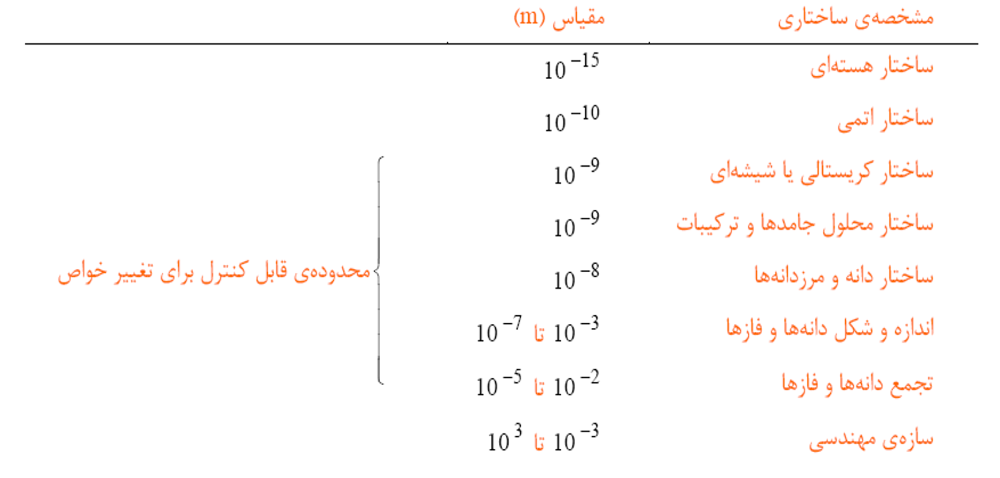
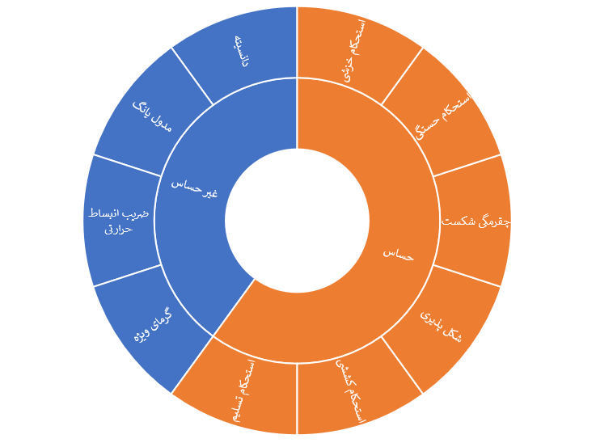
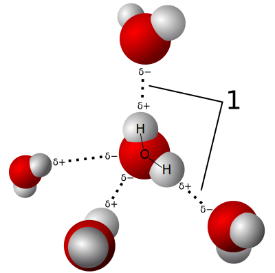
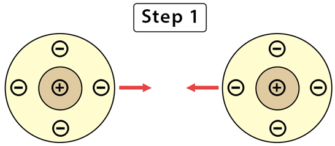
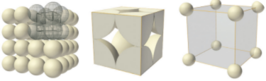
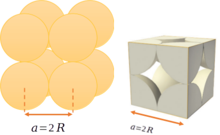

# خواص مواد مهندسی

**دکتر اعظم بیگی خردمند**

^^^

## منابع

1. W. F. Smith, *Principles of Materials Science and Engineering*, 3rd Edition, McGraw Hill, 1996.
2. K. G. Budinski and M. K. Budinski, *Engineering Materials: Properties and Selection*, 7th Edition, Prentice Hall, 2002.

^^^

## فصل اول

^^^

### تاریخچه

- متالورژی به عنوان صنعت مادر حدود 6-7 هزار سال پیش شکل گرفت.
- مس اولین فلزی بود که به صورت خالص استخراج شد.

^^^

### انواع مواد مهندسی

**فلزات:**

- رسانای خوب حرارت و الکتریسیته
- شکل‌پذیر (به دلیل پیوند فلزی)

**سرامیک‌ها:**

- پیوندهای کووالانسی و یونی
- سختی و مقاومت حرارتی بالا

**پلیمرها:**

- تشکیل شده از مولکول‌های بزرگ و طویل

^^^

### فلزها

- `چیدمان اتمی منظم و فشرده`
- `چگالی بالا`
- `صلبیت`
- `استحکام`
- `انعطاف‌پذیری`
- `مقاومت به رشد ترک`
- `هدایت گرمایی`
- `هدایت الکتریکی`
- `عدم انتقال نور`
- `بیشترین کاربرد در مهندسی`

^^^

### فلزات آهنی

- `چُدن‌ها`: آلیاژهای آهن-کربن با کمتر از 2% کربن
  - `چُدن سفید`
  - `چُدن‌های گرافیتی`
  - `چُدن خاکستری`
  - `چُدن داکتیل (نشکن)`
  - `چُدن مالیبل (چکشخوار)`
- `فولادها`: آلیاژهای آهن-کربن با بیشتر از 2% کربن
  - `ساده کربنی`
  - `کم آلیاژ`
  - `زنگ نزن`
  - `ابزار`

^^^

### سرامیک‌ها

- `تُرد`
- `مقاومت دمایی`
- `انعطاف‌پذیری کم`
- `مقاومت شیمیایی`
- `عایق جریان`
- `استثنا: برخی الکتروسرامیک‌ها رسانا هستند` (در ساخت ترانزیستورها، یکسو کننده‌ها، و ICها)

^^^

### کاربرد سرامیک‌ها

- `مصالح ساختمانی`
- `شیشه‌ها و شیشه‌های هوشمند`
- `ساینده‌ها`
- `مته‌ها و ابزار برش`
- `سیمان‌ها`
- `سرامیک‌های پوششی`
- `بیوسرامیک‌ها`
- `فیلترها`
- `کاتالیست‌ها`
- `الکتروسرامیک‌ها`

^^^

### پلیمرها

- `مقاومت دمایی`
- `تُرد در دمای زیر صفر`
- `شکل‌پذیر در دمای بالا`
- `متلاشی در دمای خیلی بالا`
- `کم چگال`
- `عایق جریان`
- `پایداری شیمیایی در دمای محیط`

^^^

### مقایسه سه ماده اصلی

| ویژگی                   | سرامیک       | فلز          | پلیمر       |
|-------------------------|--------------|--------------|-------------|
| سختی                    | بسیار بالا   | متوسط       | کم          |
| مدول الاستیسیته         | بالا         | متوسط       | پایین       |
| استحکام در دمای بالا    | بسیار بالا   | بالا         | پایین       |
| انبساط حرارتی           | کم           | متوسط       | زیاد        |
| شکل‌پذیری               | کم           | زیاد         | زیاد        |
| مقاومت به خوردگی        | بسیار بالا   | بسته به نوع  | متوسط تا زیاد |
| مقاومت به سایش          | بالا         | متوسط       | کم          |
| رسانایی الکتریکی        | کم           | بسیار بالا   | بسیار کم    |
| چگالی                   | بالا         | بالا         | کم          |
| رسانایی حرارتی          | کم           | بالا         | بسیار کم    |

^^^

### کامپوزیت‌ها

- اجزاء مواد کامپوزیتی از نظر شکل و ترکیب شیمیایی متفاوت هستند.
- اجزاء در یکدیگر حل نمی‌شوند (مخلوط می‌شوند).
- ایجاد موادی با خواص جدید.
- دارای خواص بهتر نسبت به اجزاء اولیه.

^^^

### مواد مدرن

- نیمه‌هادی‌ها
- مواد زیستی
- مواد هوشمند
- مواد نانو  

^^^

### مواد هوشمند بر اساس محرک‌ها

- آلیاژ حافظه شکلی
- سرامیک پیزوالکتریک
- مواد مغناطیسی
- مواد الکترو/مغناطیسی  

^^^

### محورهای اصلی علم مواد

- فرایند
- ساختار
- خواص
- کارایی  

^^^

### تأثیر محورهای اصلی بر هم

- علم مواد به بررسی ارتباط بین چهار عنصر می‌پردازد:
  - ساختار تابعی از فرایند ساخت است.
  - عملکرد تابعی از ویژگی‌های ماده است.

برای مثال، تأثیر فرایند در ساختار، ویژگی و عملکرد در برابر نور.

^^^

### تأثیر فرایند ساخت در آلومینیم اکسید

- یک قرص تک‌بلور و شفاف
- یک قرص چندبلوری نیمه‌کدر
- یک قرص چندبلوری کاملاً مات

^^^

### چرا علم مواد؟

برای موفقیت به عنوان مهندس، باید اطلاعاتی درباره ساختار و ویژگی‌های مواد و تأثیر آن‌ها در فرایند ساخت برای دستیابی به عملکرد بهتر داشته باشیم.

^^^

### سطوح ساختار مواد

^^^

### حساسیت به ریزساختار

**خواص غیر حساس:**

- دانسیته
- مدول یانگ
- ضریب انبساط حرارتی
- گرمای ویژه

**خواص حساس:**

- استحکام تسلیم
- استحکام کششی
- شکل‌پذیری
- چقرمگی شکست
- استحکام خستگی
- استحکام خزشی

^^^

### انواع خواص مواد

- مکانیکی
- الکتریکی
- حرارتی
- مغناطیسی
- نوری
- استهلاکی

^^^

### ساختار اتمی

**اتم:**

- پروتون (مثبت)
- نوترون (خنثی)
- الکترون (منفی)

**نمایش ساختار هسته‌ای اتم:**

- عدد اتمی ($Z$): تعداد پروتون‌ها
- عدد جرمی ($A$): تعداد پروتون‌ها + نوترون‌ها

  $$A = Z + N$$
  
- عدد آووگادرو ($N_A$):
  
  $$N_A = 6.02 \times 10^{23}$$

^^^

### ساختار الکترونی

**والانس (n):**

- تعداد الکترون‌های لایه آخر
- تعیین‌کننده خواص شیمیایی

#### دسته‌بندی بر اساس والانس ←

**الکترونگاتیویته:**

- تمایل به جذب الکترون (الکترونگاتیو) مثل نافلزات
- تمایل به از دست دادن الکترون (الکتروپوزیتیو) مثل فلزات

| n | نوع |
|--- | --- |
| 1, 2, 3 | فلز |
| 4 | شبه فلز |
| 5, 6, 7 | نافلز |
| 8 | گاز نجیب |

**جدول تناوبی:**

- اساس چیدمان: آرایش الکترونی عناصر

^^^

### پیوندهای بین اتمی

**پیوندهای اولیه (اصلی) (پیوند قوی):**

- یونی
- کووالانسی
- فلزی

**پیوندهای ثانویه (فرعی) (پیوند نسبتاً ضعیف):**

- واندروالس
- هیدروژنی

**نکته:** در این پیوندها انتقال و اشتراک الکترون وجود ندارد.

^^^

### پیوند فلزی

- در فلزات و آلیاژها
- مشخصه: الکترون آزاد
- مدل: "دریای الکترون آزاد"
- ماهیت: غیرجهت‌دار
- عامل اتصال: جاذبه بین الکترون‌های آزاد و هسته‌های یونی با بار مثبت

**نکته 1:** در مدل دریای الکترون آزاد، الکترون‌های آزاد به اتم‌های خاص تعلق ندارند.

**نکته 2:** الکترون‌های غیر والانس باقیمانده و هسته اتم، تشکیل هسته‌های یونی با بار خالص مثبت را می‌دهند که در دریای الکترون شناورند.

^^^

### پیوند یونی

- در بسیاری از سرامیک‌ها و ترکیباتی که شامل یک الکترونگاتیو و یک الکتروپوزیتیو هستند
- مشخصه: انتقال و داد و ستد الکترون‌ها
- ماهیت: غیرجهت‌دار
- عامل اتصال: جاذبه الکترواستاتیکی بین یون‌های مثبت و منفی
- عنصر فلزی با دادن الکترون لایه ظرفیت به نافلز، به هر دو عنصر امکان رسیدن به آرایش گاز پایدار را می‌دهد.
- هر چه اختلاف الکترونگاتیو (فلز-غیرفلز) بیشتر باشد، پیوند یونی قوی‌تر یا انرژی پیوند بیشتر است.

**ویژگی‌ها:**

- سخت
- شکننده
- عایق
- نقطه ذوب بالا
- عدم قابلیت تغییر شکل پلاستیک
- هدایت الکتریکی بسیار کم (در حالت مذاب و توسط یون‌ها)

^^^

### پیوند کووالانسی

- در الماس، سیلیکون و ژرمانیوم
- بین دو غیر فلز یا بین هیدروژن و یک غیر فلز
- مشخصه: شراکت الکترون‌ها
- ماهیت: جهت‌دار
- عامل اتصال: نزدیک شدن دو هسته موجب ایجاد اربیتال الکترونی جدید شامل الکترون‌های شراکت گذاشته شده می‌شود.
- به علت نامتقارن بودن شکل اربیتال‌ها، قدرت پیوند بین اتمی در تمام جهات یکسان نیست.

**ویژگی‌ها:**

- ترد
- چکش‌خواری ضعیف
- سختی بسیار زیاد (الماس ≠ بیسموت)
- نقطه ذوب بسیار بالا
- عایق الکتریکی (برای حرکت الکترون باید پیوند شکسته شود که به دما و انرژی زیاد نیاز دارد)

^^^

### پیوند واندروالس

- بین گازهای ایده‌آل (مانند آرگون، نئون) یا مولکول‌های پایدار مانند متان و مواد آلی دیگر در حالت مایع یا جامد
- ارتباطی به الکترون‌های ظرفیت ندارد
- عامل اتصال: دو قطبی‌های مولکولی یا اتمی است که به صورت دائم یا موقتی به وجود می‌آیند.

**ویژگی‌ها:**

- پیوند ضعیف
- در اثر ارتعاشات حرارتی از بین خواهند رفت

^^^

### پیوند هیدروژنی

- در مولکول‌های غیر آلی (مانند آب) و آلی (مانند DNA)
- عامل اتصال: همراه شدن هیدروژن با یکی از عناصر با الکترونگاتیوی بالا (اکسیژن، نیتروژن، فلوئور)

**ویژگی‌ها:**

- پیوند ضعیف
- در اثر ارتعاشات حرارتی از بین خواهند رفت

^^^

### پیوندهای هیبریدی (ترکیبی)

- در بسیاری از مواد، پیوندهای بین اتمی ترکیبی از پیوندهای اولیه یا ثانویه است.

^^^

### انرژی پیوند

- منحنی تغییرات نیروی بین اتمی (و انرژی پتانسیل) بر حسب فاصله بین اتمی
- با نزدیک شدن دو اتم به هم؛ دو نوع نیروی بین اتمی (جاذبه و دافعه) بین آن‌ها شکل می‌گیرد.
- نیروی جاذبه: وابسته به نوع پیوند اتمی از نیروی بین مراکز با بار مثبت و منفی است.
- نیروی دافعه: هم‌پوشانی الکترون‌های لایه آخر که با نزدیک شدن دو اتم، افزایش می‌یابد.
- نیروی خالص: مجموع این دو نیرو است.

**نکته:** هنگامی که نیروی خالص برابر صفر شود، اتم‌ها در فاصله تعادل قرار دارند.

^^^

### انرژی پیوند

**نکته:** مهم‌ترین مشخصه منحنی انرژی پیوند، نقطه مینیمم آن است. انرژی متناظر با فاصله تعادلی، انرژی پیوند است. انرژی پیوندی حداقل انرژی برای جدا کردن یا شکستن پیوند است.

| نوع پیوند | انرژی پیوند $(kJ/mol)$ |
| --- | --- |
| یونی | $625-1550$ |
| کووالانسی | $520-1250$ |
| فلزی | $100-800$ |
| واندروالسی | $< 40$ |

^^^

### انرژی پیوند

**افزایش انرژی پیوند:**

- دماي ذوب افزايش می‌یابد
- مدول یانگ افزایش می‌یابد
- ضریب انبساط حرارتی کاهش می‌یابد

**در مقیاس اتمی:** مقدار مدول یانگ تابعی از مقاومت پیوند اتمی در برابر تغییر فاصله تعادلی اتم‌هاست. مدول یانگ متناسب با شیب نمودار نیروهای بین اتمی بر حسب فاصله در نقطه تعادلی است:

$$
aE \propto - \left(\frac{dF}{dr_0}\right)_{r = r_0}
$$

^^^

## فصل دوم

^^^

### نظم اتمی

1. **بی نظم**: مانند گازها
2. **کریستال**: نظم بلند دامنه، عدد همسایگی ثابت، نظم تکرار شونده (آرایش پریودی) طی انجماد
3. **آمورف**: نظم کم دامنه، عدد همسایگی متغیر، نظم تا چند فاصله اتمی حفظ می‌شود، سریع سرد کردن مذاب با سرعت بالا برای تولید آمورف فلزی

^^^

### ساختار کریستالی

**کریستال**: مجموعه اتم‌هایی که با نظم معین در تمام حجم توزیع شده‌اند. از اتصال فرضی مرکز اتم‌ها، سیستم سه‌بعدی شامل تعداد زیادی متوازی‌السطوح که شبکه بلوری را تشکیل می‌دهند، ایجاد می‌شود. کوچک‌ترین متوازی‌السطوح تکرار شونده در تمام سه جهت، حجم بلور را سلول واحد کویند می‌نامند.

^^^

### سیستم‌های بلوری

دسته‌بندی برای راحتی ساختارهای بلوری بر مبنای شکل سلول واحد یا آرایش اتمی گروه است. این روش فقط بر پایه شکل سلول واحد بدون توجه به موقعیت اتم‌ها در سلول واحد است. در این روش یک سیستم مختصاتی برقرار می‌شود که شامل:

1. طول بردار در امتداد محور
2. طول بردار در امتداد محور
3. طول بردار در امتداد محور
4. زاویه بین بردارها و
5. زاویه بین بردارها و
6. زاویه بین بردارها و

^^^

### سیستم‌های بلوری

هفت ترکیب احتمالی وجود دارد که هرکدام یک سیستم بلوری یا سیستم تبلور جداگانه را مشخص می‌کنند که ۱۴ حالت به وجود می‌آید و به ۱۴ شبکه براوه معروفند:

- مکعبی
- تتراگونال
- هگزاگونال
- ارتورمبیک
- رمبوهدرال
- مونوکلینیك
- تری‌کلینیك

^^^

### سیستم‌های بلوری

بیشتر فلزات از سیستم‌های مکعبی یا هگزاگونال متبلور می‌شوند.

| حالت‌های مکعبی | انگلیسی | اختصار | شکل |
| --- | --- | --- | --- |
| مکعبی ساده | Simple Cubic | SC |  |
| مکعبی مرکزدار | Body Centered Cubic | BCC |  |
| مکعبی با سطوح مرکز دار | Face Centered Cubic | FCC |  |

^^^

### اندیس‌های بلوری (جهات)

جهات و صفحات بلوری در فضا توسط علائمی به نام اندیس‌های بلوری تعریف می‌گردند. عموماً از سیستم میلر برای اندیس‌گذاری صفحات و جهات بلوری استفاده می‌شود.

**روش تعیین اندیس‌های جهات در شبکه مکعبی:**

- از مبدا مختصات برداری به موازات جهت مورد نظر رسم می‌شود.
- مؤلفه‌های بردار بر روی سه محور مختصات تعیین می‌شوند.
- مؤلفه‌های بردار به کوچک‌ترین اعداد صحیح تبدیل می‌شوند.

^^^

### اندیس‌های بلوری (صفحات)

**روش تعیین اندیس‌های صفحات در شبکه مکعبی:**

1. نقاط تقاطع صفحه مورد نظر با محورهای مختصات را مشخص کنید.
2. معکوس مختصات نقاط تقاطع با محورها را محاسبه کنید.
3. این مقادیر را به کوچک‌ترین اعداد صحیح تبدیل کنید تا اندیس‌های میلر صفحه به دست آید.

^^^

### اندیس‌های بلوری (صفحات)

**اندیس میلر** یک جهت در براکت و به صورت $[hkl]$ نشان داده می‌شود، اما تمام جهات هم‌نوع به صورت $\langle hkl \rangle$ نمایش داده می‌شوند. به عنوان مثال، اندیس جهات قطری در مکعب به شکل $\langle 111 \rangle$ نشان داده می‌شود که شامل چهار جهت زیر است:

$$
[\bar{1}11], [1\bar{1}1], [11\bar{1}], [111]
$$

^^^

### اندیس‌های بلوری (صفحات)

اندیس میلر یک صفحه در پرانتز و به صورت $(hkl)$ نشان داده می‌شود. اما تمام صفحات هم‌نوع به صورت $\{hkl\}$ نمایش داده می‌شوند. به عنوان مثال، اندیس صفحات اکتاهدرال در مکعب به شکل $\{111\}$ نشان داده می‌شود که شامل چهار صفحه زیر است:

$$
(1\bar{1}1), (\bar{1}11), (11\bar{1}), (\bar{1}\bar{1}\bar{1})
$$

^^^

^^^

### اندیس‌های بلوری (صفحات)

**نکته مهم:**  
اندیس میلر یک صفحه و جهت عمود بر آن صفحه یکسان هستند.  
به عنوان مثال، اندیس وجه مکعب که عمود بر محور $ [100] $ است، برابر با $ (100) $ است و اندیس محور $ [100] $ نیز برابر با $ (100) $ است. همچنین، اندیس صفحه اکتاهدرال در مکعب $ (111) $ و اندیس قطر مکعب که عمود بر آن است نیز $ [111] $ است.

^^^

### اندیس‌های بلوری (صفحات) در شبکه هگزاگونال

**نکته:**  
اندیس میلر صفحات و جهات در بلورهای هگزاگونال به صورت چهار رقمی بیان می‌شود و همواره به فرم $ (hkil) $ است. در اینجا $ h $، $ k $ و $ i $ مربوط به سه محور در صفحه پایه هستند و $ l $ به محور عمود بر صفحه پایه اشاره دارد. رابطه زیر بین $ h $ و $ k $ و $ i $ برقرار است:

$$
i = -(h + k)
$$

^^^

### اندیس‌های بلوری (صفحات)

^^^

### ساختار بلوری فلزات

اغلب فلزات به صورت یکی از ساختارهای ساده زیر متبلور می‌شوند:

1. **مکعبی**
   - مکعب ساده (Simple Cubic - SC)
   - مکعب مرکز دار (Body Centered Cubic - BCC)
   - مکعب با وجوه مرکزدار (Face Centered Cubic - FCC)
2. **هگزاگونال فشرده**  
   - (Hexagonal Closed Pack - HCP)

^^^

^^^

### سیستم مکعبی ساده (SC)

در این سیستم، اتم‌ها در گوشه‌های مکعب قرار دارند.  
هر اتم در گوشه مکعب به 8 سلول تعلق دارد.  
سهم هر سلول از اتم‌های واقع در رئوس، یک هشتم است.

^^^

### سیستم مکعبی ساده (SC)

**کرات سخت (Hard-Ball Model):**  
مدل ساختار کره‌های سخت در یک بلور فلزی.  
شعاع ($ R $) هر کره نصف فاصله مراکز دو اتم چسبیده به هم است.  
محاسبه شعاع اتمی بر اساس یال مکعب (پارامتر شبکه - Lattice Parameter) انجام می‌شود.  
اگر یال شبکه در مکعبی ساده $ a $ باشد:

در این صورت، حجم شبکه خواهد بود:

$$
V = a^3
$$

^^^

### عدد همسایگی

عدد همسایگی به تعداد نزدیک‌ترین اتم‌های همسایه به یک اتم در شبکه اشاره دارد.  
در شبکه مکعبی ساده (SC)، هر اتم دارای 6 اتم همسایه نزدیک است.

^^^

### ضریب تراکم اتمی

نسبت حجم اتم‌ها به حجم سلول واحد، ضریب تراکم اتمی (Atomic Packing Factor - APF) نامیده می‌شود.

^^^

### تراکم چگالی صفحه‌ای

تراکم چگالی صفحه‌ای (Plane Packing Density - PPD) به کسری از مساحت یک صفحه اتمی که توسط اتم‌ها اشغال شده اشاره دارد.  
برای مثال، در سیستم SC، سه صفحه متراکم وجود دارد.  
محاسبه تراکم چگالی صفحه‌ای برای صفحه $[100]$ در سیستم SC:

$$
PPD_{[100]} = \frac{4 \times \frac{1}{4} \times \pi R^2}{a^2} = \frac{\pi R^2}{(2R)^2} = 0.785
$$

این یعنی 78.5% از مساحت صفحه $[100]$ توسط اتم‌ها اشغال شده است.

^^^

### تراکم چگالی خطی

جهات فشرده و متراکم به جهاتی گفته می‌شود که در آن‌ها اتم‌ها با یکدیگر مماس هستند. در سیستم مکعبی ساده (SC)، یال‌های مکعب، جهات فشرده ساختار هستند. در این سیستم، سه جهت متراکم داریم.

تأثیر تراکم اتمی کم بر سیستم مکعبی:

- این ساختار پرانرژی است.
- رخداد این نوع ساختار بلوری نادر است (عنصر پلونیوم $ \text{Po} $ و اکسیژن و فلوئور در حالت جامد).

شبکه بلوری مکعبی ساده سدیم کلرید (NaCl) یک جامد یونی است. هر یون توسط 6 یون غیر هم‌نام احاطه شده است.

^^^

### سیستم مکعبی مرکزدار (BCC)

در سیستم مکعبی مرکزدار (Body-Centered Cubic - BCC)، هر اتم واقع در گوشه مکعب به 8 سلول تعلق دارد. سهم هر سلول از اتم‌های واقع در رئوس، یک هشتم است. اتم مرکزی فقط به همان سلول تعلق دارد، بنابراین در کل سهم هر سلول 2 اتم است.

^^^

### سیستم مکعبی مرکزدار (BCC)

در ساختار BCC، اتم مرکزی با اتم‌های واقع در گوشه‌ها در یک راستا قرار دارند. چهار قطر مکعب $\langle 111 \rangle$ جهات فشرده ساختار هستند و شش صفحه $\{110\}$ صفحات متراکم این سیستم هستند. 

اتم مرکزی و اتم‌های گوشه‌ها شباهت دارند، و چیدمان صفحات اتمی در این ساختار به صورت ABABAB… است. 

در ساختار مکعبی مرکزدار، اگر اندازه یال شبکه $ a $ باشد، شعاع اتمی $ R $ در BCC با اندازه یال شبکه $ a $ رابطه دارد:

$$
(4R)^2 = a^2 + (a\sqrt{2})^2 \Rightarrow a = \frac{4R}{\sqrt{3}}
$$

این رابطه نشان‌دهنده ارتباط بین شعاع اتمی و اندازه یال شبکه در ساختار مکعبی مرکزدار است.

^^^
