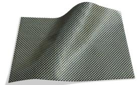
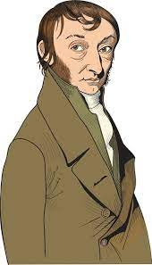
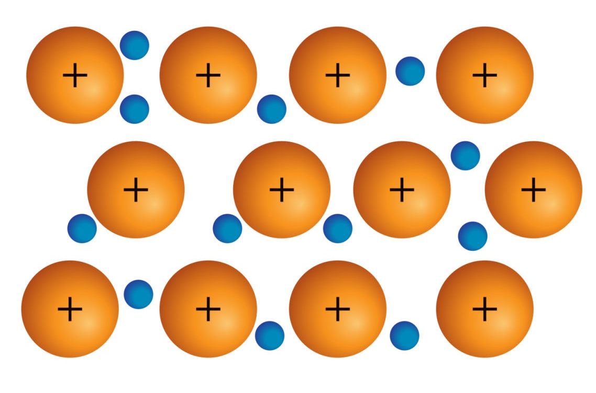
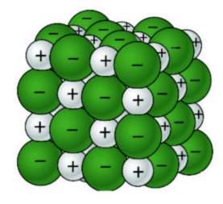
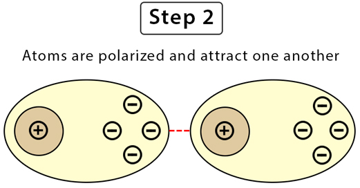
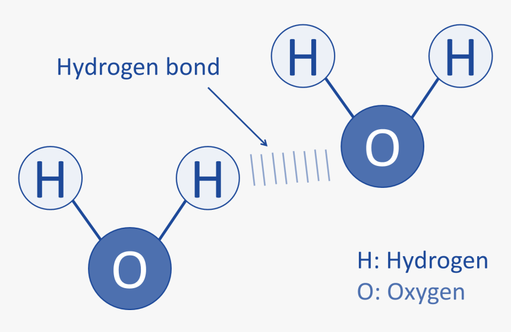
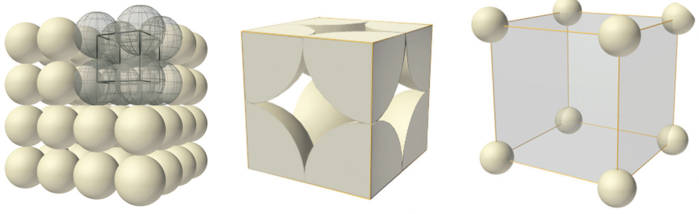
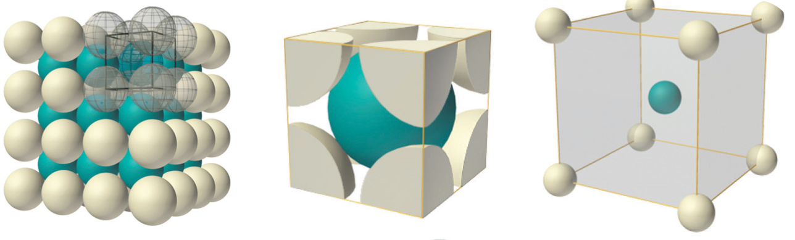
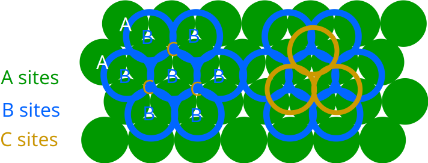

# **خواص مواد مهندسی**

## دکتر اعظم بیگی خردمند

^^^

### منابع

1. W. F. Smith, *Principles of Materials Science and Engineering*, 3rd Edition, McGraw Hill, 1996.
2. K. G. Budinski and M. K. Budinski, *Engineering Materials: Properties and Selection*, 7th Edition, Prentice Hall, 2002.

^^^

## فصل اول

^^^

### تاریخچه

- متالورژی به عنوان صنعت مادر حدود 6-7 هزار سال پیش شکل گرفت.
- مس اولین فلزی بود که به صورت خالص استخراج شد.

<!--  -->

^^^

### انواع مواد مهندسی

**فلزات:**

- رسانای خوب حرارت و الکتریسیته
- شکل‌پذیر (به دلیل پیوند فلزی)

**سرامیک‌ها:**

- پیوندهای کووالانسی و یونی
- سختی و مقاومت حرارتی بالا

**پلیمرها:**

- تشکیل شده از مولکول‌های بزرگ و طویل

^^^

### فلزها

- چیدمان اتمی منظم و فشرده
- چگالی بالا
- صلبیت
- استحکام
- انعطاف‌پذیری
- مقاومت به رشد ترک
- هدایت گرمایی
- هدایت الکتریکی
- عدم انتقال نور
- بیشترین کاربرد در مهندسی

<!--  -->

^^^

### فلزات آهنی

- چُدن‌ها: آلیاژهای آهن-کربن با کمتر از 2% کربن
  - چُدن سفید
  - چُدن‌های گرافیتی
  - چُدن خاکستری
  - چُدن داکتیل (نشکن)
  - چُدن مالیبل (چکشخوار)
- فولادها: آلیاژهای آهن-کربن با بیشتر از 2% کربن
  - ساده کربنی
  - کم آلیاژ
  - زنگ نزن
  - ابزار

^^^

### سرامیک‌ها

- تُرد
- مقاومت دمایی
- انعطاف‌پذیری کم
- مقاومت شیمیایی
- عایق جریان
- استثنا: برخی الکتروسرامیک‌ها رسانا هستند (در ساخت ترانزیستورها، یکسو کننده‌ها، و ICها)

<!--  -->

^^^

### کاربرد سرامیک‌ها

- مصالح ساختمانی
- شیشه‌ها و شیشه‌های هوشمند
- ساینده‌ها
- مته‌ها و ابزار برش
- سیمان‌ها
- سرامیک‌های پوششی
- بیوسرامیک‌ها
- فیلترها
- کاتالیست‌ها
- الکتروسرامیک‌ها

^^^

### پلیمرها

- مقاومت دمایی
- تُرد در دمای زیر صفر
- شکل‌پذیر در دمای بالا
- متلاشی در دمای خیلی بالا
- کم چگال
- عایق جریان
- پایداری شیمیایی در دمای محیط

<!--  -->

^^^

### مقایسه سه ماده اصلی

| **ویژگی**                   | **سرامیک**       | **فلز**          | **پلیمر**       |
|-------------------------|--------------|--------------|-------------|
| **سختی**                    | بسیار بالا   | متوسط       | کم          |
| **مدول الاستیسیته**         | بالا         | متوسط       | پایین       |
| **استحکام در دمای بالا**    | بسیار بالا   | بالا         | پایین       |
| **انبساط حرارتی**           | کم           | متوسط       | زیاد        |
| **شکل‌پذیری**               | کم           | زیاد         | زیاد        |
| **مقاومت به خوردگی**        | بسیار بالا   | بسته به نوع  | متوسط تا زیاد |
| **مقاومت به سایش**          | بالا         | متوسط       | کم          |
| **رسانایی الکتریکی**        | کم           | بسیار بالا   | بسیار کم    |
| **چگالی**                   | بالا         | بالا         | کم          |
| **رسانایی حرارتی**          | کم           | بالا         | بسیار کم    |

^^^

### کامپوزیت‌ها

- اجزاء مواد کامپوزیتی از نظر شکل و ترکیب شیمیایی متفاوت هستند.
- اجزاء در یکدیگر حل نمی‌شوند (مخلوط می‌شوند).
- ایجاد موادی با خواص جدید.
- دارای خواص بهتر نسبت به اجزاء اولیه.

<!-- 
 -->

^^^
`
### مواد مدرن

- نیمه‌هادی‌ها
- مواد زیستی
- مواد هوشمند
- مواد نانو  

<!-- 
 -->

^^^

### مواد هوشمند بر اساس محرک‌ها

- آلیاژ حافظه شکلی
- سرامیک پیزوالکتریک
- مواد مغناطیسی
- مواد الکترو/مغناطیسی  

<!--  -->

^^^

### محورهای اصلی علم مواد

- فرایند
- ساختار
- خواص
- کارایی  

<!--  -->

^^^

### تأثیر محورهای اصلی بر هم

- علم مواد به بررسی ارتباط بین چهار عنصر می‌پردازد:
  - ساختار تابعی از فرایند ساخت است.
  - عملکرد تابعی از ویژگی‌های ماده است.

برای مثال، تأثیر فرایند در ساختار، ویژگی و عملکرد در برابر نور.

<!--  -->

^^^

### تأثیر فرایند ساخت در آلومینیم اکسید

- یک قرص تک‌بلور و شفاف
- یک قرص چندبلوری نیمه‌کدر
- یک قرص چندبلوری کاملاً مات

<!--  -->

^^^

### چرا علم مواد؟

برای موفقیت به عنوان مهندس، باید اطلاعاتی درباره ساختار و ویژگی‌های مواد و تأثیر آن‌ها در فرایند ساخت برای دستیابی به عملکرد بهتر داشته باشیم.

^^^

### سطوح ساختار مواد

^^^

### حساسیت به ریزساختار

| **خواص غیر حساس** | **خواص حساس** |
| --- | --- |
| دانسیته | استحکام تسلیم |
| مدول یانگ | استحکام کششی |
| ضریب انبساط حرارتی | شکل‌پذیری |
| گرمای ویژه | چقرمگی شکست |
|  | استحکام خستگی |
|  | استحکام خزشی |

<!--  -->

^^^

### انواع خواص مواد

- مکانیکی
- الکتریکی
- حرارتی
- مغناطیسی
- نوری
- استهلاکی

^^^

### ساختار اتمی

**اتم:**

- پروتون (مثبت)
- نوترون (خنثی)
- الکترون (منفی)

**نمایش ساختار هسته‌ای اتم:**

- عدد اتمی ($Z$): تعداد پروتون‌ها
- عدد جرمی ($A$): تعداد پروتون‌ها + نوترون‌ها

  $$A = Z + N$$
  
- عدد آووگادرو ($N_A$):
  
  $$N_A = 6.02 \times 10^{23}$$

^^^

### ساختار الکترونی

**والانس (n):**

- تعداد الکترون‌های لایه آخر
- تعیین‌کننده خواص شیمیایی

^^^

### دسته‌بندی بر اساس والانس بخش اول

**الکترونگاتیویته:**

- تمایل به جذب الکترون (الکترونگاتیو) مثل نافلزات
- تمایل به از دست دادن الکترون (الکتروپوزیتیو) مثل فلزات

| **n** | **نوع** |
|--- | --- |
| 1, 2, 3 | فلز |
| 4 | شبه فلز |
| 5, 6, 7 | نافلز |
| 8 | گاز نجیب |

^^^

### دسته‌بندی بر اساس والانس بخش دوم

**جدول تناوبی:**

- اساس چیدمان: آرایش الکترونی عناصر

^^^

### پیوندهای بین اتمی

- **پیوندهای اولیه (اصلی) (پیوند قوی)**
- **پیوندهای ثانویه (فرعی) (پیوند نسبتاً ضعیف):**

^^^

### **پیوندهای اولیه (اصلی) (پیوند قوی):**

- یونی
- کووالانسی
- فلزی

^^^

### **پیوندهای ثانویه (فرعی) (پیوند نسبتاً ضعیف):**

- واندروالس
- هیدروژنی

**نکته:** در این پیوندها انتقال و اشتراک الکترون وجود ندارد.

^^^

### پیوند فلزی

- در فلزات و آلیاژها
- مشخصه: الکترون آزاد
- مدل: "دریای الکترون آزاد"
- ماهیت: غیرجهت‌دار
- عامل اتصال: جاذبه بین الکترون‌های آزاد و هسته‌های یونی با بار مثبت

**نکته 1:** در مدل دریای الکترون آزاد، الکترون‌های آزاد به اتم‌های خاص تعلق ندارند.

**نکته 2:** الکترون‌های غیر والانس باقیمانده و هسته اتم، تشکیل هسته‌های یونی با بار خالص مثبت را می‌دهند که در دریای الکترون شناورند.

^^^

### پیوند یونی

- در بسیاری از سرامیک‌ها و ترکیباتی که شامل یک الکترونگاتیو و یک الکتروپوزیتیو هستند
- مشخصه: انتقال و داد و ستد الکترون‌ها
- ماهیت: غیرجهت‌دار
- عامل اتصال: جاذبه الکترواستاتیکی بین یون‌های مثبت و منفی
- عنصر فلزی با دادن الکترون لایه ظرفیت به نافلز، به هر دو عنصر امکان رسیدن به آرایش گاز پایدار را می‌دهد.
- هر چه اختلاف الکترونگاتیو (فلز-غیرفلز) بیشتر باشد، پیوند یونی قوی‌تر یا انرژی پیوند بیشتر است.

^^^

### ویژگی‌ها پیوند یونی

- سخت
- شکننده
- عایق
- نقطه ذوب بالا
- عدم قابلیت تغییر شکل پلاستیک
- هدایت الکتریکی بسیار کم (در حالت مذاب و توسط یون‌ها)

^^^

### پیوند کووالانسی

- در الماس، سیلیکون و ژرمانیوم
- بین دو غیر فلز یا بین هیدروژن و یک غیر فلز
- مشخصه: شراکت الکترون‌ها
- ماهیت: جهت‌دار
- عامل اتصال: نزدیک شدن دو هسته موجب ایجاد اربیتال الکترونی جدید شامل الکترون‌های شراکت گذاشته شده می‌شود.
- به علت نامتقارن بودن شکل اربیتال‌ها، قدرت پیوند بین اتمی در تمام جهات یکسان نیست.

^^^

### ویژگی‌ها پیوند کووالانسی

- ترد
- چکش‌خواری ضعیف
- سختی بسیار زیاد (الماس ≠ بیسموت)
- نقطه ذوب بسیار بالا
- عایق الکتریکی (برای حرکت الکترون باید پیوند شکسته شود که به دما و انرژی زیاد نیاز دارد)

^^^

### پیوند واندروالس

- بین گازهای ایده‌آل (مانند آرگون، نئون) یا مولکول‌های پایدار مانند متان و مواد آلی دیگر در حالت مایع یا جامد
- ارتباطی به الکترون‌های ظرفیت ندارد
- عامل اتصال: دو قطبی‌های مولکولی یا اتمی است که به صورت دائم یا موقتی به وجود می‌آیند.

^^^

### ویژگی‌ها پیوند واندروالس

- پیوند ضعیف
- در اثر ارتعاشات حرارتی از بین خواهند رفت

^^^

### پیوند هیدروژنی

- در مولکول‌های غیر آلی (مانند آب) و آلی (مانند DNA)
- عامل اتصال: همراه شدن هیدروژن با یکی از عناصر با الکترونگاتیوی بالا (اکسیژن، نیتروژن، فلوئور)

^^^

### ویژگی‌ها پیوند هیدروژنی

- پیوند ضعیف
- در اثر ارتعاشات حرارتی از بین خواهند رفت

^^^

### پیوندهای هیبریدی (ترکیبی)

- در بسیاری از مواد، پیوندهای بین اتمی ترکیبی از پیوندهای اولیه یا ثانویه است.

^^^

### انرژی پیوند بخش اول

- منحنی تغییرات نیروی بین اتمی (و انرژی پتانسیل) بر حسب فاصله بین اتمی
- با نزدیک شدن دو اتم به هم؛ دو نوع نیروی بین اتمی (جاذبه و دافعه) بین آن‌ها شکل می‌گیرد.
- نیروی جاذبه: وابسته به نوع پیوند اتمی از نیروی بین مراکز با بار مثبت و منفی است.
- نیروی دافعه: هم‌پوشانی الکترون‌های لایه آخر که با نزدیک شدن دو اتم، افزایش می‌یابد.
- نیروی خالص: مجموع این دو نیرو است.

**نکته:** هنگامی که نیروی خالص برابر صفر شود، اتم‌ها در فاصله تعادل قرار دارند.

^^^

### انرژی پیوند بخش دوم

^^^

### انرژی پیوند بخش سوم

**نکته:** مهم‌ترین مشخصه منحنی انرژی پیوند، نقطه مینیمم آن است. انرژی متناظر با فاصله تعادلی، انرژی پیوند است. انرژی پیوندی حداقل انرژی برای جدا کردن یا شکستن پیوند است.

| **نوع پیوند** | **انرژی پیوند $(kJ/mol)$** |
| --- | --- |
| یونی | $625-1550$ |
| کووالانسی | $520-1250$ |
| فلزی | $100-800$ |
| واندروالسی | $< 40$ |

^^^

### انرژی پیوند بخش چهارم

**افزایش انرژی پیوند:**

- دماي ذوب افزايش می‌یابد
- مدول یانگ افزایش می‌یابد
- ضریب انبساط حرارتی کاهش می‌یابد

^^^

### انرژی پیوند بخش پنجم

**در مقیاس اتمی:** مقدار مدول یانگ تابعی از مقاومت پیوند اتمی در برابر تغییر فاصله تعادلی اتم‌هاست. مدول یانگ متناسب با شیب نمودار نیروهای بین اتمی بر حسب فاصله در نقطه تعادلی است:

$$aE \propto - \left(\frac{dF}{dr_0}\right)_{r = r_0}$$

^^^

## فصل دوم

^^^

### نظم اتمی

1. **بی نظم**: مانند گازها
2. **کریستال**: نظم بلند دامنه، عدد همسایگی ثابت، نظم تکرار شونده (آرایش پریودی) طی انجماد
3. **آمورف**: نظم کم دامنه، عدد همسایگی متغیر، نظم تا چند فاصله اتمی حفظ می‌شود، سریع سرد کردن مذاب با سرعت بالا برای تولید آمورف فلزی

^^^

### ساختار کریستالی

**کریستال**: مجموعه اتم‌هایی که با نظم معین در تمام حجم توزیع شده‌اند. از اتصال فرضی مرکز اتم‌ها، سیستم سه‌بعدی شامل تعداد زیادی متوازی‌السطوح که شبکه بلوری را تشکیل می‌دهند، ایجاد می‌شود. کوچک‌ترین متوازی‌السطوح تکرار شونده در تمام سه جهت، حجم بلور را سلول واحد کویند می‌نامند.

^^^

### سیستم‌های بلوری بخش اول

دسته‌بندی برای راحتی ساختارهای بلوری بر مبنای شکل سلول واحد یا آرایش اتمی گروه است. این روش فقط بر پایه شکل سلول واحد بدون توجه به موقعیت اتم‌ها در سلول واحد است. در این روش یک سیستم مختصاتی برقرار می‌شود که شامل:

1. طول بردار در امتداد محور
2. طول بردار در امتداد محور
3. طول بردار در امتداد محور
4. زاویه بین بردارها و
5. زاویه بین بردارها و
6. زاویه بین بردارها و

^^^

### سیستم‌های بلوری بخش دوم

هفت ترکیب احتمالی وجود دارد که هرکدام یک سیستم بلوری یا سیستم تبلور جداگانه را مشخص می‌کنند که ۱۴ حالت به وجود می‌آید و به ۱۴ شبکه براوه معروفند:

- مکعبی
- تتراگونال
- هگزاگونال
- ارتورمبیک
- رمبوهدرال
- مونوکلینیك
- تری‌کلینیك

^^^

### سیستم‌های بلوری بخش سوم

بیشتر فلزات از سیستم‌های مکعبی یا هگزاگونال متبلور می‌شوند.

| **حالت‌های مکعبی** | **انگلیسی** | **اختصار** | **شکل** |
| --- | --- | --- | --- |
| ***مکعبی ساده*** | Simple Cubic | SC |  |
| ***مکعبی مرکزدار*** | Body Centered Cubic | BCC |  |
| ***مکعبی با سطوح مرکز دار*** | Face Centered Cubic | FCC |  |

^^^

### اندیس‌های بلوری (جهات)

جهات و صفحات بلوری در فضا توسط علائمی به نام اندیس‌های بلوری تعریف می‌گردند. عموماً از سیستم میلر برای اندیس‌گذاری صفحات و جهات بلوری استفاده می‌شود.

**روش تعیین اندیس‌های جهات در شبکه مکعبی:**

- از مبدا مختصات برداری به موازات جهت مورد نظر رسم می‌شود.
- مؤلفه‌های بردار بر روی سه محور مختصات تعیین می‌شوند.
- مؤلفه‌های بردار به کوچک‌ترین اعداد صحیح تبدیل می‌شوند.

^^^

### اندیس‌های بلوری (صفحات) بخش اول

**روش تعیین اندیس‌های صفحات در شبکه مکعبی:**

1. نقاط تقاطع صفحه مورد نظر با محورهای مختصات را مشخص کنید.
2. معکوس مختصات نقاط تقاطع با محورها را محاسبه کنید.
3. این مقادیر را به کوچک‌ترین اعداد صحیح تبدیل کنید تا اندیس‌های میلر صفحه به دست آید.

^^^

### اندیس‌های بلوری (صفحات) بخش دوم

**اندیس میلر** یک جهت در براکت و به صورت $[hkl]$ نشان داده می‌شود، اما تمام جهات هم‌نوع به صورت $\langle hkl \rangle$ نمایش داده می‌شوند. به عنوان مثال، اندیس جهات قطری در مکعب به شکل $\langle 111 \rangle$ نشان داده می‌شود که شامل چهار جهت زیر است:

$$[\bar{1}11], [1\bar{1}1], [11\bar{1}], [111]$$

^^^

### اندیس‌های بلوری (صفحات) بخش سوم

اندیس میلر یک صفحه در پرانتز و به صورت $(hkl)$ نشان داده می‌شود. اما تمام صفحات هم‌نوع به صورت $\{hkl\}$ نمایش داده می‌شوند. به عنوان مثال، اندیس صفحات اکتاهدرال در مکعب به شکل $\{111\}$ نشان داده می‌شود که شامل چهار صفحه زیر است:

$$(1\bar{1}1), (\bar{1}11), (11\bar{1}), (\bar{1}\bar{1}\bar{1})$$

^^^

^^^

### اندیس‌های بلوری (صفحات) بخش چهارم

**نکته مهم:**  
اندیس میلر یک صفحه و جهت عمود بر آن صفحه یکسان هستند.  
به عنوان مثال، اندیس وجه مکعب که عمود بر محور $ [100] $ است، برابر با $ (100) $ است و اندیس محور $ [100] $ نیز برابر با $ (100) $ است. همچنین، اندیس صفحه اکتاهدرال در مکعب $ (111) $ و اندیس قطر مکعب که عمود بر آن است نیز $ [111] $ است.

^^^

### اندیس‌های بلوری (صفحات) در شبکه هگزاگونال

**نکته:**  
اندیس میلر صفحات و جهات در بلورهای هگزاگونال به صورت چهار رقمی بیان می‌شود و همواره به فرم $ (hkil) $ است. در اینجا $ h $، $ k $ و $ i $ مربوط به سه محور در صفحه پایه هستند و $ l $ به محور عمود بر صفحه پایه اشاره دارد. رابطه زیر بین $ h $ و $ k $ و $ i $ برقرار است:

$$i = -(h + k)$$

^^^

### اندیس‌های بلوری (صفحات)

^^^

### مقدمه‌ای بر ساختار بلوری فلزات

#### **ساختار بلوری فلزات**

- اغلب فلزات به یکی از ساختارهای زیر متبلور می‌شوند:
  - **مکعبی:**
    - مکعب ساده (SC)
    - مکعب مرکز دار (BCC)
    - مکعب با وجوه مرکزدار (FCC)
  - **هگزاگونال فشرده (HCP)**
- **تصویر:** نمایش انواع ساختارهای بلوری (فلزات بلوری)

^^^

### سیستم مکعبی ساده (SC)

- **ویژگی‌های ساختاری سیستم SC:**
  - **موقعیت اتم‌ها:** اتم‌ها در گوشه‌های مکعب قرار دارند.
  - **عدد همسایگی:** هر اتم دارای ۶ اتم همسایه نزدیک است.
  - **مدل کرات سخت (Hard-Ball Model):** شعاع هر کره نصف فاصله مراکز دو اتم چسبیده به هم است.
  - **حجم شبکه:**
    - اگر یال شبکه $a$ باشد، حجم شبکه خواهد بود:
  
      $$V = a^3$$

  - **تصویر:** سیستم مکعبی ساده (SC)
  
  

^^^

### تراکم و عدد همسایگی در SC

- **ضریب تراکم اتمی (APF):** نسبت حجم اتم‌ها به حجم سلول واحد.
- **تراکم چگالی صفحه‌ای (PPD):**
  - برای صفحه $ [100] $ در سیستم SC:
    $$PPD_{[100]} = \frac{\pi R^2}{(2R)^2} = 0.785$$

  

  - **جهات فشرده:** یال‌های مکعب جهات فشرده ساختار هستند.
  - **نمونه:** شبکه بلوری مکعبی ساده سدیم کلرید (NaCl)

  

^^^

### سیستم مکعبی مرکزدار (BCC) بخش اول

- **ویژگی‌های ساختاری سیستم BCC:**
  - **موقعیت اتم‌ها:** هر اتم گوشه به ۸ سلول تعلق دارد.
  - **سهم اتم مرکزی:** اتم مرکزی فقط به همان سلول تعلق دارد.
  - **کل تعداد اتم‌ها:** ۲ اتم در هر سلول واحد.
  
  

^^^

### سیستم مکعبی مرکزدار (BCC) بخش دوم

- **ساختار داخلی BCC:**
  - **جهات و صفحات فشرده:**
    - قطرهای مکعب $\langle 111\rangle$ جهات فشرده
    - صفحات $ \{110\} $ صفحات متراکم
  - **رابطه شعاع اتمی با یال شبکه:**
  
    $$a = \frac{4R}{\sqrt{3}}$$
  
  - **ضریب تراکم اتمی (APF):**
  
    $$APF = 0.68$$
  
  

^^^

### سیستم مکعبی با وجوه مرکزدار (FCC) بخش اول

- **ویژگی‌های ساختاری سیستم FCC:**
  - **تعداد اتم‌ها در هر سلول:**
    - هر اتم گوشه به ۸ سلول تعلق دارد.
    - هر اتم در مرکز هر وجه به ۲ سلول مجاور تعلق دارد.
    - در کل ۴ اتم در هر سلول واحد.
  
    $$\begin{rcases}8 \times \frac{1}{8} = 1\\\6 \times \frac{1}{2} = 3\end{rcases}\Rightarrow  1 + 3 = 4$$

^^^

### سیستم مکعبی با وجوه مرکزدار (FCC) بخش دوم

- **ویژگی‌های فیزیکی:**
  - وجود ۴ صفحه فشرده و ۳ جهت فشرده در هر صفحه.
  - تأثیر این ساختار بر خواص فیزیکی فلزات (مانند قابلیت تغییر شکل بالا).
  - بیشترین فشردگی به این ساختار اختصاص دارد

- **مثال‌ها:** آلومینیوم (Al)، مس (Cu)، طلا (Au)
  
  

^^^

### ساختار مکعبی با وجوه مرکزدار (FCC)

**ضریب تراکم اتمی و چگالی صفحه‌ای در FCC:**

- **APF (Atomic Packing Factor):**
  $$APF = 0.74$$
  
- **PPD[100] (Plane Packing Density):**
  $$PPD_{[100]} = \frac{\pi R^2 + 4 \times \frac{1}{4} \times \pi R^2}{a^2} = \frac{2 \pi R^2}{\left( \frac{4R}{\sqrt{2}} \right)^2} = 0.785$$

^^^

### ویژگی‌های هندسی و حجمی ساختار FCC

- **تعداد اتم‌ها در سلول واحد**: $4$
- **طول لبه سلول**: $ 4R = \sqrt{2}a $
- **حجم اتم**: $ \frac{4}{3} \pi \left(\sqrt{2}\frac{a}{4}\right)^3 $
- **حجم سلول واحد**: $ a^3 $

$$\text{APF} = \frac{4 \times \frac{4}{3}\times \pi \left(\sqrt{2}\frac{a}{4}\right)^3}{a^3}$$

- 

^^^

### ترتیب چیدمان در ساختار FCC

- **توالی چیدمان:** ABCABC...
- **نمایش دو بعدی:**
  
  
  
- **سلول واحد FCC:**
  
  

^^^

### تصاویر تکمیلی ساختار FCC

- 
- 

^^^

### چیدمان صفحات اتمی در ساختار FCC

- **توالی چیدمان متوالی صفحات اتمی:** ABCABCABC

**تصویر مربوطه:**

^^^

### ساختار هگزاگونال فشرده (HCP)

**ویژگی‌های ساختاری:**

- در ساختار HCP، اتم‌های صفحه بالایی سلول دقیقاً روی اتم‌های صفحه پایینی قرار دارند، اما اتم‌های صفحه میانی در موقعیت متفاوتی هستند.
- **توالی چیدمان:** ABAB...
- **نمایش سه‌بعدی و دو‌بعدی:** (تصاویر مرتبط در دسترس نیستند، لطفاً در صورت وجود اضافه کنید)

**ضریب تراکم اتمی و صفحه‌ای در HCP:**

- **APF:**
  $$APF = 0.74$$
- **PPF[0001]:**
  $$PPF_{[0001]} = 0.92$$

^^^

### ویژگی‌های اضافی ساختار HCP

- **صفحه قاعده بلور:** دارای بیشترین فشردگی اتمی است و مشابه صفحه اکتاهدرال در FCC دارای 3 جهت فشرده است.
- **عدد همسایگی در FCC و HCP:** برابر 12 است.
- **تعداد اتم‌ها در سلول واحد HCP:**
  $$\left(12 \times \frac{1}{6}\right) + \left(2 \times \frac{1}{2}\right) + 3 = 6$$

^^^

### مقایسه ساختارهای FCC و HCP

**شباهت‌ها:**

- **عدد همسایگی:** هر دو برابر 12.
- **ضریب تراکم اتمی:** هر دو برابر 0.74.
- **ضریب تراکم صفحه‌ای در صفحات فشرده:**
  $$PPF_{[0001]} = PPF_{[111]} = 0.92$$

**تفاوت‌ها:**

- **توالی چیدمان:**
  - FCC: ABCABC...
  - HCP: ABAB...

**نکته:** یک جابجایی عرضی در یکی از صفحات فشرده می‌تواند ساختار را از HCP به FCC یا بالعکس تغییر دهد.

^^^

### نقص در چیدمان صفحات (Stacking Faults)

- **تعریف:** زمانی که توالی چیدمان صفحات اتمی در یک بلور ناقص یا ناپیوسته باشد.
- **مثال:** تبدیل توالی ABCABC به ABCA...CABCA.
- **انواع نقص‌ها:**
  - **ذاتی:** با حذف بخشی از یک صفحه فشرده ایجاد می‌شود.
  - **عارضی:** با اضافه شدن بخشی از یک صفحه فشرده ایجاد می‌شود.

**تاثیرات دما:**

- تغییر ساختمان اتمی از HCP به FCC یا بالعکس در حین گرمایش یا سرمایش برخی فلزات با ایجاد نقص در چیدمان صفحات اتمی امکان‌پذیر است.
- **مثال:** استحاله آلوتروپیک فلز کبالت در 420 درجه سانتی‌گراد.

^^^

### مقایسه آرایش اتمی در ساختارهای کریستالی فلزات

| **ساختار** | **تعداد اتم در سلول واحد** | **عدد همسایگی** | **تعداد جهات متراکم** | **تعداد صفحات متراکم** | **تراکم فضایی** | **رابطه شعاع اتمی و پارامتر شبکه (a)** |
| --- | --- | --- | --- | --- | --- | --- |
| SC | 1 | 6 | $3 \langle 100 \rangle$ | $\{100\}$ | 0.52 | $a = 2R$ |
| BCC | 2 | 8 | $4 \langle 111 \rangle$ | $6 \{110\}$ | 0.68 | $a = \frac{4R}{\sqrt{3}}$ |
| FCC | 4 | 12 | $6 \langle 110 \rangle$ | $4 \{111\}$ | 0.74 | $a = \frac{4R}{\sqrt{2}}$ |
| HCP | 6 | 12 | $3 \langle 11\bar{2}0 \rangle$ | $1 (0001)$ | 0.74 | $a = 2R$ |

^^^

### ساختار بلوری عناصر فلزی

| **Face-centered Cubic (FCC)** | **Hexagonal Close-packed (HCP)** | **Body-centered Cubic (BCC)** |
| --- | --- | --- |
| آلومینیوم (Al) | منیزیم (Mg) | آهن (Fe) (زیر 911.5°C و بین 1396 تا 1538°C) |
| مس (Cu) | روی (Zn) | تیتانیوم (Ti) (بین 882 تا 1670°C) |
| نقره (Ag) | کادمیوم (Cd) | تنگستن (W) |
| طلا (Au) | زیرکونیوم (Zr) (زیر 863°C) | وانادیوم (V) |
| نیکل (Ni) | بریلیوم (Be) | مولیبدن (Mo) |
| سرب (Pb) | | فلزات قلیایی (Li, Na, K, Rb, Cs) |
| پلاتین (Pt) | | کروم (Cr) |

^^^

### اندازه شعاع اتمی برخی از فلزات

| **فلز** | **ساختار کریستالی** | **شعاع اتمی (nm)** | **فلز** | **ساختار کریستالی** | **شعاع اتمی (nm)** |
| --- | --- | --- | --- | --- | --- |
| ***آلومینیوم*** | FCC | 0.1431 | ***مولیبدن*** | BCC | 0.1363 |
| ***کادمیوم*** | HCP | 0.1490 | ***نیکل*** | FCC | 0.1246 |
| ***کروم*** | BCC | 0.1249 | ***پلاتین*** | FCC | 0.1387 |
| ***کبالت*** | HCP | 0.1253 | ***نقره*** | FCC | 0.1445 |
| ***مس*** | FCC | 0.1278 | ***تانتالوم*** | BCC | 0.1430 |
| ***طلا*** | FCC | 0.1442 | ***تیتانیوم*** $(\alpha)$ | HCP | 0.1445 |
| ***آهن*** $(\alpha)$ | BCC | 0.1241 | ***تنگستن*** | BCC | 0.1371 |
| ***سرب*** | FCC | 0.1750 | ***روی*** | HCP | 0.1332 |

**توضیحات:**

- 1 نانومتر (nm) برابر با $10^{-9}$ متر است. برای تبدیل به آنگستروم (Å)، مقدار نانومتر را در 10 ضرب کنید.

^^^

### محاسبه دانسیته تئوریک فلزات

**رابطه کلی:**
$$\rho = \frac{n \times A}{V_c \times N_A}$$

**متغیرها:**

- $n$: تعداد اتم‌ها در سلول واحد
- $A$: وزن اتمی (g/mol)
- $V_c$: حجم سلول واحد ($cm^3$)
- $N_A$: عدد آووگادرو ($6.022 \times 10^{23} mol^{-1}$)

^^^

### محاسبه دانسیته تئوریک برای مس (Cu)

- **داده‌ها:**
  - ساختار بلوری: FCC (4 اتم در سلول واحد)
  - وزن اتمی: 63.55 g/mol
  - شعاع اتمی: 0.128 nm

- **محاسبات:**
  - پارامتر شبکه:

    $$a = \frac{4R}{\sqrt{2}} = \frac{4 \times 0.128}{\sqrt{2}} = 0.361\ nm = 3.61 \times 10^{-8}\ cm$$

  - حجم سلول واحد:

    $$V_c = a^3 = (3.61 \times 10^{-8})^3 = 4.72 \times 10^{-23}\ cm^3$$

  - دانسیته:

    $$\rho = \frac{4 \times 63.55}{4.72 \times 10^{-23} \times 6.022 \times 10^{23}} = 8.89\ g/cm^3$$

**نکته:** دانسیته تئوریک معمولاً بیشتر از دانسیته واقعی است به دلیل وجود نقص‌ها و فضای خالی در ساختار واقعی.

^^^

### ناهمسانگردی (Anisotropy)

**تعریف:**

- اگر خواص یک ماده مستقل از جهت باشد، به آن **همسانگرد (Isotropic)** گفته می‌شود. در غیر این صورت، ماده **ناهمسانگرد (Anisotropic)** است.

**ویژگی‌ها:**

- خواص فیزیکی بلورها معمولاً تابعی از جهت بلوری هستند، زیرا فشردگی و فاصله اتم‌ها در جهات مختلف متفاوت است.
- **مثال در بلور BCC:**
  - فاصله اتم‌ها در سه جهت اصلی:
    $$a,\ \sqrt{2}a,\ \sqrt{\frac{3}{2}}a$$

^^^

### پلی‌کریستال‌ها

- بیشتر مواد مهندسی **پلی‌کریستال** هستند که هر دانه آن یک تک‌کریستال است.
- اگر دانه‌ها به صورت تصادفی قرار گرفته باشند، خواص ماده به صورت همسانگرد مشاهده می‌شود.

^^^

### مدول الاستیسیته (Elastic Modulus)

**رابطه:**

$$\sigma = E \times \varepsilon$$

**متغیرها:**

- $\sigma$: تنش (Stress)
- $E$: مدول الاستیسیته
- $\varepsilon$: کرنش (Strain)

**مثال از ناهمسانگردی مکانیکی:**

- در آهن BCC، مدول الاستیک تابع جهت کشش است:
  $$E_{[111]} = 2E_{[100]}$$
- به دلیل جاذبه اتمی بیشتر در جهات فشرده‌تر، مدول الاستیک در این جهات بیشتر است.

^^^

### عوامل موثر بر استحکام فلزات

**مقاومت مواد بلوری:**

- **نقص‌های بلوری:** مقاومت مواد بلوری را به طور قابل توجهی تحت تاثیر قرار می‌دهند. هر گونه نقص در ساختار بلوری (مانند نقص‌های نقطه‌ای، نقص‌های خطی یا نقص‌های صفحه‌ای) می‌تواند تاثیر زیادی بر روی خواص مکانیکی ماده داشته باشد.

**دسته‌بندی نقص‌ها:**

- **نقص‌های نقطه‌ای:** شامل جابجایی اتم‌ها، حفره‌ها و ناخالصی‌های بینابینی است.
- **نقص‌های خطی:** شامل نابه‌جایی‌ها (Dislocations) می‌شود.
- **نقص‌های صفحه‌ای:** شامل نقص‌های چیدمان صفحات، دوگانگی‌های مکانیکی، و مرزهای دانه است.

^^^

### نا‌به‌جایی‌ها (Dislocations)

**تعریف و مفهوم:**

- نا‌به‌جایی به عنوان نقصی در ساختار بلوری شناخته می‌شود که منجر به تغییر در چیدمان منظم اتم‌ها در یک بلور می‌شود.
  
^^^

### انواع نابه‌جایی‌ها

1. **نا‌به‌جایی لبه‌ای (Edge Dislocation):**

  - در این نوع، یک صفحه از اتم‌ها به طور ناقص به درون بلور وارد شده و باعث انحراف در نظم بلوری می‌شود.
  - **تصویر مرتبط:** (در دسترس نیست، لطفاً در صورت وجود اضافه کنید)

2. **نا‌به‌جایی پیچی (Screw Dislocation):**

  - یک خط از اتم‌ها در یک جهت خاص به نحوی جابجا شده که یک شکل پیچ مانند در ساختار بلوری ایجاد می‌کند.
  - **تصویر مرتبط:** (در دسترس نیست، لطفاً در صورت وجود اضافه کنید)

3. **نا‌به‌جایی مخلوط (Mixed Dislocation):**

  - ترکیبی از دو نوع نابه‌جایی لبه‌ای و پیچی است.

**اثر نابه‌جایی‌ها:**

- نابه‌جایی‌ها از عواملی هستند که باعث کاهش استحکام بلورها می‌شوند. حضور نابه‌جایی‌ها باعث ایجاد لغزش بین صفحات بلوری می‌شود که در نهایت منجر به تغییر شکل پلاستیک می‌شود.

^^^

### مفاهیم مرتبط با نابه‌جایی‌ها

#### بردار برگرز (Burgers Vector)

- **تعریف:** برداری که میزان و جهت تغییر چیدمان اتم‌ها در یک نابه‌جایی را نشان می‌دهد.
- **ویژگی‌ها:** بردار برگرز به نابه‌جایی‌ها وابسته است و در ساختارهای بلوری مختلف، اندازه و جهت‌های مختلفی دارد.
- **تصویر مربوطه:** (در دسترس نیست، لطفاً در صورت وجود اضافه کنید)

#### دانسیته نابه‌جایی‌ها

- **تعریف:** تعداد نابه‌جایی‌ها در واحد حجم یا سطح.
- **واحد:** $cm^{-2}$
- **اثر:** افزایش دانسیته نابه‌جایی‌ها می‌تواند منجر به افزایش استحکام ماده شود، زیرا حرکت نابه‌جایی‌ها با یکدیگر باعث کاهش حرکت کلی آن‌ها می‌شود.

^^^

### تنش تسلیم (Yield Stress)

**رابطه تنش تسلیم با دانسیته نابه‌جایی‌ها:**
$$\tau = \tau_0 + k\sqrt{\rho}$$

- **متغیرها:**
  - $\tau$: تنش تسلیم
  - $\tau_0$: تنش پایه
  - $k$: ثابت ماده
  - $\rho$: دانسیته نابه‌جایی‌ها

**مثال:** در فلزات، افزایش دانسیته نابه‌جایی‌ها منجر به افزایش استحکام تسلیم می‌شود. این پدیده به عنوان اثر **تقویت کار (Work Hardening)** شناخته می‌شود.

^^^

### ساختارهای بلوری

#### 1. **ساختار مکعبی ساده (SC)**

- **تعریف**: در این ساختار، اتم‌ها فقط در گوشه‌های مکعب وجود دارند.
- **جهات فشرده**: $<100>$ (تعداد: 3)
- **صفحات متراکم**: $\{100\}$
- **تراکم اتمی**: 0.52
- **رابطه شعاع اتمی و a**: $a = 2R$
^^^

### جدول ویژگی‌های ساختار SC

| **ویژگی**              | **مقدار**             |
| --- | --- |
| تعداد اتم در سلول واحد | 1                 |
| عدد همسایگی        | 6                 |
| تعداد جهات متراکم  | 3 $<100>$         |
| تعداد صفحات متراکم | $\{100\}$         |
| تراکم فضایی        | 0.52              |
| رابطه شعاع اتمی و a | $a = 2R$          |

^^^

### 2. **ساختار مکعبی مرکز دار (BCC)**

- **تعریف**: در این ساختار، اتم‌ها در گوشه‌های مکعب و مرکز آن قرار دارند.
- **جهات فشرده**: $<111>$ (تعداد: 4)
- **صفحات متراکم**: $\{110\}$ (تعداد: 6)
- **تراکم اتمی**: 0.68
- **رابطه شعاع اتمی و a**: $a = \frac{4R}{\sqrt{3}}$
- **پراکندگی اتمی**: $PPD_{[100]} = 0.585$
^^^

### جدول ویژگی‌های ساختار BCC

| **ویژگی**              | **مقدار**                      |
| --- | --- |
| تعداد اتم در سلول واحد | 2                          |
| عدد همسایگی        | 8                          |
| تعداد جهات متراکم  | 4 $<111>$                  |
| تعداد صفحات متراکم | $\{110\}$ (6 صفحه)         |
| تراکم فضایی        | 0.68                       |
| رابطه شعاع اتمی و a | $a = \frac{4R}{\sqrt{3}}$  |
| پراکندگی اتمی      | $PPD_{[100]} = 0.585$      |

^^^

### فرمول‌های مربوط به BCC

- **رابطه شعاع اتمی و a**:
  $$(4R)^2 = a^2 + (a\sqrt{2})^2 \Rightarrow a = \frac{4}{\sqrt{3}}R$$
- **ضریب تراکم اتمی (APF)**:
  $$APF = \frac{2 \times \frac{4}{3}\pi R^3}{\left(\frac{4}{\sqrt{3}}\right)^3} = 0.68$$
- **پراکندگی صفحه‌ای (PPD)**:
  $$PPD_{[100]} = \frac{4 \times \frac{1}{4} \times \pi R^2}{a^2} = \frac{4 \times \frac{1}{4} \times \pi R^2}{\left(\frac{4}{\sqrt{3}}R\right)^2} = 0.585$$

^^^

### ساختار مکعبی با وجوه مرکز دار (FCC)

- **تعریف**: در این ساختار، اتم‌ها در گوشه‌ها و مرکز هر وجه مکعب قرار دارند.
- **جهات فشرده**: $<110>$ (تعداد: 6)
- **صفحات متراکم**: $\{111\}$ (تعداد: 4)
- **تراکم اتمی**: 0.74

^^^

### ویژگی‌ها و فرمول‌های FCC

- **رابطه شعاع اتمی و a**: $a = \frac{4R}{\sqrt{2}}$
- **پراکندگی اتمی**: $PPD_{[100]} = 0.785$
- **چیدمان صفحات**: ABCABC...

^^^

### جدول ویژگی‌های ساختار FCC

| **ویژگی**              | **مقدار**                      |
| --- | --- |
| تعداد اتم در سلول واحد | 4                          |
| عدد همسایگی        | 12                         |
| تعداد جهات متراکم  | 6 $<110>$                  |
| تعداد صفحات متراکم | $\{111\}$ (4 صفحه)         |
| تراکم فضایی        | 0.74                       |
| رابطه شعاع اتمی و a | $a = \frac{4R}{\sqrt{2}}$  |
| پراکندگی اتمی      | $PPD_{[100]} = 0.785$      |

^^^

### فرمول‌های مربوط به FCC

- **ضریب تراکم اتمی (APF)**:
  $$APF = 0.74$$

^^^

### پراکندگی صفحه‌ای (PPD) FCC

  $$PPD_{[100]} = \frac{\pi R^2 + 4 \times \frac{1}{4} \times \pi R^2}{a^2} = \frac{2 \times \pi R^2}{\left(\frac{4}{\sqrt{2}}\right)^2} = 0.785$$

^^^

### یادآوری ساختار هگزاگونال فشرده (HCP)

- **تعریف**: در این ساختار، اتم‌ها در سه لایه با چیدمان ABAB... قرار دارند.
- **جهات فشرده**: $<1120>$ (تعداد: 3)

^^^

### ویژگی‌های ساختار HCP

- **صفحات متراکم**: $\{0001\}$ (تعداد: 1)
- **تراکم اتمی**: 0.74
- **رابطه شعاع اتمی و a**: $a = 2R$
- **پراکندگی اتمی**: $PPF_{[0001]} = 0.92$

^^^

### جدول ویژگی‌های ساختار HCP

| **ویژگی**              | **مقدار**                      |
| --- | --- |
| تعداد اتم در سلول واحد | 6                          |
| عدد همسایگی        | 12                         |
| تعداد جهات متراکم  | 3 $<1120>$                 |
| تعداد صفحات متراکم | $\{0001\}$ (1 صفحه)        |
| تراکم فضایی        | 0.74                       |
| رابطه شعاع اتمی و a | $a = 2R$                   |
| پراکندگی اتمی      | $PPF_{[0001]} = 0.92$      |

^^^

### مقایسه سیستم‌های FCC و HCP

- **عدد همسایگی**: 12
- **ضریب تراکم اتمی**: 0.74
- **پراکندگی صفحه‌ای**: 0.92

^^^

### تفاوت در چیدمان صفحات

- **چیدمان صفحات**:
  - **FCC**: ABCABC...
  - **HCP**: ABAB...
  
این ساختارها از نظر عدد همسایگی، ضریب تراکم اتمی، و پراکندگی صفحه‌ای مشابه هستند، اما در چیدمان صفحات و ویژگی‌های ساختاری تفاوت‌هایی دارند که می‌تواند بر خواص فیزیکی مواد تأثیر بگذارد.

^^^

### فرمول محاسبه دانسیته تئوریک فلزات

فرمول عمومی برای محاسبه دانسیته تئوریک به صورت زیر است:

$$\rho = \frac{n A}{V_c N_A}$$

^^^

### پارامترهای فرمول دانسیته تئوریک

- $n$: تعداد اتم‌ها در سلول واحد
- $A$: وزن اتمی (g/mol)
- $V_c$: حجم سلول واحد ($cm^3$)
- $N_A$: عدد آووگادرو ($6.02 \times 10^{23} \text{ atoms/mol}$)

^^^

### مثال برای مس (FCC)

- تعداد اتم در سلول واحد: 4
- وزن اتمی: 63.55 g/mol
- شعاع اتمی: 0.128 nm (1 nm = $10^{-7}$ cm)
- حجم سلول واحد: $a^3$؛ برای FCC، $a = \frac{4R}{\sqrt{2}}$؛ $V_c = 4.75 \times 10^{-23} \text{ cm}^3$

^^^

### محاسبه دانسیته تئوریک مس

فرمول دانسیته تئوریک:

$$\rho_{Cu} = \frac{4 \times 63.55}{\left(\frac{4 \times 0.128 \times 10^{-7}}{\sqrt{2}}\right)^3 \times 6.02 \times 10^{23}}$$

نتیجه:

$$\rho_{Cu} = 8.89\ \text{g/cm}^3$$

^^^

### ناهمسانگردی

خواص فیزیکی بلورها معمولاً به جهت بلوری وابسته است. در ساختار BCC، فواصل اتمی در جهات مختلف متفاوت است، که منجر به خواص فیزیکی متفاوت در جهات مختلف می‌شود.

^^^

### پلی‌کریستال

پلی‌کریستال‌ها (Polycrystalline) موادی هستند که از دانه‌های مختلف کریستالی تشکیل شده‌اند. هر دانه، یک کریستال تک است و این دانه‌ها به طور تصادفی درون ماده قرار گرفته‌اند.

#### خواص پلی‌کریستال‌ها

این ساختارها به دلیل ویژگی‌های متفاوتی که از یک دانه به دانه دیگر دارند، می‌توانند خواص متنوعی از خود نشان دهند.

^^^

### 2. **ناهمسانگردی (Anisotropy) و همسانگردی (Isotropy)**

- **ناهمسانگردی**: خواصی از یک ماده که به جهت بلوری وابسته است.
- **همسانگردی**: خواصی که در تمامی جهات مشابه است.

^^^

### مثال‌هایی از ناهمسانگردی و همسانگردی

- در پلی‌کریستال‌ها، به دلیل چیدمان تصادفی دانه‌ها، معمولاً خواص همسانگردی دارند.
- مدول الاستیسیته می‌تواند در جهات مختلف بلور متفاوت باشد.

^^^

### 3. **مدول الاستیسیته (Elastic Modulus)**

مدول الاستیسیته رابطه بین تنش و کرنش را بیان می‌کند:

$$\frac{F}{A_0} = E \frac{\Delta L}{L_0}$$

^^^

### متغیرهای فرمول مدول الاستیسیته

- $\frac{F}{A_0}$: تنش
- $E$: مدول الاستیسیته
- $\frac{\Delta L}{L_0}$: کرنش

^^^

### 4. **ناهمسانگردی مکانیکی در آهن BCC**

مدول الاستیسیته در آهن با ساختار BCC:

$$E_{[111]} = 2E_{[100]}$$

^^^

### تأثیر جهت در مدول الاستیسیته آهن BCC

مدول الاستیسیته در جهات فشرده‌تر بیشتر است به دلیل جاذبه بیشتر اتمی.

^^^

### 5. **پلی‌مورفی (الوتروپی)**

پلی‌مورفی به وجود دو یا چند ساختار کریستالی مختلف برای یک ماده اشاره دارد.

^^^

### مثال برای پلی‌مورفی

آهن می‌تواند به صورت‌های مختلفی مانند آهن آلفا، بتا، و گاما وجود داشته باشد که هرکدام ویژگی‌های مختلفی دارند.

^^^

### 6. **تأثیر دما بر حجم آهن خالص**

- ساختار FCC از ساختار BCC متراکم‌تر است.
- چگالی آهن گاما (FCC) بیشتر از آهن آلفا و دلتا (BCC) است.

^^^

### تغییر حجم در آهن گاما به آلفا

تبدیل آهن گاما به آهن آلفا و دلتا با افزایش حجم همراه است.

^^^

### 7. **محاسبه تغییر حجم در استحاله آلوتروپی**

مراحل محاسبه تغییر حجم در استحاله آلوتروپی:

1. محاسبه تعداد اتم‌های ساختار اولیه و نهایی.
2. مقایسه حجم ساختار اولیه و نهایی.
3. محاسبه تغییر حجم:

$$\Delta V = \frac{V_1 - V_0}{V_0} \times 100$$

^^^

### مثال تغییر حجم در تبدیل BCC به FCC

برای تبدیل BCC به FCC:

$$\Delta V = \frac{V_{FCC} - 2V_{BCC}}{2V_{BCC}} \times 100$$

یا:

$$\Delta V = \frac{\frac{V_{FCC}}{n_{FCC}} - \frac{V_{BCC}}{n_{BCC}}}{\frac{V_{BCC}}{n_{BCC}}} \times 100$$

^^^

### 8. **چگالی خطی (Linear Density)**

چگالی خطی اتمی:

$LD = \frac{\text{Number of atoms}}{\text{Unit length in the vector direction}}$

^^^

### مثال چگالی خطی برای آلومینیوم

در جهت [110]:

$$LD = \frac{2}{\sqrt{2}a} = 3.5\ nm^{-1}$$

^^^

### 9. **چگالی صفحه‌ای (Planar Density)**

چگالی صفحه‌ای در صفحه (100) در آهن (BCC):

$$a = \frac{4\sqrt{3}}{3}R$$

^^^

### محاسبه چگالی صفحه‌ای (100) در آهن

$$pd = \frac{1}{a^2} = \frac{1}{\left(\frac{4\sqrt{3}}{3}R\right)^2} = 12.1 \frac{atoms}{nm^2}$$

^^^

### محاسبه چگالی صفحه‌ای (111) در آهن

$$area = \sqrt{2}ah = \sqrt{3}a^2 = \frac{16\sqrt{3}}{3} R^2$$

چگالی صفحه‌ای:

$$pd = \frac{1}{\frac{16\sqrt{3}}{3} R^2} = 7.0 \frac{atoms}{nm^2}$$

^^^

### 10. **عدد همسایگی (Coordination Number)**

عدد همسایگی: تعداد نزدیکترین اتم‌های همسایه به یک اتم.

^^^

### مقدارهای عدد همسایگی

عدد همسایگی می‌تواند شامل مقادیر مختلف مانند 1، 2، 3، 4، 6، 8 و 12 باشد.

^^^

### 11. **فضاهای خالی (Voids)**

فضاهای خالی در ساختارهای کریستالی:

- فضاهای هشت‌وجهی و چهاروجهی.

^^^

### 12. **نقایص کریستالی**

نقایص کریستالی بر خواص ماده تأثیرگذار هستند.

^^^

### دو دسته کلی نقایص کریستالی

- **نقایص کریستالی یا ساختاری**: تمام نقاط شبکه توسط اتم‌ها اشغال شده‌اند.
- **کریستال‌های واقعی**: نقاط شبکه ممکن است بی‌نظم باشند.

^^^

## فصل ۳: نقائص کریستالی

^^^

### سوالات کلیدی

- مکانیسم انجماد چیست؟
- انواع نقائص چیست؟
- عیوب بر خواص چه اثری دارند؟ آیا می‌توان آنها را کنترل کرد؟
- آیا عیوب مطلوب هستند؟

^^^

### دسته‌بندی کریستال‌ها

1. **کریستال‌های کامل یا ایده‌آل:**
   - تمام نقاط شبکه در سلول واحد توسط اتم‌ها اشغال شده است.

2. **کریستال‌های واقعی:**
   - نقاط شبکه دچار بی‌نظمی موضعی در چیدمان اتم‌ها می‌شوند، که این بی‌نظمی‌ها به عنوان "عیب" شناخته می‌شوند.

^^^

### مکانیسم انجماد

- شامل دو مرحله است: **جوانه‌زنی** و **رشد جوانه**.  
   در نهایت، مرز دانه‌ای بین کریستال‌ها با چگالی کمتر تشکیل می‌شود.

^^^

### طبقه‌بندی عیوب کریستالی بر اساس تعداد ابعاد

1. **عیوب صفر بعدی (نقطه‌ای):** مانند جای خالی، اتم بین‌نشین، اتم جانشینی.
2. **عیوب یک بعدی (خطی):** مانند نابجایی‌ها.
3. **عیوب دو بعدی (صفحه‌ای):** مانند مرزهای دانه.
4. **عیوب سه بعدی (حجمی):** مانند فاز دوم.

^^^

### تأثیر عیوب بر خواص مواد

1. **خواص مکانیکی:** عیوب می‌توانند استحکام آلیاژها را بهبود بخشند.
2. **خواص الکتریکی:** ناخالصی‌ها می‌توانند هدایت الکتریکی را کاهش دهند.
3. **خواص نوری:** نقائص می‌توانند طول موج نور جذب شده یا منتشر شده را تغییر دهند.

^^^

### انواع نقائص نقطه‌ای

1. **جای خالی:**  
   غیاب یک اتم در محل شبکه.

2. **اتم بین‌نشینی:**  
   اتمی که در فضای بین اتم‌های فلز قرار گرفته و میدان تنش فشاری ایجاد می‌کند.

3. **نقص جانشینی:**  
   اتم ناخالصی به جای اتم اصلی فلز قرار می‌گیرد.

4. **نقص شاتکی:**  
   جفت جای خالی آنیونی و کاتیونی، در بلورهای یونی.

5. **نقص فرنکل:**  
   ترکیب یک جای خالی و یک اتم بین‌نشینی.

^^^

### غلظت تعادلی جای خالی

- وابسته به دما و با استفاده از رابطه زیر محاسبه می‌شود:

$$\frac{N_v}{N} = \exp \left( \frac{-Q_v}{kT} \right)$$

- **$N_v$:** تعداد جاهای خالی  
- **$N$:** تعداد مکان‌های بالقوه  
- **$Q_v$:** انرژی اکتیواسیون  
- **$k$:** ثابت بولتزمن  
- **$T$:** دما بر حسب کلوین  

^^^

### مثال: غلظت تعادلی جاهای خالی در مس

محاسبه غلظت تعادلی جاهای خالی برای یک سانتی‌متر مکعب مس در دمای 1000 درجه سانتی‌گراد با داده‌های زیر:

- **$\rho = 8.4\ \text{g/cm}^3$**
- **$A = 63.5\ \text{g/mol}$**
- **$Q_v = 0.9\ \text{eV/atom}$**
- **$N_A = 6.02 × 10^{23}\ \text{atoms/mol}$**

^^^

### نقایص خطی

- **نابجایی لبه‌ای:**  
  مانند وارد شدن یک نیم‌صفحه اتمی اضافی در بلور است. مشخصه آن **بردار برگرز** است:

$$\mathbf{b} = \frac{[hkl]}{2a}$$

- در نابجایی لبه‌ای، بردار برگرز عمود بر خط نابجایی است.

^^^

### نابجایی پیچشی

- ناشی از حرکت یک بخش بلور نسبت به بخش دیگر.
- نابجایی پیچشی می‌تواند راستگرد یا چپگرد باشد.

^^^

### اهمیت نابجایی‌ها

- **لغزش:**
  نابجایی‌ها با حرکت خود موجب **لغزش سطوح کریستالی** و تغییر شکل پلاستیک مواد می‌شوند. سیستم لغزش شامل ترکیب جهت لغزش و صفحه لغزش است.

^^^

### جدول طبقه‌بندی عیوب کریستالی

| **نوع عیب**   | **توضیحات** |
| --- | --- |
| عیوب صفر بعدی | نقص نقطه‌ای: جای خالی، اتم بین‌نشین، اتم جانشینی |
| عیوب یک بعدی | نابجایی‌ها: لبه‌ای، پیچشی |
| عیوب دو بعدی | مرزهای دانه‌ای، نقص‌های صفحه‌ای |
| عیوب سه بعدی | فاز دوم، عیوب حجمی |

^^^

### نقص در چیدمان لایه‌های اتمی

- در فلزات با ساختار FCC:
  توالی چیدمان صفحات معمولاً به‌صورت ABCABC است.  
  اگر این توالی به ABCABABABC تغییر کند، نقص ایجاد می‌شود که باعث افزایش استحکام فلز می‌گردد.

^^^

### مرزهای دوقلویی

- زمانی که یک بخش از بلور نسبت به بخش دیگر تصویر آینه‌ای باشد، "دوقلویی" نامیده می‌شود.
- دوقلویی در اثر تغییر شکل یا عملیات حرارتی رخ می‌دهد.
- صفحه تقارن بین دو بخش به عنوان "مرز دوقلویی" شناخته می‌شود.
- مرز دوقلویی مانعی برای لغزش است و به افزایش استحکام فلز کمک می‌کند.

^^^

### نقایص حجمی

نقایص حجمی در مواد به دو دسته تقسیم می‌شوند:

1. **نقایص حجمی میکروسکوپی:** شامل حفره‌های کوچک داخلی، حفره‌های سطحی، رسوبات، ترک‌های مویی.
2. **نقایص حجمی ماکروسکوپی:** شامل حفره‌ها و ترک‌های بزرگ‌تر.

^^^

### تعریف آلیاژ

- آلیاژ ترکیبی از دو یا چند عنصر شیمیایی است که حداقل یکی از آن‌ها فلز باشد.
- **سیستم آلیاژی:** به ترکیب آلیاژهایی که از عناصر مختلف تشکیل می‌شوند، گفته می‌شود.

^^^

### ساختار آلیاژها

- در حالت تعادلی، گرم و سرد کردن آلیاژ باید آهسته باشد تا زمان کافی برای تغییرات فاز وجود داشته باشد.
- در حالت جامد، فلزات سه نوع فاز دارند:
  1. **فلزات خالص**
  2. **آلیاژها یا ترکیبات واسطه**
  3. **محلول‌های جامد**

^^^

### فازهای آلیاژی

- فاز بخشی از سیستم با ترکیب و خواص همگن است.
- **فاز با نقطه ذوب متجانس:** فازهایی که منحنی سرد شدن آن‌ها مانند فلزات خالص است و دارای نقطه ذوب و انجماد ثابتی هستند.

^^^

### ترکیبات واسطه

ترکیبات واسطه به سه دسته تقسیم می‌شوند:

1. **ترکیبات بین‌فلزی یا ظرفیتی:** ترکیبات فلزات غیرمشابه از نظر شیمیایی.
2. **ترکیبات بین‌نشینی:** ترکیبات بین فلزات واسطه مثل تیتانیوم و کروم.
3. **ترکیبات الکترونی:** طبق قانون هیوم و روتاری، ترکیب اتم‌ها با نسبت الکترون‌های ظرفیت.

^^^

### قانون هیوم و روتاری

- دو اتم با نسبت مشخص از تعداد الکترون‌های ظرفیت ترکیب می‌شوند.
- مثال: ترکیب نقره و روی به نسبت 2 به 1.

^^^

### محلول‌های جامد

- **بخش‌های محلول جامد:**
  1. **اتم‌های محلول**
  2. **اتم‌های حلال**

^^^

### انواع محلول‌های جامد

- محلول جامد جانشینی
- محلول جامد بین‌نشینی

^^^

### محلول جامد جانشینی

- اتم‌های محلول در ساختار کریستالی اتم‌های حلال جایگزین می‌شوند.
- مثال: آلیاژهای نقره-طلا.

^^^

### محلول جامد بین‌نشینی

- اتم‌های کوچک در فضاهای بین اتم‌های حلال قرار می‌گیرند.
- مثال: محلول‌های کربن در آهن.

^^^

### عوامل تأثیرگذار بر تشکیل محلول‌های جامد

- **ساختار بلوری**: تاثیر ساختار بلوری بر حل‌شوندگی.
- **اندازه نسبی اتم‌ها**: میزان تطابق اندازه اتم‌ها.
- **تمایل شیمیایی**: میل شیمیایی بین اتم‌ها.
- **ظرفیت نسبی**: ظرفیت اتم‌ها برای حل شدن در یکدیگر.

^^^

### آزمایش کشش

- **آماده‌سازی نمونه**: مطابق با استاندارد مشخص.
- **بستن نمونه**: به فک‌های دستگاه کشش.
- **اعمال نیروی کششی**: تا زمان شکست.
- **ثبت نیرو و تغییر طول**: در هر لحظه.
- **رسم نمودار تنش-کرنش**: با استفاده از داده‌ها.

^^^

### مفاهیم مرتبط با تنش و کرنش

- **تنش مهندسی ($S$)**: نسبت نیرو به سطح مقطع اولیه.
- **کرنش مهندسی ($e$)**: نسبت تغییرات طول به طول اولیه.
- **تنش حقیقی ($\sigma$)**: نسبت نیرو به سطح مقطع لحظه‌ای.
- **کرنش حقیقی ($ε$)**: نسبت تغییرات طول به طول لحظه‌ای.

^^^

### روابط مهم

- **تنش و کرنش مهندسی و حقیقی**:
  - $ \varepsilon = \ln(1 + e) $
  - $ \sigma = S \times \exp(\varepsilon) $

^^^

### بخش‌های نمودار تنش-کرنش

- **کرنش الاستیک**: تغییر طول نسبی در محدوده الاستیک.
- **کرنش یکنواخت**: از نقطه شروع تغییرشکل پلاستیک تا نقطه تنش ماکزیمم.
- **کرنش غیر یکنواخت**: از نقطه حداکثر تنش تا شکست.

^^^

### خواص کششی

- **استحکام تسلیم (Yield Strength)**: تنشی که تغییر شکل پلاستیک آغاز می‌شود.
- **استحکام کششی (Tensile Strength)**: تنش در نقطه حداکثر منحنی تنش-کرنش.
- **مدول الاستیک یا مدول یانگ (E)**: شیب منحنی در ناحیه الاستیک.

^^^

### خواص دیگر

- **نرمی**: میزان تغییر شکل پلاستیکی قبل از شکست.
- **نسبت پواسون**: نسبت بین کرنش طولی و عرضی.
- **قابلیت جهندگی**: میزان انرژی ذخیره‌شده در تغییر شکل الاستیک.
- **تافنس (چقرمگی)**: قابلیت جذب انرژی قبل از شکست.

^^^

### آزمایش فشار

- استفاده برای مواد ترد مانند چدن‌ها و سرامیک‌ها.
- تنش فشاری ممکن است بیشتر از تنش کششی باشد.

^^^

### خزش و خستگی

- **خزش**: تغییر شکل پلاستیک مداوم در اثر دما و بار ثابت.
- **خستگی**: شکست در اثر تنش‌های متناوب کمتر از تنش تئوریک شکست.

^^^

### سختی

- **سختی**: مقاومت در برابر فرورفتگی یا خراش.
- **روش‌های اندازه‌گیری**: راکول، برینل، و ویکرز.
  - **روش برینل**: نسبت نیروی اعمالی به سطح فرورفتگی حاصل از نافذ کروی.

^^^

### سختی راکول

^^^

### روش اندازه‌گیری سختی به روش راکول

- **اصل کار**: سختی براساس عمق فرورفتگی اندازه‌گیری می‌شود.
- **مراحل**:
  1. بار اولیه (10 کیلوگرم) به سطح نمونه اعمال می‌شود.
  2. بار اصلی (60 تا 150 کیلوگرم) به نمونه اعمال می‌شود.
  3. عدد سختی از عقربه دستگاه خوانده می‌شود.

^^^

### نافذها

- **مخروط الماسی** با زاویه رأس 120 درجه.
- **گلوله‌های فولادی** با قطرهای 1/16، 1/8، 1/4 و 1/2 اینچ.

^^^

### بارها (راکول)

- **سختی‌سنجی عادی**: بارهای ثانویه 60، 100 و 150 کیلوگرم و بار اولیه 10 کیلوگرم.
- **سختی‌سنجی سطحی**: بارهای ثانویه 15، 30 و 45 کیلوگرم و بار اولیه 3 کیلوگرم.

^^^

### مقیاس‌های رایج راکول

- **RB**: نافذ کره فولادی با قطر 1/16 اینچ و بار 100 کیلوگرم.
- **RC**: نافذ مخروط الماسی و بار 150 کیلوگرم.

^^^

### مزایای روش راکول

- تشخیص تغییرات کوچک سختی در فولاد سخت شده.
- سرعت بالا.
- کاهش خطای انسانی.
- نیاز کم به آماده‌سازی سطح نمونه.
- کوچک بودن اندازه فرورفتگی.

^^^

### سختی ویکرز

^^^

### روش اندازه‌گیری سختی به روش ویکرز

- **اصل کار**: سختی بر اساس سطح فرورفتگی محاسبه می‌شود.
- **مراحل**:
  1. نافذ هرم مربعی شکل بر روی سطح نمونه فشار داده می‌شود.
  2. قطر مربعی که ایجاد می‌شود با میکروسکوپ اندازه‌گیری می‌شود.
- **رابطه**:
  $$HV = 1.8564 \frac{F}{d^2}$$
  که $F$ نیرو (کیلوگرم) و $d$ قطر فرورفتگی (میلی‌متر) است.

^^^

### مزایا و معایب روش ویکرز

| **مزایا** | **معایب** |
| --- | --- |
| مناسب برای اندازه‌گیری سختی ورق‌های نازک و قطعات ضخیم. | سرعت کم آزمایش |
|  | نیاز به آماده‌سازی دقیق سطح نمونه |
|  | امکان خطا در تعیین طول قطر |

^^^

### نافذ ویکرز

- **هرم الماسی** با زاویه رأس 136 درجه.

^^^

### بار   (ویکرز)

- بین 1 تا 100 کیلوگرم بسته به سختی ماده و اندازه مجاز فرورفتگی.

^^^

## خواص حرارتی مواد

^^^

### ظرفیت گرمایی و ظرفیت گرمایی ویژه

| **ویژگی**                 | **توضیحات**                                       |
|------------------------|-----------------------------------------------|
| **ظرفیت گرمایی**       | قابلیت یک ماده برای جذب انرژی.                |
| **ظرفیت گرمایی ویژه**  | مقدار انرژی لازم برای افزایش دمای یک گرم از ماده به میزان یک درجه سانتی‌گراد. |
| **فرمول ظرفیت گرمایی ویژه** | $ C = \frac{\delta Q}{\delta T} $ |

^^^

### دمای دیبای ($\theta_D$)

- دمای خاصی که پس از آن ظرفیت گرمایی به مقدار ثابت می‌رسد.

^^^

### پدیده‌های فیزیکی

- **امواج مکانیکی و الکترومغناطیسی**: مانند امواج صوتی و پرتوهای X.
- **امواج مکانیکی**: در شبکه‌های اتمی با کوپل شدن ارتعاشات اتم‌ها به وجود می‌آیند.

^^^

### فونون‌ها

- **تعریف**: بسته‌های انرژی کوانتومی امواج مکانیکی.
- **عملکرد**: انتشار فونون‌ها به معنای جابجایی امواج و انتقال انرژی است که موجب هدایت گرمایی می‌شود.

^^^

### مکانیزم‌های انتقال حرارت در دماهای بالا

| **دما**            | **مکانیسم غالب**             |
|----------------|---------------------------|
| **بالاتر از 1200°C** | انتقال از طریق تابش (پدیده فوتونی) |
| **دماهای معمولی**   | صندلی تابش کم، در دمای بالا تابش قابل مشاهده است |

^^^

### مقایسه ظرفیت گرمایی مواد

| **ماده**      | **ظرفیت گرمایی (C)**   | **علت ظرفیت گرمایی بالا**                      |
|-----------|--------------------|--------------------------------------------|
| **پلیمرها**   | بالا                | جذب انرژی توسط زنجیره‌های پلیمری          |
| **سرامیک‌ها** | متوسط               | ساختار مستحکم و پیوندهای قوی یونی و کووالانسی |
| **فلزات**     | کم                  | وجود الکترون‌های آزاد برای انتقال انرژی    |

^^^

### چرا ظرفیت گرمایی پلیمرها بالاتر است؟

- ساختار زنجیره‌ای پلیمرها قادر به جذب انرژی زیاد و تغییر شکل است.
- زنجیره‌های پلیمری به همراه پیوندهای بین اتمی در جذب انرژی موثرند.

^^^

### مقایسه انبساط حرارتی مواد

| **ماده**      | **ضریب انبساط حرارتی** | **علت ضریب انبساط بالا**                    |
|-----------|---------------------|------------------------------------------|
| **پلیمرها**   | زیاد                | پیوندهای ضعیف‌تر، نمودار نامتقارن      |
| **فلزات**     | متوسط               | پیوندهای قوی‌تر                       |
| **سرامیک‌ها** | کم                  | پیوندهای یونی و کووالانسی قوی‌تر      |

^^^

### هدایت حرارتی مواد

- **فلزات**: بهترین هدایت حرارتی (مناسب برای رادیاتور)
- **سرامیک‌ها و پلیمرها**: هدایت کمتر (پلیمرها به عنوان عایق حرارتی استفاده می‌شوند)

^^^

### مقایسه هدایت حرارتی مواد

| **ماده**      | **هدایت حرارتی** | **کاربرد**                                |
|-----------|---------------|----------------------------------------|
| **فلزات**     | زیاد         | رادیاتور، اتو                         |
| **سرامیک‌ها** | متوسط        | نگهداری دما (مثل ظروف آرام‌پز)        |
| **پلیمرها**   | کم           | عایق حرارتی (مثل یونولیت و پلاستیک)  |

^^^

### خواص حرارتی الکترون آزاد

^^^

### افزایش انرژی الکترون آزاد

- الکترون‌های آزاد با جذب انرژی، انرژی خود را افزایش می‌دهند.
- این فرایند در فلزات مکانیسم جذب انرژی را تقویت می‌کند.

^^^

### ظرفیت گرمایی

- ظرفیت گرمایی فلزات عمدتاً به ارتعاشات اتمی مربوط است که به شکل افزایش انرژی الکترون‌های آزاد مشاهده می‌شود.

^^^

### انبساط حرارتی

- انرژی پیوندها در فلزات بسیار قوی است، بنابراین انبساط حرارتی در آن‌ها کمتر است.

^^^

### خواص هدایت حرارتی فلزات

- **هدایت گرمایی**: الکترون‌های آزاد با جذب انرژی، حرکت بیشتری می‌کنند که منجر به هدایت گرمایی می‌شود.
- **خواص الکتریکی و هدایت گرمایی**: الکترون آزاد در فلزات نقش مهمی در این خواص ایفا می‌کند.
- **مکانیسم انتقال حرارت**: فلزات با مکانیسم جابجایی الکترون آزاد حرارت را منتقل می‌کنند که همان مکانیسم جریان الکتریکی است.

^^^

### مقایسه مواد

| **مواد**         | **مکانیسم انتقال حرارت**                | **مکانیسم مکانیکی**          |
|--------------|-------------------------------------|---------------------------|
| **فلزات**    | جابجایی الکترون آزاد               | رفتار پلاستیک و انعطاف‌پذیری |
| **سرامیک‌ها**| ارتعاشات اتمی (بدون الکترون آزاد)  | ترد و شکننده               |
| **پلیمرها**  | جذب انرژی در زنجیره‌های پلیمری    | رفتار پلاستیک محدود       |

^^^

### تنش حرارتی (Stress Thermal)

- **تنش حرارتی**: حرارت وارد شده به ماده تنش‌هایی را القا می‌کند که ممکن است منجر به تغییرات مکانیکی یا شکست شود.
- **ایجاد تنش حرارتی**: در صورت اختلاف دما یا سرد و گرم شدن ناگهانی، تنش‌های حرارتی ایجاد می‌شوند که می‌تواند منجر به ترک‌خوردگی شود.

^^^

### شوک حرارتی (Thermal Shock)

- **تعریف**: شوک حرارتی به معنای تغییر ناگهانی دما است که ممکن است فراتر از مقاومت ماده باشد و منجر به شکست شود.
- **مواد ترد**: مانند سرامیک‌ها که تحت شوک حرارتی ممکن است به سرعت بشکنند چون تنها ناحیه الاستیک دارند و فاقد رفتار پلاستیک هستند.

^^^

### مقاومت در برابر شوک حرارتی (Thermal Shock Resistance)

- **فاکتورهای موثر**: مقاومت ماده در برابر شوک حرارتی به فاکتورهایی مانند ضریب انبساط حرارتی، مدول یانگ، و ضریب هدایت حرارتی بستگی دارد.
- برای مواد ترد مانند سرامیک‌ها، تنش فشاری می‌تواند از رشد ترک‌ها جلوگیری کرده و مقاومت را افزایش دهد.

^^^

### Quench (سرد کردن ناگهانی)

- **فرایند Quench**: سرد کردن ناگهانی ماده از دمای بالا (مانند 900 درجه به 50 درجه) که منجر به تنش‌های سطحی و درونی می‌شود.
- **تنش کششی در سطح**: این تنش به دلیل اختلاف در سرعت سرمایش بین سطح و داخل ماده ایجاد می‌شود.

^^^

### Toughness (چقرمگی)

- **تعریف**: چقرمگی به میزان انرژی که یک ماده به ازای واحد حجم می‌تواند جذب کند تا دچار شکست شود گفته می‌شود.
- **ویژگی‌های مواد Tough**: مواد Tough می‌توانند انرژی بیشتری جذب کرده و مقاومت بالاتری در برابر شکست داشته باشند.

^^^

## خواص الکتریکی

^^^

### قانون اهم

- رابطه‌ی معناداری بین ولتاژ، جریان الکتریکی و مقاومت وجود دارد که این تناسب از مقاومت الکتریکی نشأت می‌گیرد.
- **فرمول قانون اهم**:
  
  $$\Delta v = IR$$

- هر چه مقاومت کمتر یا بیشتر شود، جریان به ازای یک ولتاژ مشخص کم یا زیاد می‌شود.

^^^

### مفاهیم

| **نماد**         | **معنی**                         |
|---------------|------------------------------|
| $I$           | شدت جریان (آمپر)              |
| $R$           | مقاومت الکتریکی (اهم)          |
| $\Delta v$    | ولتاژ الکتریکی (ولت)           |
| **توضیح**     | اختلاف ولتاژ در هر فاصله‌ای یک میدان الکتریکی به وجود می‌آورد. |

^^^

### پاسخ ماده به میدان الکتریکی

- میدان الکتریکی محرک است و با ماده برهمکنش می‌کند، ماده با رسانایی، عایقی یا رفتاری بینابینی پاسخ می‌دهد.

^^^

### مقاومت ویژه (Resistivity)

- وقتی که فاصله و ابعاد وارد مقاومت شوند، مقاومت به مقاومت ویژه وابسته می‌شود.
- **فرمول‌ها**:
  
  $$\sigma = \frac{1}{\rho}, \quad R = \frac{\rho L}{A}$$

  که در آن $ \rho $ مقاومت ویژه و $ \sigma $ هدایت الکتریکی است.

^^^

### ساختار مواد و هدایت الکتریکی

| **نوع ماده**      | **توضیحات**                                              |
|---------------|------------------------------------------------------|
| **الکترون‌ها** | در فلزات، الکترون‌های آزاد نقش مهمی در هدایت الکتریکی و حرارتی دارند. هر چه تعداد الکترون‌های آزاد بیشتر باشد، هدایت حرارتی و الکتریکی فلز بیشتر است. |
| **یون‌ها**    | در سرامیک‌ها الکترون آزاد وجود ندارد و یون‌ها نقش هدایت الکتریکی را به عهده دارند. در جامدات یون‌ها تحرک کمتری نسبت به الکترون‌ها دارند، ولی در محلول‌ها حرکت بیشتری دارند. |

^^^

### مقایسه خواص الکتریکی مواد

| **ماده**         | **ویژگی‌ها**                                        |
|--------------|-------------------------------------------------|
| **فلزات**    | دارای پیوند فلزی و الکترون‌های آزاد هستند، که به راحتی جابجا شده و باعث هدایت الکتریکی بالا می‌شوند. |
| **سرامیک‌ها**| به دلیل پیوند یونی-کووالانسی قوی، فاقد الکترون‌های آزاد و جریان الکتریکی در شرایط معمول عایق هستند. |
| **پلیمرها**  | فاقد الکترون‌های آزاد و دارای یون‌های سبک غیر فلزی هستند، که رسانایی کمتری دارند. |

^^^

### نیمه‌هادی‌ها

- در نیمه‌هادی‌ها هدایت الکتریکی به دلیل عبور الکترون‌ها از نوار ظرفیت به نوار هدایت رخ می‌دهد.
- هدایت الکتریکی نیمه‌هادی‌ها وابسته به دما است و با افزایش دما، هدایت آنها افزایش می‌یابد.

^^^

### نوارهای انرژی

- نوار ظرفیت (Valence Band) و نوار هدایت (Conduction Band) دو نوار اصلی در ساختار مواد هستند.
- **فاصله بین نوار ظرفیت و نوار هدایت (Gap)**:
  - اگر فاصله کوچک باشد، ماده رسانا است.
  - اگر فاصله بزرگ باشد، ماده عایق است.

^^^

### فلزات انتقالی

- الکترون‌ها به راحتی می‌توانند با تحریک حرارتی یا الکتریکی از ترازهای پر به ترازهای خالی بروند، که این منجر به هدایت الکتریکی بالا در فلزات می‌شود.

^^^

### مقایسه رسانه‌ها از نظر هدایت

| **ماده**        | **ویژگی هدایت**   |
|-------------|----------------|
| **پلیمر**   | کم‌ترین هدایت |
| **سرامیک**  | هدایت متوسط   |
| **نیمه هادی** | هدایت بالا     |
| **فلز**     | بیشترین هدایت |

^^^

### حفره-الکترون

- وقتی الکترونی از نوار ظرفیت به نوار هدایت می‌رود، حفره‌ای در نوار ظرفیت باقی می‌ماند. این حفره‌ها معادل بار مثبت هستند و ماهیت الکتریکی مهمی دارند.

**حفره (Hole)**

- **تعریف**: حفره از نظر قدر مطلق معادل بار الکترون و از نظر علامت مثبت است. 
- وقتی میدان الکتریکی اعمال می‌شود، دو عامل در هدایت دخالت دارند:
  - الکترون‌هایی که در جهت میدان حرکت می‌کنند.
  - حفره‌ها که در جهت عکس میدان حرکت می‌کنند.

^^^

### هدایت الکتریکی (Electrical Conductivity)

$$\sigma = n e \mu_e$$

**پارامترها**

| **پارامتر**      | **توضیحات**                                                                 |
|--------------|--------------------------------------------------------------------------|
| $ n $        | جمعیت موجودات که قابلیت انتقال بار دارند.                             |
| $ e $        | بار الکتریکی که حفره‌ها به اندازه الکترون با علامت مخالف بار دارند.    |
| $ \mu_e $    | قابلیت تحرک الکترون‌ها.                                                 |

**رفتار الکترون‌ها**

- الکترون‌ها مسیر خود را مستقیم طی نمی‌کنند و مدام مسیرشان تغییر می‌کند، به دلیل برخورد با موانع.

^^^

### سرعت دریفت (Drift Velocity)

- **تعریف**: سرعت دریفت در یک ذره الکترون در شرایط عادی به سرعت نور نزدیک می‌شود.
  
  $$v_d = \mu_e E$$

- **توضیحات**:
  - سرعت دریفت برآیند حرکت الکترون است و بسیار کندتر از سرعت امواج الکترومغناطیس است.
  - کاهش نقص‌ها و عیوب موجب افزایش سرعت دریفت و بهبود هدایت الکتریکی می‌شود.

**رفتار حفره‌ها و الکترون‌ها**

- رفتار حفره‌ها و الکترون‌ها به دلیل قدرت تحرک متفاوتشان و میزان انحراف از مسیر اصلی متفاوت است.

^^^

### عوامل موثر بر مقاومت ویژه (ρ_total)

$$\rho_{total} = \rho_t + \rho_i + \rho_d$$

| **عامل**         | **توضیحات**                                                       |
|---------------|----------------------------------------------------------------|
| $ \rho_t $    | مقاومت تحت تاثیر دما                                          |
| $ \rho_i $    | مقاومت تحت تاثیر میزان ناخالصی‌ها                            |
| $ \rho_d $    | مقاومت تحت تاثیر تغییر شکل                                    |

^^^

### تاثیر دما، ناخالصی و تغییر شکل

#### تاثیرات در دمای معین

| **نوع**                   | **تاثیرات**                                                   |
|-----------------------|------------------------------------------------------------|
| **مس خالص**           | مقاومت 1 است                                              |
| **مس با ناخالصی نیکل**| مقاومت 2.5 است                                            |
| **مس با ناخالصی‌های بیشتر** | مقاومت 3.5 است                                        |

#### تاثیرات در تغییر شکل

| **نوع**                       | **تاثیرات**                                                 |
|---------------------------|----------------------------------------------------------|
| **مس خالص بدون تغییر فرم** | مقاومت 1.5 است                                        |
| **مس خالص با تغییر شکل**   | مقاومت 3.5 است                                        |

^^^

### نیمه هادی‌ها

**هدایت الکتریکی در نیمه هادی‌های ذاتی:**

$$\sigma = n e \mu_e + p e \mu_h$$

| **نوع ماده**   | **فرمول**                                          |
|-------------|-------------------------------------------------|
| **حفره**    | $ \sigma_h = p e \mu_h $                       |
| **الکترون** | $ \sigma_e = n e \mu_e $                       |

**نیمه هادی‌های غیر ذاتی (Doped Semiconductors):**

- **نوع-n (n-type):**
  - حضور الکترون‌های آزاد که مسبب هدایت هستند.
  - $ \sigma \approx n e \mu_e $

- **نوع-p (p-type):**
  - مکانیزم حفره هدایت را ایجاد می‌کند.
  - $ \sigma \approx p e \mu_h $

^^^

### ترانزیستور

**تعریف:** در کنار هم قرار دادن نوع-n و نوع-p یک دیود به وجود می‌آورد که خاصیت یک‌سو کنندگی دارد.

**ترانزیستور:** برای تقویت جریان‌ها و افزایش شدت و قدرت و فرکانس بالا در الکترونیک کاربرد دارد.

^^^

## خواص زیستی

^^^

### خواص زیستی مواد مهندسی

**تعریف:** خواص زیستی مواد مهندسی شامل کاربرد مواد در محیط بیولوژیک بدن انسان است.

^^^

### موارد استفاده خواص زیستی مواد

| **مورد استفاده**                      | **مورد استفاده**                            |
|-----------------------------------|-----------------------------------------|
| جایگزینی مفاصل                    | دستگاه ترمیم پوست                      |
| صفحات استخوانی                    | مکانیسم دارو رسانی                     |
| سیمان استخوانی                    | ایمپلنت سینه                            |
| پروتز ایمپلنت دندانی              | پیوند عروق                              |
| تاندون و رباط مصنوعی              | بخیه‌های جراحی                          |
| پروتز رگ‌های خونی                 | مواد پایدار                             |
| دریچه قلب                         | استنت‌ها                                |
| مجراهای عصبی                      | پین و پیچ برای تثبیت شکستگی            |
| مش جراحی                          |                                         |

^^^

### برهمکنش مواد در بدن

| **نوع ماده**                 | **توضیحات**                                                                 |
|--------------------------|--------------------------------------------------------------------------|
| **سمی (Toxic)**          | ماده مورد نظر بافت اطرافش و سلول‌ها را سمی و از بین می‌برد.              |
| **نزدیک به خنثی (Nearly Inert)** | ماده در محیط بدن واکنشی نشان نمی‌دهد و تقریباً خنثی است.                 |
| **زیست فعال (Bioactive)**| ماده با بدن واکنش می‌دهد اما این واکنش سمی نیست و می‌تواند مفید باشد.   |
| **قابل تجزیه (Degradable)**   | ماده فعال است و در زمان طولانی تجزیه می‌شود و پس از عملکردش حذف می‌شود.  |

^^^

### ویژگی‌های اصلی مواد مهندسی زیستی

1. **زیست سازگاری (Biocompatibility)**
2. **ویژگی‌ها و خواص مکانیکی**
3. **قابلیت فراوری و فناوری ساخت (Processability)**

**رتبه‌بندی:**

| **ویژگی**            | **سرامیک‌ها** | **پلیمرها** | **فلزات**   |
|------------------|-----------|----------|---------|
| **زیست سازگاری** | بالا      | متوسط   | کم      |
| **مکانیکی**      | کم        | متوسط   | بالا    |
| **قابلیت فراوری**| متوسط     | بالا    | کم      |

**یادآوری:** نابجایی‌ها مسئول تغییر شکل پلاستیک هستند و حرکت نابجایی‌ها به شکل‌های مختلف سبب تغییر شکل پلاستیک می‌شود.

^^^

### حرکت نابجایی در فلزات و مواد دیگر

| **نوع ماده**                | **توضیحات**                                                                                           |
|-------------------------|----------------------------------------------------------------------------------------------------|
| **فلزات**              | - اتصال غیر جهت دار: اتم‌ها به صورت غیر جهت دار به یکدیگر متصل می‌شوند.                       |
|                         | - وجود صفحات متراکم برای لغزش: صفحات متراکم (مانند صفحات [111] در سیستم FCC) وجود دارند.     |
|                         | - چگالی نابجایی‌ها: در حدود $10^3$ تا $10^{10}$ نابجایی در هر میلی‌متر مربع است.                |
| **سرامیک‌های کووالنت** | - اتصال جهت دار: اتصال اتم‌ها به صورت جهت دار است.                                             |
|                         | - عدم وجود صفحات متراکم برای لغزش: صفحات متراکم وجود ندارد و حرکت نابجایی‌ها مشکل‌تر است.     |
|                         | - چگالی نابجایی‌ها: در حدود $0.1$ تا $1$ نابجایی در هر میلی‌متر مربع است.                       |
| **سرامیک‌های یونی**     | - نیاز به اجتناب از بارهای مثبت و منفی: نابجایی‌ها باید از بارهای مثبت و منفی اجتناب کنند.    |
|                         | - عدم وجود صفحات متراکم برای لغزش: مشابه سرامیک‌های کووالنت، این مواد نیز فاقد صفحات متراکم هستند. |
|                         | - چگالی نابجایی‌ها: در حدود $10^2$ تا $10^4$ نابجایی در هر میلی‌متر مربع است.                   |

^^^

### کرنش شبکه اطراف نابجایی‌ها

- **نواحی تحت فشار (تیره) و نواحی تحت کشش (رنگی) اطراف نابجایی‌ها:** نابجایی‌ها باعث ایجاد کرنش‌های متفاوت در اطراف خود می‌شوند. نواحی تحت فشار و کشش موجب تغییر خواص مکانیکی ماده می‌شوند.

^^^

### انواع نابجایی‌ها

| **نوع نابجایی**       | **توضیحات**                                                                 |
|-------------------|--------------------------------------------------------------------------|
| **نابجایی لبه‌ای** | با اضافه کردن یا حذف لایه‌ای از اتم‌ها در شبکه کریستالی ایجاد می‌شود.   |
| **نابجایی پیچی**  | نتیجه پیچ خوردگی در لایه‌های اتمی است و منجر به کرنش برشی خالص می‌شود.  |

^^^

### تعامل نابجایی‌ها

- **نابجایی‌های موافق همدیگر را دفع می‌کنند و نابجایی‌های مخالف همدیگر را جذب می‌کنند.**
- **نابجایی‌ها ممکن است پشت موانع انباشته شوند و یا با یکدیگر تکمیل شوند، که منجر به تغییر شکل پلاستیک می‌شود.**

^^^

### سیستم‌های لغزش در فلزات

- **سیستم لغزش:** یک سیستم لغزش شامل صفحه متراکم و جهت متراکم است. به عنوان مثال، در سیستم FCC، صفحات لغزش متراکم در [111] و جهت‌های متراکم در <110> قرار دارند.
- **تعداد سیستم‌های لغزش:** در سیستم FCC، 12 سیستم لغزش وجود دارد که شامل 4 دسته صفحه موازی و 3 جهت متراکم در هر صفحه است.

^^^

### تنش و حرکت نابجایی

- **تنش برشی بحرانی ($\tau_{CRSS}$):** مقدار حداقل تنش برشی لازم برای شروع حرکت نابجایی.
- **حرکت نابجایی در تک کریستال:** در صورت اعمال تنش کششی یا فشاری، نابجایی‌ها در جهت مناسب شروع به حرکت می‌کنند.

^^^

### روش‌های مقاوم‌سازی

1. **کاهش اندازه دانه:** اندازه دانه کوچک‌تر موجب افزایش موانع برای حرکت نابجایی‌ها و افزایش استحکام می‌شود.
2. **آلیاژسازی با محلول جامد:** افزودن ناخالصی‌ها به شبکه کریستالی موجب ایجاد تنش‌های اضافی و ممانعت از حرکت نابجایی‌ها می‌شود.
3. **کارسرد (کرنش سختی):** اعمال کرنش به فلز موجب افزایش چگالی نابجایی‌ها و در نتیجه افزایش استحکام می‌شود.

^^^

### تغییر شکل و بازیابی

- **تغییر شکل پلاستیک:** تغییر فرم در فلزات به دلیل حرکت نابجایی‌ها انجام می‌شود.
- **بازیابی و تبلور مجدد:** در طی بازیابی، انرژی کرنشی نابجایی‌ها آزاد می‌شود و تعداد نابجایی‌ها کاهش می‌یابد. تبلور مجدد منجر به تشکیل دانه‌های جدید با چگالی نابجایی کمتر می‌شود.
