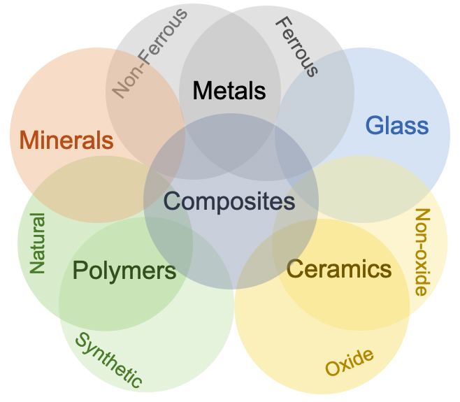
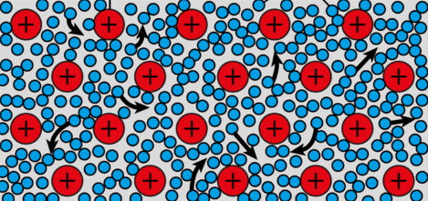
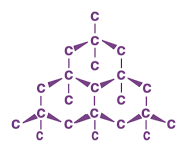
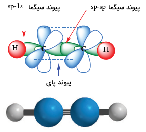

# خواص مواد مهندسی

**دکتر اعظم بیگی خردمند**

^^^

## منابع

1. W. F. Smith, *Principles of Materials Science and Engineering*, 3rd Edition, McGraw Hill, 1996.
2. K. G. Budinski and M. K. Budinski, *Engineering Materials: Properties and Selection*, 7th Edition, Prentice Hall, 2002.

^^^

## فصل اول

^^^

### تاریخچه

- متالورژی به عنوان صنعت مادر حدود 6-7 هزار سال پیش شکل گرفت.
- مس اولین فلزی بود که به صورت خالص استخراج شد.

^^^

### انواع مواد مهندسی

**فلزات:**

- رسانای خوب حرارت و الکتریسیته.
- شکل‌پذیر (به دلیل پیوند فلزی).

**سرامیک‌ها:**

- پیوند کووالانسی و یونی.
- دارای سختی و دیرگدازی بالا.

**پلیمرها:**

- از مولکول‌های بزرگ و طویل تشکیل شده‌اند.

^^^

### فلزها

- `چیدمان اتمی بسیار منظم و فشرده`
- `چگالی بالا`
- `صلبیت`
- `استحکام`
- `انعطاف‌پذیری`
- `مقاومت به رشد ترک`
- `الکترون آزاد`
- `هدایت گرمایی`
- `هدایت الکتریکی`
- عدم انتقال نور
- `بیشترین کاربرد در مهندسی`

^^^

### فلزات آهنی

- `چُدن‌ها`: آلیاژهای آهن-کربن و عناصر دیگر که کمتر از 2% کربن دارند.
  - `چُدن سفید`
  - `چُدن‌های گرافیتی`
  - `چُدن خاکستری`
  - `چُدن داکتیل (نشکن)`
  - `چُدن مالیبل (چکشخوار)`
- `فولادها`: آلیاژهای آهن-کربن و عناصر دیگر که بیشتر از 2% کربن دارند.
  - `ساده کربنی`
  - `کم آلیاژ`
  - `زنگ نزن`
  - `ابزار`

^^^

### سرامیک‌ها

- `تُرد`
- `مقاومت دمایی`
- `انعطاف‌پذیری کم`
- `عموماً مستحکم`
- `عموماً پایداری شیمیایی`
- `عموماً عایق جریان`
- `استثنا: گروهی الکتروسرامیک‌ها رسانا هستند` (در ساخت ترانزیستورها، یکسو کننده‌ها و ICها)

^^^

### کاربرد سرامیک‌ها

- `مصالح ساختمانی`
- `شیشه‌ها`
- شیشه‌های هوشمند
- ساینده‌ها
- مته‌ها
- ابزار برش
- انواع سیمان‌ها
- سرامیک‌های پوشش دهی
- بیو سرامیک‌ها
- فیلترها
- کاتالیست‌ها
- الکتروسرامیک‌ها

^^^

### پلیمرها

- `مقاومت دمایی`
- `در دمای زیر صفر تُرد`
- `در دمای بالا عموماً شکل‌پذیر`
- `در دمای خیلی بالا متلاشی`
- `عموماً کم چگال`
- `عموماً عایق جریان`
- `عموماً پایداری شیمیایی در دمای محیط`

^^^

### مقایسه سه ماده اصلی

| ویژگی                   | سرامیک       | فلز          | پلیمر       |
|--- | --- | --- | --- |
| سختی                     | بسیار بالا  | متوسط       | کم          |
| مدول الاستیسیته          | بالا         | متوسط       | پایین       |
| استحکام در دمای بالا     | بسیار بالا  | بالا         | پایین       |
| انبساط حرارتی            | کم           | متوسط       | زیاد        |
| شکل‌پذیری                | کم           | زیاد         | زیاد        |
| مقاومت به خوردگی         | بسیار بالا  | بسته به نوع | متوسط تا زیاد |
| مقاومت به سایش           | بالا         | متوسط       | کم          |
| رسانایی الکتریکی         | کم           | بسیار بالا  | بسیار کم    |
| چگالی                    | بالا         | بالا         | کم          |
| رسانایی حرارتی           | کم           | بالا         | بسیار کم    |

^^^

### کامپوزیت‌ها

اجزاء مواد کامپوزیتی از نظر شکل و ترکیب شیمیایی متفاوت هستند.  
اجزاء در یکدیگر حل نمی‌شوند (مخلوط می‌شوند).  
ایجاد موادی با خواص جدید.  
دارای خواص مناسب‌تری نسبت به اجزاء اولیه.

^^^

### مواد مدرن

نیمه‌هادی‌ها  
مواد زیستی  
مواد هوشمند  
مواد نانو  

^^^

### مواد هوشمند بر اساس محرک‌ها

آلیاژ حافظه شکلی  
سرامیک پیزوالکتریک  
مواد مغناطیسی  
الکترو/مغناطیسی  

^^^

### محورهای اصلی علم مواد

فرایند  
ساختار  
خواص  
کارایی  

^^^

### تأثیر محورهای اصلی بر هم

علم مواد به بررسی ارتباط بین ۴ عنصر می‌پردازد:  
ساختار تابعی از فرایند ساخت آن‌هاست.  
عملکرد تابعی از ویژگی‌های آن ماده است.

برای مثال، تأثیر فرایند در ساختار، ویژگی و عملکرد در برابر نور.

^^^

### تأثیر فرایند ساخت در آلومینیم اکسید

یک قرص تک‌بلور و شفاف.  
یک قرص چندبلوری نیمه‌کدر.  
یک قرص چندبلوری کاملاً مات.

^^^

### چرا علم مواد؟

به‌عنوان یک مهندس موفق باید اطلاعاتی از ساختار و ویژگی مواد و تأثیر آن در فرایند ساخت برای رسیدن به عملکردهای بهتر داشته باشیم.

^^^

### سطوح ساختار مواد

^^^

### حساسیت به ریزساختار

**خواص غیر حساس:**

- دانسیته
- مدول یانگ
- ضریب انبساط حرارتی
- گرمای ویژه

**خواص حساس:**

- استحکام تسلیم
- استحکام کششی
- شکل‌پذیری
- چقرمگی شکست
- استحکام خستگی
- استحکام خزشی

^^^

### انواع خواص مواد

- مکانیکی
- الکتریکی
- حرارتی
- مغناطیسی
- نوری
- استهلاکی

^^^

### ساختار اتمی

**اتم:**

- پروتون (مثبت)
- نوترون (خنثی)
- الکترون (منفی)

**نمایش ساختار هسته‌ای اتم:**

- عدد اتمی ($Z$): تعداد پروتون‌ها
- عدد جرمی ($A$): تعداد پروتون‌ها + نوترون‌ها

  $$A = Z + N$$
  
- عدد آووگادرو ($N_A$):
  
  $$N_A = 6.02 \times 10^{23}$$

^^^

### ساختار الکترونی

**والانس (n):**

- تعداد الکترون لایه آخر
- تعیین‌کننده خواص شیمیایی

#### دسته‌بندی بر اساس والانس ←

**الکترونگاتیویته:**

- تمایل به جذب الکترون (الکترونگاتیو) مثل نافلزات
- تمایل به از دست دادن الکترون (الکتروپوزیتیو) مثل فلزات

| n | نوع |
| --- | --- |
| 1, 2, 3 | فلز |
| 4 | شبه فلز |
| 5, 6, 7 | نافلز |
| 8 | گاز نجیب |

**جدول تناوبی:**

- اساس چیدمان: آرایش الکترونی عناصر

^^^

### پیوندهای بین اتمی

**پیوندهای اولیه (اصلی) (پیوند قوی):**

- یونی
- کووالانسی
- فلزی

**پیوندهای ثانویه (فرعی) (پیوند نسبتاً ضعیف):**

- واندروالس
- هیدروژنی

**نکته:** در این پیوندها انتقال و اشتراک الکترون وجود ندارد.

^^^

### پیوند فلزی

- در فلزات و آلیاژها
- مشخصه: الکترون آزاد
- مدل: "دریای الکترون آزاد"
- ماهیت: غیرجهت‌دار
- عامل اتصال: جاذبه بین الکترون‌های آزاد و هسته یونی با بار مثبت

  **نکته 1:** در مدل دریای الکترون آزاد، الکترون‌های آزاد که به اتم‌های خاص تعلق ندارند.

  **نکته 2:** الکترون‌های غیر والانس باقیمانده و هسته اتم، تشکیل هسته‌های یونی را می‌دهند که دارای بار خالص مثبت هستند و در دریای الکترون شناورند.

^^^

### پیوند یونی

- در بسیاری از سرامیک‌ها و ترکیباتی دارای یک الکترونگاتیو و یک الکتروپوزیتیو
- مشخصه: انتقال و داد و ستد الکترون
- ماهیت: غیرجهت‌دار
- عامل اتصال: جاذبه الکترواستاتیکی بین یون مثبت و یون منفی
- عنصر فلزی با دادن الکترون لایه ظرفیت به نافلز، رسیدن هر دو عنصر به آرایش گاز پایدار
- هر چه اختلاف الکترونگاتیو (فلز-غیرفلز) بیشتر باشد، پیوند یونی قوی‌تر یا انرژی پیوند بیشتر

**ویژگی‌ها:**

- سخت
- شکننده
- عایق
- نقطه ذوب بالا
- عدم قابلیت تغییر شکل پلاستیک
- هدایت الکتریکی بسیار کمی (در حالت مذاب و توسط یون‌ها)

^^^

### پیوند کووالانسی

- در الماس، سیلیکون و ژرمانیوم
- بین دو غیر فلز و یا بین هیدروژن و یک غیر فلز
- مشخصه: شراکت الکترون
- ماهیت: جهت‌دار
- عامل اتصال: نزدیک شدن دو هسته موجب ایجاد اربیتال الکترونی جدید شامل الکترون‌های به شراکت گذاشته شده می‌شود.
- به علت نامتقارن بودن شکل اربیتال‌ها، قدرت پیوند بین اتمی در تمام جهات یکسان نیست.

**ویژگی‌ها:**

- ترد
- چکش‌خواری ضعیف
- سختی بسیار زیاد (الماس ≠ بیسموت)
- نقطه ذوب بسیار بالا
- عایق الکتریکی (برای حرکت الکترون باید پیوند شکسته شود که به دما و انرژی زیاد نیاز دارد)

^^^

### پیوند واندروالس

- بین گازهای ایده‌آل (مانند آرگون، نئون) یا مولکول‌های پایدار مانند متان و مواد آلی دیگر در حالت مایع یا جامد
- ارتباطی به الکترون‌های ظرفیت ندارد
- عامل اتصال: دو قطبی‌های مولکولی یا اتمی است که به صورت دائم یا موقتی به وجود می‌آیند.

**ویژگی‌ها:**

- پیوند ضعیف
- در اثر ارتعاشات حرارتی از بین خواهند رفت

^^^

### پیوند هیدروژنی

- در مولکول‌های غیر آلی (مانند آب) و آلی (مانند DNA)
- عامل اتصال: همراه شدن هیدروژن با یکی از عناصر با الکترونگاتیوی بالا (اکسیژن، نیتروژن، فلوئور)

**ویژگی‌ها:**

- پیوند ضعیف
- در اثر ارتعاشات حرارتی از بین خواهند رفت

^^^

### پیوندهای هیبریدی (ترکیبی)

- در بسیاری از مواد، پیوندهای بین اتمی ترکیبی از پیوندهای اولیه یا ثانویه است.

^^^

### انرژی پیوند

- منحنی تغییرات نیروی بین اتمی (و انرژی پتانسیل) بر حسب فاصله بین اتمی
- با نزدیک شدن دو اتم به هم؛ دو نوع نیروی بین اتمی (جاذبه و دافعه) بین آن‌ها شکل می‌گیرد.
- نیروی جاذبه: بسته به نوع پیوند اتمی از نیروی بین مراکز با بار مثبت و منفی است.
- نیروی دافعه: هم‌پوشانی الکترون‌های لایه آخر است که با نزدیک شدن دو اتم، افزایش می‌یابد.
- نیروی خالص: مجموع این دو نیرو است.

**نکته:** هنگامی که نیروی خالص برابر صفر شود، اتم‌ها در فاصله تعادل قرار دارند.

^^^

### انرژی پیوند

^^^

### انرژی پیوند

مهم ترین مشخصه منحني: نقطه مينيمم آن است.
انرژي متناظر با فاصله ي تعادلي، انرژي پيوند است.
انرژي پيوندي حداقل انرژي براي جدا كردن و يا شكستن پيوند است.

| نوع پیوند | انرژی پیوند $(kJ)$ |
| --- | --- |
| یونی | $625-1550$ |
| کووالانسی | $520-1250$ |
| فلزی | $100-800$ |
| واندروالسی | $< 40$ |

^^^

### انرژی پیوند

انرژي پيوندي متناسب با دماي ذوب
**افزايش انرژي پيوندي:**
دماي ذوب افزايش
مدول يانگ افزايش
ضريب انبساط حرارتي كاهش

**در مقياس اتمي:**
 مقدار مدول يانگ تابعي از مقاومت پيوند اتمي در برابر تغيير فاصله ي تعادلي اتم هاست. مدول يانگ متناسب با شيب نمودار نيروي بين اتمي- فاصله در نقطه ي 
$$
aE \propto - \left(\frac{dF}{dr_0}\right)_{r = r_0}
$$

^^^

## فصل دوم

^^^

### نظم اتمی

1. **بی نظم**
مثل گاز ها

2. **کریستال**
نظم بلند دامنه
عدد همسایگی ثابت
نظم تکرار شونده (آرایش پریودی) طی انجماد

3. **آمورف**
نظم کم دامنه
عدد همسایگی متغییر
نظم تا چند فاصله اتمی حفظ می شود
سریع سرد کردن مذاب با سرعت حدود برای تولید آمورف فلزی

^^^

### ساختار کریستالی

**کریستال**: مجموعه اتم هایی که با نظم معین در تمام حجم توزیع شده اند
از اتصال فرضی مرکز اتم ها سیستم سه بعدی شامل تعداد زیادی متوازی السطوح که شبکه بلوری را تشکیل میدهند
کوچک ترین متوازی السطوح تکرار شونده در تمام سه جهت حجم بلور را سلول واحد کویند

^^^

### سیستم های بلوری

دسته بندی برای راحتی ساختار های بلوری بر مبنای شکل سلول واحد یا آرایش اتمی گروه
این روش فقط بر پایه شکل سلول واحد بدون توجه به موقعیت اتم ها در سلول واحد
در این روش یک سیستم مختصاتی برقرار می شود
تعیین شکل هندسی سلول واحد

1. طول بردار در امتداد محور
2. طول بردار در امتداد محور
3. طول بردار در امتداد محور
4. زاويه ي بين بردار و
5. زاويه ي بين بردار و
6. زاويه ي بين بردار و

^^^

### سیستم های بلوری

هفت تلفيق احتمالي وجود می آید که هر کدام يک سيستم بلوري يا سيستم تبلور جداگانه را مشخص مي کنند که 14 حالت به وجود مي آيد به 14 شبكه براوه معروف اند

- مکعبي
- تتراگونال
- هگزاگونال
- ارتورمبيک
- رمبوهدرال
- مونوکلينيک
- تري کلينيک

^^^

### سیستم های بلوری

اكثر فلزات از سيستم هاي مكعبي يا هگزاگونال متبلور مي شوند.

| حالت های مکعبی | انگلیسی | اختصار | شکل |
| --- | --- | --- | --- |
| مکعبی ساده | Simple Cubic | SC |  |
| مکعبی مرکزدار | Body Centered Cubic | BCC |  |
| مکعبی با سطوح مرکز دار | Face Centered Cubic | FCC |  |

^^^

### اندیس های بلوری(جهات)

جهات و صفحات بلوری در فضا توسط علائمی به نام اندیس های بلوری تعریف می گردند.
 عموما از سیستم میلر برای اندیس گذاری صفحات و جهات بلوری استفاده می شود

روش تعیین اندیس های جهات در شبکه مکعبی
از مبدا مختصات برداری به موازات جهت مورد نظر رسم می شود.
 مولفه های بردار بر روی سه محور مختصات تعیین می شوند.
 مولفه های بردار به کوچک ترین اعداد صحیح تبدیل می شوند.

^^^

### اندیس های بلوری(جهات)

اندیس میلر یک جهت در براکت و به صورت $[hkl]$ نشان داده می‌شود، اما تمام جهات هم‌نوع به صورت $\langle hkl \rangle$ نمایش داده می‌شوند. به عنوان مثال، اندیس جهات قطری در مکعب به شکل $\langle 111 \rangle$ نشان داده می‌شود که شامل چهار جهت زیر است:

$$
[\bar{1}11], [1\bar{1}1], [11\bar{1}], [111]
$$
